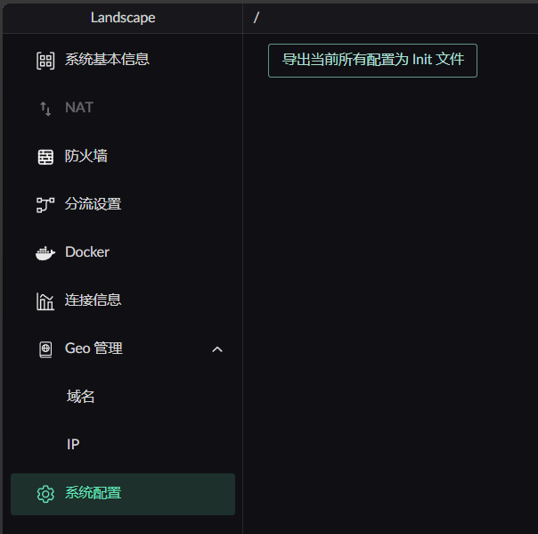
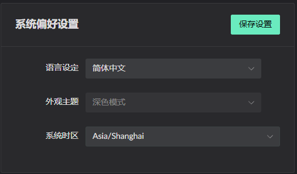
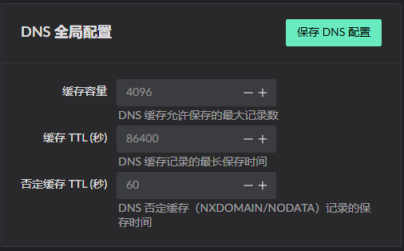
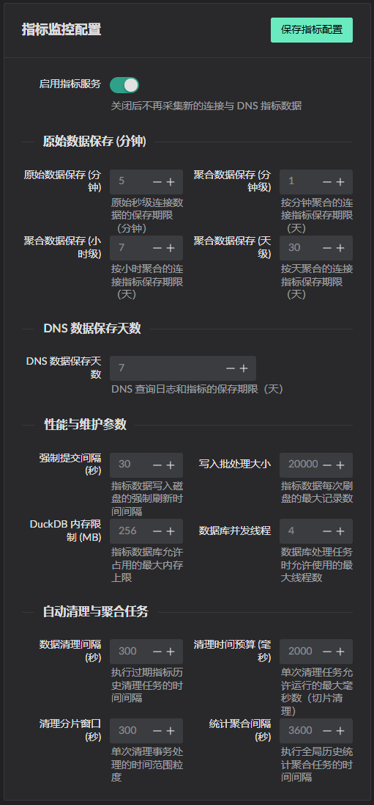

# Exporting and Restoring Settings

::: warning
An exported configuration can only be restored by the same Landscape version
that created it.

For a cross-version restore, first run the version that created the export and
let it restore the initialization data. Then start the target version so its
normal database migrations can run.
:::

## Restoring an exported configuration

1. Export the configuration to obtain `landscape_init.toml`.
2. Copy the file into the `.landscape-router` directory.
3. Delete `landscape_init.lock`.
4. Restart Landscape Router to import the file.

::: danger Verify the export before deleting the lock
Deleting `landscape_init.lock` makes Landscape reinitialize its configuration
on the next startup. Confirm that `landscape_init.toml` is complete and that
the running version matches the exported version before continuing.
:::

For a field-by-field description of everything in that file, see [landscape_init.toml Reference](../configuration/init-config).

---

## Settings included in the export

1. System preferences

2. Global DNS configuration

3. Metrics configuration

