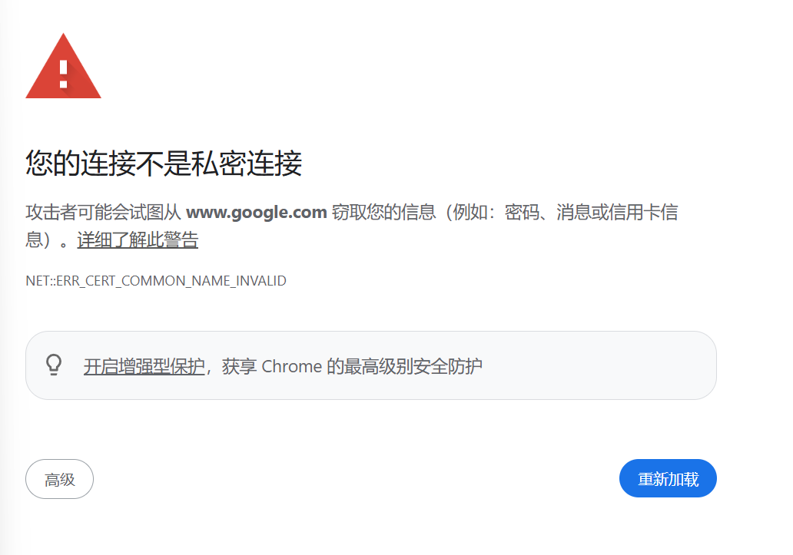

# Your Connection is Not Private

When visiting a webpage and encountering the situation in the image below, it may be due to inconsistent traffic shaping settings between IPv4 and IPv6 of the current host.   
A possible situation is that the flow entry `only configured IPv4`. Changing the entry configuration from IPv4 to using `MAC address matching` can solve this problem.

