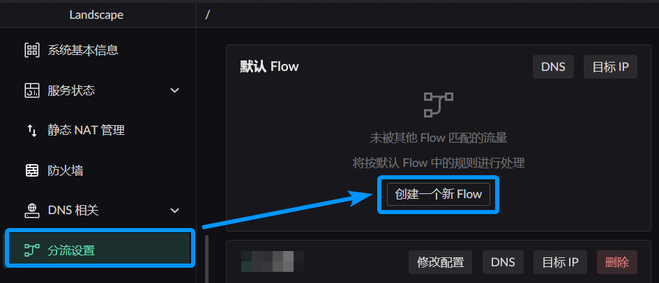
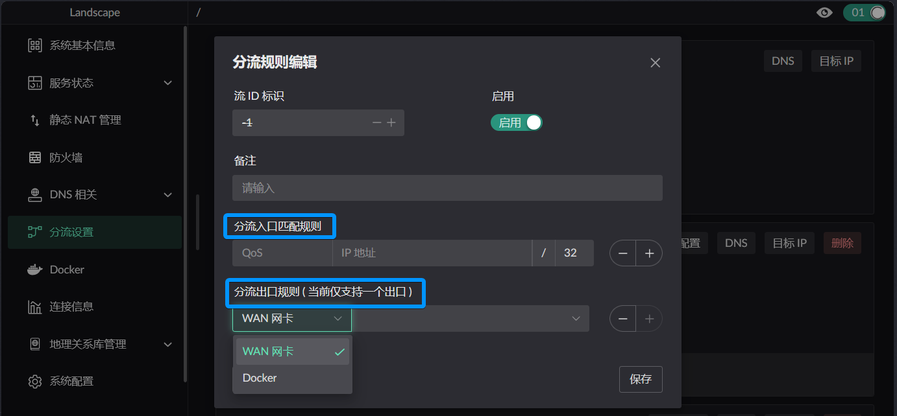
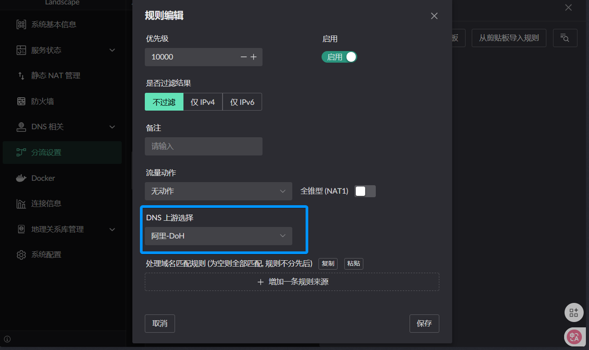
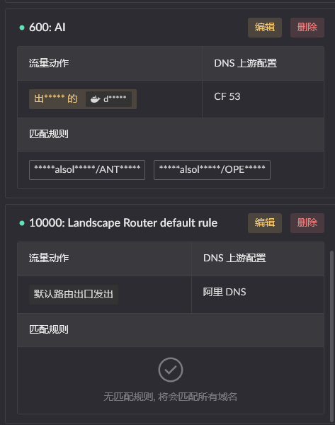
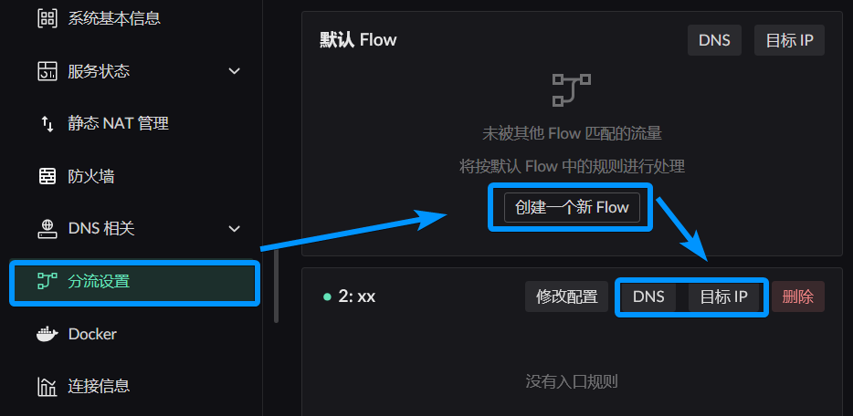

# Traffic Shaping
Traffic shaping can `define` a set of target IP behaviors and `apply` them to a group of clients.

> Any ideas are welcome to be posted here, or create a new one: https://github.com/ThisSeanZhang/landscape/discussions/88

## Basic Concepts
* `Flow`: A set of policies with entry and exit points, Chinese "流"
* `Entry`: A set of filter rules for screening clients, matching using `IP address` or `MAC`
* `Exit`: Docker container (the program in the container needs to work with the [relay program](#relay-program-image)), or a certain WAN network card. Currently, there is no multi-exit load balancing, only a single exit.
* `Default Flow`: Flow ***ID 0***, all `unmatched` traffic defaults to this flow, exit is the `default route` set in the topology, such as enabling the `Set as default route` switch in [PPPoE](../other-features/ipv4/ipv4.md#pppoe)
* `Other Flows`: Flow ***ID 1~255***, matched according to entry rules, if matched successfully, enters this flow
* `Rule matching within flow`: Will check DNS rules and IP rules. When both types of rules are satisfied, select by priority (the smaller the priority value, the higher), once matched, send to the exit, subsequent rules are no longer matched (only matches one rule)
* `Priority`: Defined by the index value of DNS / IP rules, total number of entries is 2^32. When this value is duplicate, DNS action processing is prioritized.

## Flow Definition
When we discuss traffic shaping, our focus is generally on: from `what client` the traffic comes, to `which exit` it goes out. The choice of exit depends on the client's access `target`, that is, ***domain name*** or ***IP***. (Of course, domain names will eventually become ***target IP*** when accessed)

Click the button in the image below to create a new Flow
  

This window will pop up
  

Entry defines which qualifying clients will use this flow

Exit defines which exit will be used when traffic is determined to be handled by this flow, when the rules in it `have not changed` the target's action. That is, the default exit of this flow.

Not all traffic from this entry goes out through this exit. How to determine these exceptions is generally distinguished by domain name or IP.

:::info
* Entry / Exit can be left unconfigured  
* When the entry is empty, only the exit is defined. Although there are no entry rules, other flow rules can forward to this flow, equivalent to using the exit  
* When the exit is empty, only the entry is defined. Equivalent to traffic entering this flow is discarded by default, unless using another flow's exit  
* If neither is defined, it can be used to discard traffic forwarded from other flows  
:::

## How Flows Divide
### DNS Rule Description
:::info
Each flow has independent DNS cache, no need to worry that the same domain name will cause caches in different flows to overwrite each other.
:::

* For each DNS rule, these parts can be defined:
  1. When encountering `what domain name` this rule `takes effect` -- Domain name matching rules
  2. When `resolving` these configured domain names, which `upstream` to use -- DNS upstream selection
  3. When `clients matching Flow entry` access this domain name, which `exit` to use for sending -- Traffic action
  4. When the DNS resolution result conflicts with IP rules, which takes effect? -- Priority (will compare who has higher priority between IP rules and DNS rules (the smaller the value, the higher))
  
  

* Any Flow should have at least one fallback DNS rule, used for processing when the current domain name does not match any rule, looks like this



### Target IP Rule Description
Target IP rule configuration is actually just missing the upstream definition compared to DNS rules. Other concepts like traffic action and priority are the same, so they will not be repeated.

### Traffic Actions
The core concept in Flow is this, controlling the specific behavior of the current rule's target.
  

* `Current flow's exit`: Domain names or IPs matched by the current rule use the exit defined in the `current Flow`
* `Default flow's exit`: Domain names or IPs matched by the current rule are sent out using the exit of the `default flow`
* `Block connection`: Discard the packet
* `Use specified flow exit`: Domain names or IPs matched by the current rule are sent out using the exit of the `selected flow`.   
  For example, you have flows A / B, A defines that when C accesses website D, use B's exit. In this case, when C accesses non-D websites, it will use the exit defined in Flow A, and when accessing D, it will use the exit defined in B. 

```text
┌─────────────────────────────── Flow A (default exit) ────────────────────────────────┐
│                                                                                       │
│   [C initiates access] ───► Determine: target == D ? ───► No ───► Use A exit to send │
│                              │                                                        │
│                              │ Yes                                                    │
│                              ▼                                                        │
└────────────────────────────────────────────────────────────────────────────────────────┘
                               │
┌─────────────────────────────── Flow B (special exit) ─────────────────────────────────┐
│                               └──► Use B exit to send                                  │
└────────────────────────────────────────────────────────────────────────────────────────┘
```

## Rule Setting Location

### Default Flow Flow 0 Destination Matching Rule Settings

Access configuration through `DNS card` in the upper right of the homepage   
  

### Other Flows Flow 1~255 Destination Matching Rule Settings

Access configuration through `Traffic Shaping Settings` in the sidebar  
 
 

<!-- # Multiple Flow Combination
After traffic enters the container, assuming traffic becomes the container's IP for sending, you can create a new Flow configuration, add the container IP, so you can control the behavior of traffic sent out from this container.
(In most cases, this should be unnecessary) -->
## How to Use Docker Container as Flow Exit
Programs mentioned in the tutorial below:
1. Relay program: Download from [release](https://github.com/ThisSeanZhang/landscape/releases/latest), select the needed version redirect_pkg_handler.
2. Worker program: Can be any program, such as network program, packet analysis program, proxy program. (Different programs need to use different working modes to start)

:::info
Only containers packaged with the [**relay program**](https://github.com/ThisSeanZhang/landscape/blob/main/landscape-ebpf/src/bin/redirect_pkg_handler.rs) can be used as effective flow **exit containers**  
:::

### Relay Program (Image)
The project provides a **test relay program** for testing, [image with **relay program** is here](https://github.com/ThisSeanZhang/landscape/pkgs/container/landscape-edge):

If using the UI's image run interface to run, remember to enable `Use as Flow exit`. Only then can it be used as an effective Flow exit.


If you don't want to use the UI to start, using third-party or manual start requires manually adding the following parameters:
* docker run
```shell
docker run -d \
  --name your_service \
  --sysctl net.ipv4.conf.lo.accept_local=1 \
  --cap-add=NET_ADMIN \
  --cap-add=BPF \
  --cap-add=PERFMON \
  --privileged \
  -v /root/.landscape-router/unix_link/:/ld_unix_link/:ro \ # Required mapping
  # Can mount any worker program and its startup scripts etc. required files :/app/server
  ghcr.io/thisseanzhang/landscape-edge:amd64-xx # xx needs to be modified to appropriate version
```

* compose
```yaml
services:
  your_service:
    image: ghcr.io/thisseanzhang/landscape-edge:amd64-xx # xx needs to be modified to appropriate version
    sysctls:
      - net.ipv4.conf.lo.accept_local=1
    cap_add:
      - NET_ADMIN
      - BPF
      - PERFMON
    privileged: true
    volumes:
      - /root/.landscape-router/unix_link/:/ld_unix_link/:ro # Required mapping
      # Can mount any worker program and its startup scripts etc. required files :/app/server
```
The packaged `landscape-edge:amd64-xx` image includes a [**demo worker program**](https://github.com/ThisSeanZhang/landscape/blob/main/landscape-ebpf/src/bin/redirect_demo_server.rs) placed in `/app/server`, the program's function is to create TProxy listening on port `12345`.

The **relay program** is placed in `/app`. By default, it forwards traffic to be processed to the listening port `12345` of the demo **worker program**. You can change the forwarding listening port by setting the container's environment variable: `LAND_PROXY_SERVER_PORT`.

You can mount any **worker program** in the `/app/server` directory to replace the **demo worker program** inside the container.  
For example, you can put the **worker program** in a certain directory, as shown below.
```text
root@landscape-router:/xx/flow# tree
.
├── config.json
├── run.sh  // Your worker program's startup script
└── server // Your worker program
1 directory, 3 files
```
Then map `/xx/flow` to the container's `/app/server`. When the container starts, `/app/start.sh` will execute `/app/server/run.sh`, thus executing your needed program according to the script in run.

::: info
**[Test relay program](https://github.com/ThisSeanZhang/landscape/pkgs/container/landscape-edge) image already includes, no need to add/mount yourself**, just start directly.
:::

### Custom Image
When you don't want to use the image already packaged by Landscape, and want to integrate Landscape's relay program in an existing image, you can do this.
1. First copy the relay program version you need: find `redirect_pkg_handler` in [Release](https://github.com/ThisSeanZhang/landscape/releases).
2. Need to prepare some environment with scripts. For example, this is the script executed at startup in the original image
  ```bash
    #!/bin/bash

    ip rule add fwmark 0x1/0x1 lookup 100
    ip route add local default dev lo table 100

    /app/server/run.sh /app/server &
    /app/redirect_pkg_handler &

    wait
  ```

  
