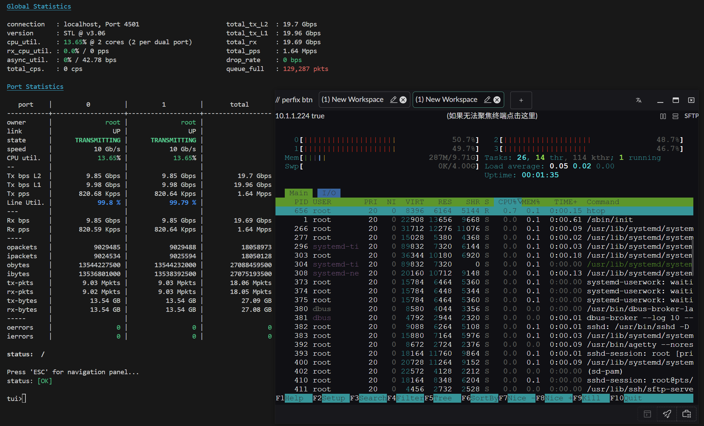

# eBPF Routing

## Overview

Landscape Router uses eBPF to implement high-performance packet forwarding in the kernel, bypassing the traditional Netfilter path and significantly improving routing performance.

## Prerequisites

For LAN and WAN to communicate normally, route forwarding must be enabled on the corresponding interfaces.


::: tip Where to configure it Open the interface configuration page, find the relevant WAN and LAN interfaces, and enable the `Route Forwarding Service` option. :::

---

## How the Acceleration Works

### Netfilter Packet Flow

The diagram below shows the full Netfilter packet flow:


> Image source: [Wikipedia - Netfilter](https://en.wikipedia.org/wiki/Netfilter#/media/File:Netfilter-packet-flow.svg) (CC BY-SA 3.0)

### Traditional Routing vs eBPF Routing

#### Traditional approach (Netfilter / iptables / nftables)

Packets go through multiple stages:

```text
NIC receive -> kernel network stack -> Netfilter hooks -> route decision -> NAT -> forwarding decision -> transmit
```

#### eBPF accelerated approach

::: tip Core advantage Landscape Router completes forwarding at the **Ingress / Egress (qdisc)** layer. In other words, it decides the destination **before** packets enter Netfilter and sends them directly to the target interface. :::

Acceleration path:

```text
NIC receive -> eBPF processing (TC layer) -> direct forwarding to target NIC
            -> bypass Netfilter
```

### Performance Characteristics

| Feature | Description |
| --- | --- |
| **Forwarding stage** | TC (Traffic Control) layer, before Netfilter |
| **NAT integration** | NAT connection state is not yet fully shared with the eBPF routing path |
| **Direct traffic** | Nearly no overhead for direct forwarding |
| **Container decision** | The decision of whether to forward traffic into a Docker container also happens here |

::: warning Current limitation Because NAT connection state has not yet been fully integrated into eBPF routing, the current acceleration result is not the final form. This is already a working 0-to-1 implementation, and it will continue to be optimized. :::

---

## Performance Tests

### Metric Definitions

- **RX-PPS**: received packets per second
- **RX-BPS**: received bits per second

### Test Environment 1

**Configuration**:

- Operating system: Arch Linux (kernel 6.12.63-1-lts)
- CPU: AMD 2700X (PVE virtual machine with 4 physical cores)
- NIC: Passthrough X520-DA2 (10Gbps)

**Results**:

#### Small packet performance (64 bytes)


#### Large packet performance (1500 bytes)



---

### Test Environment 2

**Configuration**:

- Operating system: Arch Linux (kernel 6.12.63-1-lts)
- CPU: AMD 2700X (PVE virtual machine with 4 physical cores / 8 threads)
- NIC: Passthrough X520-DA2 (10Gbps)

**Results**:

#### Small packet performance (64 bytes)


#### Large packet performance (1500 bytes)


---

## Related Documents

- [Traffic Shaping](./traffic-flow.md) - Learn how to configure traffic forwarding rules
- [Basic Operations](../../network/basic-settings.md) - XPS/RPS tuning for network interfaces
- [Firewall Settings](../../network/firewall.md) - Security policies that work alongside eBPF routing
