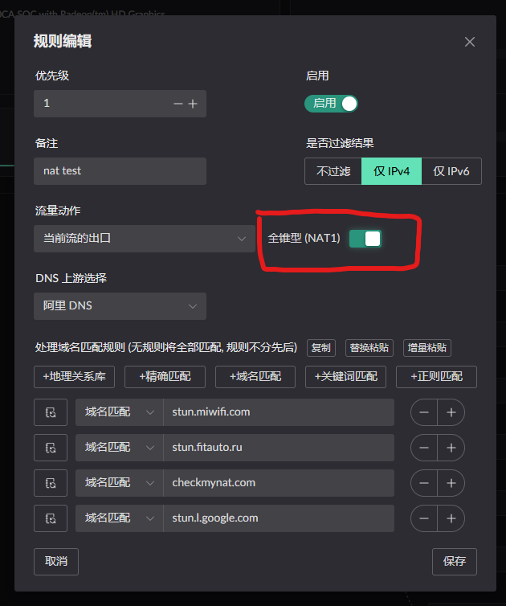
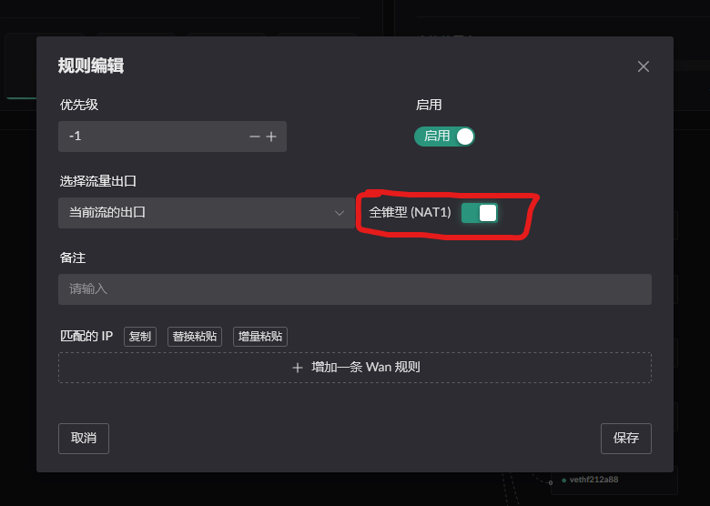
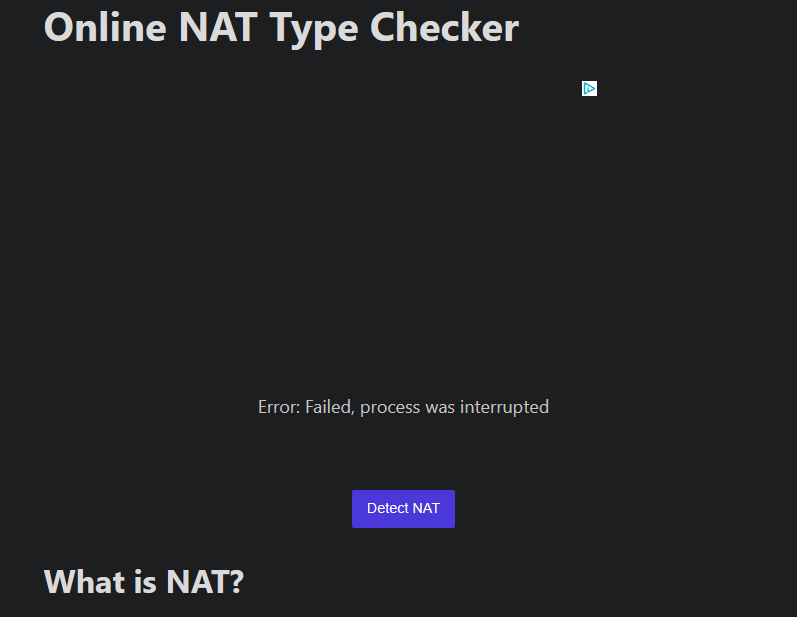
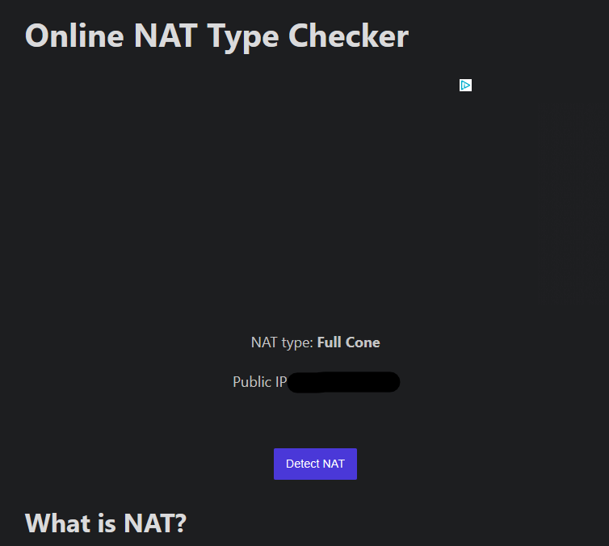

# NAT4? No, stricter than NAT4

Most router software today gives you only two choices for NAT behavior: either everything is NAT1 or everything is NAT4.  
Landscape gives you another option: both, but only where you want it.

## What changed?

Traditional NAT, even NAT4 / Symmetric NAT, still usually follows one default assumption:

> One internal port may create mappings to multiple external targets.

Landscape uses a stricter default policy:

> One port belongs only to the server it first connected to, unless you explicitly allow otherwise.

More specifically:

After `Client A` talks to `Server B`, NAT creates the mapping `Client A` -> `Router A'`.

While that connection is alive:

- `Client A` -> `Server B` ✅ allowed
- `Server B` -> `Router A'` ✅ allowed, then translated back to `B -> A`
- `Client A` -> `Another server C` ❌ dropped directly, and no new mapping is created
- `Another server C` -> `Router A'` ❌ dropped

## Why design it this way?

Because many programs quietly use your uplink for things like PCDN.  
Then when you actually need your uplink, you discover it has already been rate-limited or consumed.

## What if I want NAT1?

1. If you already know the port, use a static NAT mapping to allow that specific client port to use NAT1.
2. If you know the target domain or IP, use DNS rules or IP rules in the UI to control it.

 

## Result Demo

When accessing [checkmynat](https://www.checkmynat.com/) with the default behavior, you will get:

`Error: Failed, process was interrupted`

After enabling the NAT1 switch and testing again, the site reports Full Cone:

