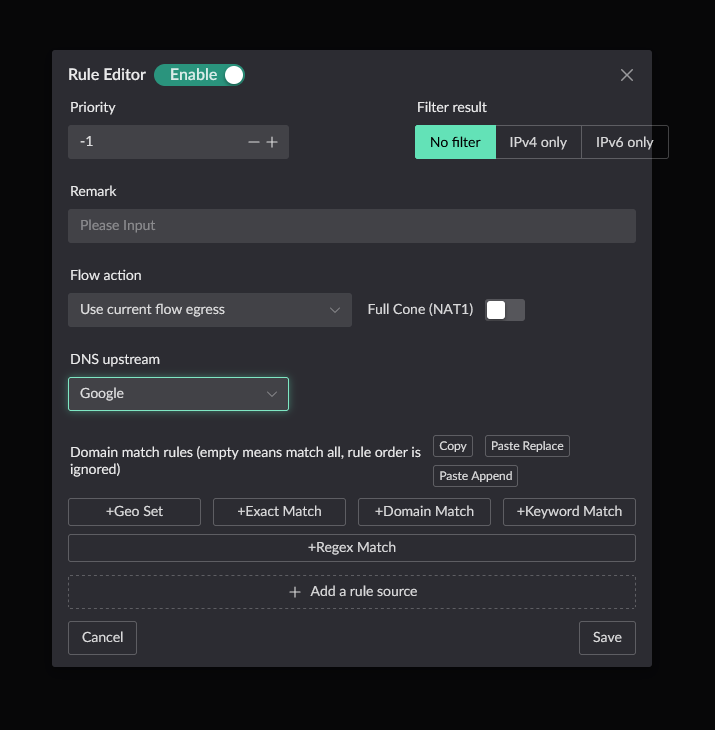
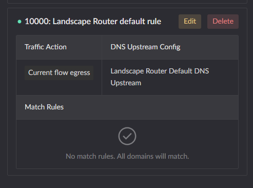

# Flow Setup

> This guide walks you through configuring flows: creating a Flow, setting its ingress and egress, and adding DNS and IP rules so different traffic takes different paths.

## The core concepts at a glance

A few concepts to know before starting:

| Concept          | Description                                                                                              | Analogy                        |
| ---------------- | -------------------------------------------------------------------------------------------------------- | ------------------------------ |
| **Flow**         | A traffic policy made up of ingress rules, egresses and routing rules                                    | A custom pipe                  |
| **Ingress rule** | Matches the source device (device / MAC / IP), deciding **whose** traffic enters this Flow                | The filter on the pipe's inlet |
| **Egress**       | Where traffic finally leaves (a WAN interface or a Docker container); several can be set with weights     | Where the pipe leads           |
| **Routing rule** | DNS and IP rules deciding **which egress** traffic inside the Flow actually takes                        | A fork inside the pipe         |

### The two kinds of Flow

- **Default Flow (ID 0)**: built in. Any traffic not matched by another Flow goes here, and its egress is the default route.
- **Custom Flows (ID 1~255)**: the ones you create. They match devices by ingress rules, and DNS / IP rules can subdivide the traffic further.

::: tip More detail
See [Traffic Shaping](../features/traffic-flow).
:::

## The scenario

The configuration below assumes this scenario throughout:

> The house has **two broadband lines**: carrier A (WAN1) and carrier B (WAN2).
>
> - The **TV box** goes out over carrier A
> - **Everything else** goes out over carrier B
> - When the TV box visits certain domains, it switches back to carrier B (whose route to those sites is better)

Keeping this in mind makes each configuration step easier to place.

## Creating a custom Flow

### Opening the flow settings page

Click **Flow Settings** in the left-hand menu. You will see:

- **The default Flow card** — the entry point to the default flow's DNS / IP rules, with "create a new Flow" and "flow trace" buttons at the bottom
- **Custom Flow cards** — one card per Flow you created, showing its ingress rules and egress

### Adding a Flow

Click the "create a new Flow" button:

The configuration dialog looks like this:

The fields:

| Field             | Description                                                                       |
| ----------------- | --------------------------------------------------------------------------------- |
| **Flow ID**       | The Flow's unique identifier, 1~255, no duplicates                                |
| **Enable**        | Whether the Flow is in effect                                                     |
| **Note**          | For your own reference, so you remember what this Flow is for                      |
| **Ingress rules** | Which devices enter this Flow                                                     |
| **Egress rules**  | Where matched traffic leaves by default; several egresses can be weighted          |

There are three common patterns:

::: tabs
== Ingress + egress (most common)

The ingress matches specific devices, and their traffic goes out through the configured egress **by default**. DNS / IP rules can then redirect part of it elsewhere.

In our scenario, create Flow 1 for the TV box: ingress matches the TV box, egress is carrier A's WAN.

== Egress only

Set an egress but no ingress rules. Such a Flow does not receive traffic directly, but other Flows' DNS / IP rules can reference it **as a redirect target**.

For example, create Flow 2 (egress only, pointing at carrier B's WAN) for Flow 1's domain rules to reference, so specific domains switch back to carrier B.

== Ingress only

Set an ingress but no egress. Matched traffic is **dropped by default**, unless a DNS / IP rule redirects it to another Flow's egress.

:::

Our scenario uses the first pattern.

### Configuring ingress rules

Ingress rules decide **which devices'** traffic enters the Flow. Three matching modes are available:

| Mode        | Description                                                     | When to use                            |
| ----------- | --------------------------------------------------------------- | -------------------------------------- |
| Device      | Pick from already enrolled devices                              | The device is enrolled via DHCP        |
| MAC address | Enter the MAC address by hand                                   | The device is not enrolled, or static  |
| IP address  | Enter an IP plus prefix length (e.g. `192.168.1.0/24`)          | Matching a whole subnet at once        |

#### Doing it in our scenario

Create Flow 1 for the TV box and click "add an ingress match rule":

- Choose **MAC address** mode and enter the TV box's MAC
- Set the Flow ID to `1` and note it as "TV box — carrier A"
- Choose **WAN interface** as the egress type and pick carrier A's WAN

::: tip Notes on ingress rules

- Multiple ingress rules are OR'd together — matching any one enters the Flow
- Match precedence: IP > MAC
- Ingress rules of different Flows should not overlap, or only one of them takes effect
  :::

### Configuring the egress

Two egress types are supported, each with a weight (a higher weight receives more traffic):

| Egress type   | Description                                    |
| ------------- | ---------------------------------------------- |
| WAN interface | Pick an interface in the WAN zone              |
| Docker        | Pick a container designated as a Flow egress   |

::: info Load balancing across egresses
With several egresses configured, traffic is split in proportion to the weights. For example, weight 3 on carrier A and 1 on carrier B sends roughly 75% of traffic over carrier A.
:::

Click save when done. The TV box's traffic now goes out over carrier A.

## Configuring DNS routing rules

Pointing a device at one broadband line is not the whole story — to send **specific domains** out through a different egress, you need DNS routing rules.

### Rule structure

Every DNS rule defines:

| Part               | Description                                                                    |
| ------------------ | ------------------------------------------------------------------------------ |
| **Domain match**   | The domain that triggers the rule (e.g. `*.example.com`)                        |
| **Upstream DNS**   | The upstream used to resolve it (optional; the default upstream is used if empty) |
| **Traffic action** | What happens to matched traffic                                                |
| **Priority**       | Lower numbers win; used to resolve conflicts between rules                      |

### Adding a DNS rule to a Flow

1. Click the **DNS** button on Flow 1's card to open the DNS rule sidebar
2. Click add rule to open the editor:

### Traffic actions in detail

The traffic action decides where matched traffic ultimately goes:

| Action                     | Description                                        |
| -------------------------- | -------------------------------------------------- |
| **This Flow's egress**     | Send via the egress configured on this Flow        |
| **The default Flow's egress** | Send via the default route (Flow 0's egress)     |
| **Block**                  | Drop the traffic, denying access                   |
| **A specific Flow's egress** | Redirect to another Flow's egress                |

#### Doing it in our scenario

Add a DNS rule to Flow 1 so the TV box switches back to carrier B for certain domains:

1. First create Flow 2 — egress only, pointing at carrier B's WAN interface
2. Go back to Flow 1 and click DNS to open the DNS rule sidebar
3. Add a rule: domain match `*.example.com`, traffic action **a specific Flow's egress** → Flow 2
4. Set the priority to `1000`

### The catch-all rule (required)

Every Flow needs at least one **catch-all DNS rule** to handle traffic that **matched no domain rule**. Flow 1 needs one:

- Leave the domain match **empty** (matches every domain)
- Set the traffic action to **this Flow's egress**
- Give it a high priority value (e.g. `10000`) so it is only reached after every specific domain rule

::: tip Match order

1. DNS rules are matched by priority, lowest number first
2. Matching stops at the first rule that hits
3. With no match, traffic takes the Flow's default egress
   :::

## Configuring IP routing rules (optional)

IP rules work like DNS rules, but match the **destination IP address** rather than a domain.

### When to use IP rules

- The target service's IP ranges are known and reasonably stable
- You want to route by IP geography (together with GeoIP labels)
- The traffic can be classified without waiting on DNS resolution

### Doing it in our scenario

Add an IP rule to Flow 1 so traffic to `1.1.1.0/24` goes out over the default route:

1. Click the **Destination IP** button on Flow 1's card
2. Add a rule with destination IP `1.1.1.0/24`
3. Set the traffic action to **the default Flow's egress**
4. Set the priority to `500`

::: warning When DNS and IP rules conflict
If one packet matches both a DNS rule and an IP rule at the same priority, the DNS rule wins.
:::

## Verifying the result

Landscape ships a **flow trace** tool so you can check your rules before sending real traffic.

Click the **flow trace** button on the default Flow card. The tool works in two steps:

### Step 1: match the source client

Pick or type a client (device / MAC / IP) and click "query Flow match" to see which Flow will handle it.

### Step 2: query a target

Enter a domain or IP address, and the system will:

1. Resolve the domain
2. Show which DNS rule / IP rule each resolved IP hits
3. Show the resulting egress action
4. Compare the route cache against the current configuration

::: tip Cache consistency
If the trace reports that the cache and the configuration disagree, click "clear route cache" so the new rules take effect immediately.
:::

#### Verifying our scenario

1. In step 1, pick the TV box → confirm it matches **Flow 1**
2. In step 2, enter a domain covered by the rule → confirm the egress points at **Flow 2** (carrier B's WAN)
3. In step 2, enter any other domain → confirm it takes Flow 1's **default egress** (carrier A's WAN)

You can also browse to something on the device and then check **Metrics → Connection Info** to see which Flow live connections belong to.

## Next steps

- [Traffic Shaping](../features/traffic-flow) — the full design and advanced usage (weighted egresses, Docker container egresses, and so on)
- [DNS Setup](./dns-setup) — configure upstream DNS servers
- [Basic Network Setup](./basic-network-setup) — revisit the basic network configuration
