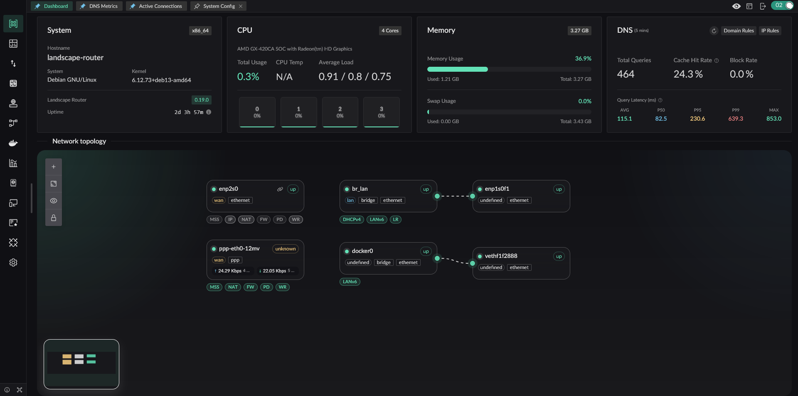

# Landscape - eBPF-based Linux Router Platform

Landscape Router is a tool built with eBPF / Rust / Vue  
that helps you turn Linux into a **router**.

## Overview

## Core Features

- eBPF-based traffic steering. Direct traffic keeps its performance. Match entries with `(SIP-CIDR, MAC)` and targets with `(DIP, domain, Geo rules)`
- Independent DNS configuration and cache for each Flow to avoid DNS pollution and leaks
- Redirect traffic into Docker containers, so TProxy-capable programs can extend behavior
- Geo database management with DAT and TXT source support
- A stricter default NAT4 model, while still allowing specified IPs or domains to use NAT1 for scenarios such as overlay networking
- A full API. Everything available in the UI can also be done through API

---

## Why Landscape Exists

The most direct reason is simple: I wanted to keep using the Linux distribution I am already familiar with, instead of being locked into a single router OS. In addition to Debian, Landscape has already seen real-world use on Arch, openSUSE, and other distributions.

It is absolutely possible to build a router by combining existing Linux programs, and that approach can be stable. But those setups usually scatter configuration across many places, increase maintenance cost, and require extra work for storing and migrating configuration files. Landscape keeps those configurations in a single directory. A new version can replace the old one directly, migrate configuration automatically on startup, and still supports downgrading when needed.

Many LAN environments also contain BT/PT or similar software that needs NAT1, while you may not want other PCDN-style software quietly consuming your uplink. Landscape therefore provides finer-grained NAT control, so NAT behavior can be decided per domain or IP.

Different devices on the same LAN often need different traffic policies, and direct traffic should continue working even if a container used for diversion fails. Landscape is designed around that requirement.

## Main Features

> ✅ Implemented and tested  
> ⚠ Feasible but not tested  
> ❌ Not implemented

- <u>IP Configuration</u>
  - _Static IP Configuration_
    - ✅ Specify IP
    - ✅ Configure a gateway and set the default route
  - _DHCP Client_
    - ✅ Specify host name
    - ❌ Custom options
  - _PPPoE (PPPD version)_
    - ✅ Specify the default route
    - ⚠ Multi-interface dialing
    - ✅ Specify the interface name
  - _PPPoE (eBPF version)_
    - ✅ Core protocol implementation
    - ❌ NIC GRO/GSO can still cause packets to exceed MTU (unresolved)
  - _DHCP Server_
    - ✅ Provide basic IP allocation and lease renewal
    - ✅ Customize gateway, subnet, and access configuration for allocated IPs
    - ✅ Bind MAC addresses to IPs
    - ✅ Show IP allocation results
    - ✅ Show 24-hour online status of devices
  - _IPv6 Support_
    - ✅ Use DHCPv6-PD to request prefixes from upstream routers
    - ✅ Use RA to advertise multiple prefixes to downstream devices
    - ✅ Let downstream devices request delegated prefixes with PD
- <u>DNS</u>
  - ✅ Support DNS over HTTPS, DNS over TLS, and DNS over QUIC for upstream requests
  - ✅ Provide DoH service to LAN clients so browsers can actively initiate ECH requests
  - ✅ Use specific upstream DNS servers for specific domains
  - ✅ DNS hijacking that returns A/AAAA answers; when no DNS result is specified, the behavior is interception
  - ✅ Mark IPs from specific DNS results so later traffic can be controlled
  - ✅ GeoSite file support
  - ❌ Add Docker container domain labels into DNS resolution
  - ✅ Test domain lookups directly
- <u>Traffic Shaping (eBPF)</u>
  - ✅ Distinguish traffic by IP and MAC values
  - ✅ Each Flow has its own DNS configuration and DNS cache
  - ✅ Forward marked traffic according to rule actions such as direct, drop, allow port reuse, or redirect to a Docker container or network interface
  - ❌ Set tracking marks for specified traffic
  - ✅ Control public IP behavior based on marked rules, with `geoip.dat` support
  - ✅ Resolve conflicts between IP rules and DNS rules by priority (smaller value means higher priority)
- <u>Geo Database Management</u>
  - ✅ Manage multiple Geo database sources
  - ✅ Automatically update Geo IP and GeoSite data
  - ✅ Support TXT-format IP data sources
- <u>NAT (eBPF)</u>
  - ✅ Basic NAT
  - ✅ Static mappings and opening specific ports
  - ✅ Default NAT4, while allowing marked domains or IPs to dynamically use NAT1
- <u>Metrics Module</u>
  - ✅ Report connection information every 5 seconds (bytes and packet counts)
  - ✅ Show current connections (not yet merged with NAT connection info)
  - ✅ Expose metrics export APIs
  - ✅ Query historical metrics
- <u>Certificate Management</u>
  - ✅ Manage Let's Encrypt accounts
  - ⚠ Manage ZeroSSL accounts
  - ✅ Support Cloudflare and Alibaba Cloud DNS-01 validation
  - ⚠ Support Tencent Cloud and Google DNS-01 validation
  - ✅ Issue, renew, and revoke certificates, and also generate self-signed certificates
  - ✅ Certificates can be used for API, DoH, and HTTP reverse proxy
- <u>Internal HTTP Reverse Proxy</u>
  - ✅ Select upstreams by SNI
  - ✅ Use different upstreams for the same SNI based on different HTTP path prefixes
  - ✅ Forward standard proxy headers
  - ⚠ Add extra custom request headers
- <u>Docker</u>
  - ✅ Run and manage Docker containers in a simple way
  - ⚠ Pull images
  - ✅ Redirect traffic into Docker containers running TProxy
- <u>WiFi</u>
  - ✅ Switch wireless interface states with `iw`
  - ✅ Create WiFi hotspots with `hostapd`
  - ❌ Connect to WiFi hotspots
- <u>Storage</u>
  - ✅ Use a database instead of the previous configuration storage model
  - ✅ Export all current configuration as `landscape_init.toml`
  - ❌ Provide a UI component for uploading and restoring configuration
  - ⚠ Add a UI component for modifying configuration
  - ❌ Use a separate database path for metrics
- <u>Miscellaneous</u>
  - ✅ Export a global API so deployed instances can be managed through API instead of the UI. Once deployed, you can access it at [https://landscape.local:6443/api/docs](https://landscape.local:6443/api/docs)
  - ✅ Login page
  - ⚠ Add English frontend pages
  - ✅ NIC XPS/RPS optimization to spread load across CPU cores and improve overall throughput. Interrupt affinity is not deeply tuned yet, and suggestions are welcome in issues

More features are still being added...

<!-- ## Tested Distributions

* Debian -->
