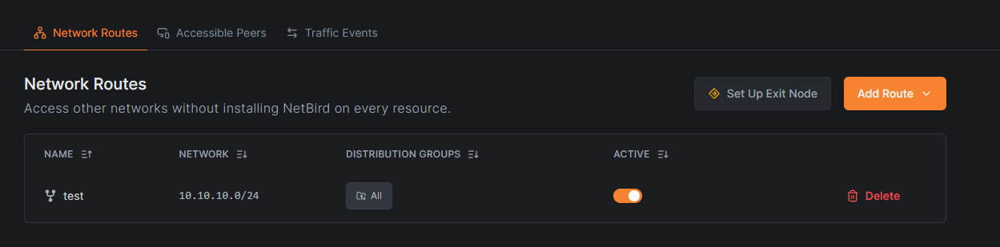
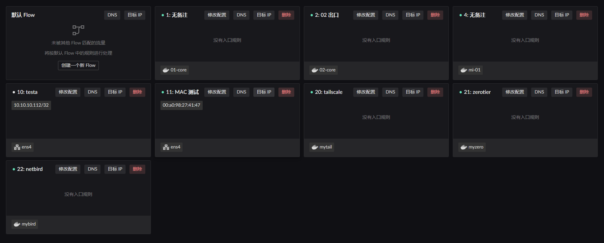
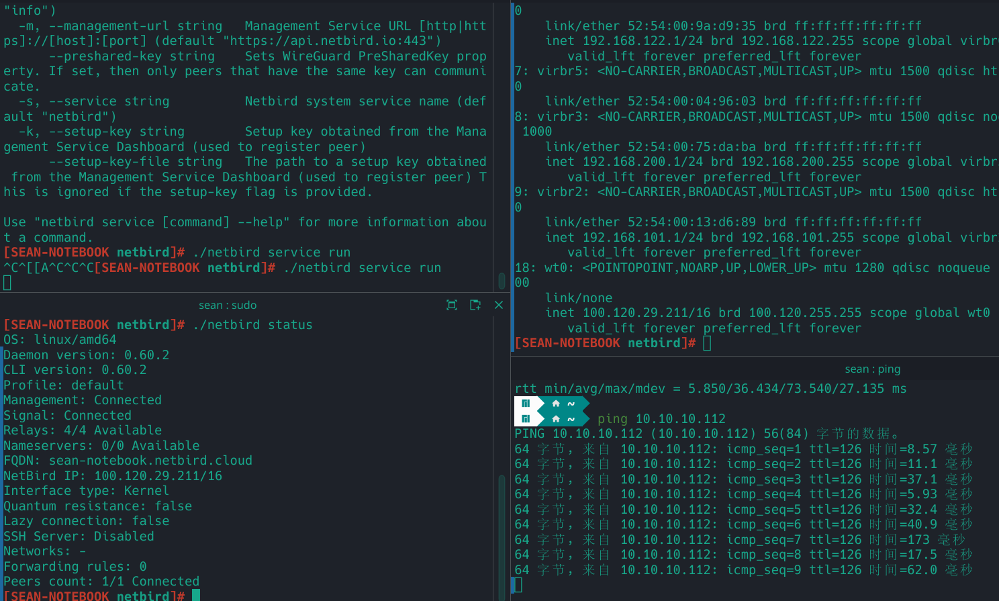

# NetBird

::: warning
NetBird's website is blocked on a direct connection, so whether direct connectivity actually works depends on where you deploy it.
:::

Deploying NetBird roughly comes down to:

1. Set up NAT1 mapping
2. Start the NetBird container and create a Flow that uses it as the egress
3. Set up routing so programs on the LAN can reach the IPs / subnets inside NetBird

## Setting up NAT1

There are two ways to get FullCone NAT (NAT1); either one works.

1. Configure a static NAT mapping for the port NetBird uses, [`51820`](https://docs.netbird.io/get-started/cli#up).
2. Add NetBird's domain (netbird.io) to a DNS rule and turn the NAT1 switch on.

Both only take effect once the `Route LAN` service is enabled on the `bridge` the container belongs to, as shown below. 

> Static NAT configuration (the internal target port is the container port, the IP is the container IP) 

> DNS / IP rule configuration  
> Not yet configured in practice; see the ZeroTier page for the approach.

## Starting the container

::: warning
You must set the bridge name!

```yaml
networks:
  my-netbird-bridge:
    driver: bridge
    driver_opts:
      # Must be set. Otherwise a dynamic interface name is used, and a restart changes it,
      # which stops the LAN service from starting properly.
      com.docker.network.bridge.name: netbird-br0
```

:::

Start the container from the [image](https://github.com/landscape-router/landscape-apps/pkgs/container/landscape-apps%2Fnetbird) built in the [apps](https://github.com/landscape-router/landscape-apps) repository. The compose file below may be out of date; for the latest, see [docker-compose](https://github.com/landscape-router/landscape-apps/blob/main/netbird/docker-compose.yaml).

Then start it with your own compose configuration.

```yaml
services:
  netbird:
    image: ghcr.io/landscape-router/landscape-apps/netbird:latest
    container_name: mybird
    hostname: mybird
    cap_add:
      - NET_ADMIN
      - SYS_ADMIN
      - SYS_RESOURCE
      - BPF
      - PERFMON
    environment:
      - NB_SETUP_KEY=${SETUP_KEY}
    volumes:
      - ${DATA_PATH}:/var/lib/netbird
      - /root/.landscape-router/unix_link/:/ld_unix_link/:ro
    networks:
      my-netbird-bridge:
        ipv4_address: 10.102.1.10
    dns:
      - 10.102.1.1

networks:
  my-netbird-bridge:
    driver: bridge
    driver_opts:
      # Must be set. Otherwise a dynamic interface name is used, and a restart changes it,
      # which stops the LAN service from starting properly.
      com.docker.network.bridge.name: netbird-br0
    ipam:
      config:
        - subnet: 10.102.1.0/24
          gateway: 10.102.1.1
```

Then create a Flow that uses this container as its egress. 

Note that you have to add routes for the gateway node in the NetBird admin console.  

## Configuring the "route" rules

Click the `Destination IP` button on the relevant Flow to configure it. Only Flows with a matching rule take effect. 

For instance, my LAN client's MAC address is `00:a0:98:27:41:47` and that client is currently governed by the `Flow 11` rules. So I configure `Destination IP` on `Flow 11` and pick the egress as `Flow 22`, the one created when starting the container. 

That way, when the LAN client reaches `100.120.0.0/16` or `192.168.2.0/24`, those packets take the Flow 22 (netbird) egress and are forwarded into the `mybird` container.

> The `192.168.2.0/24` example assumes you also deployed netbird on the far side, in which case you can configure the remote subnet directly and reach it both ways.

## Verifying the result

The devices involved:

- `Device 1`: 100.120.29.211, a `NetBird client` **not** deployed on the router
- `Device 2`: 100.120.126.160, the `NetBird client` deployed on the router
- `Device 3`: 10.10.10.112, a host on the router's LAN

1. Ping `Device 3` from `Device 1`, handled through `Device 2`. 
2. Ping `Device 1` from `Device 3`, handled through `Device 2`. 
