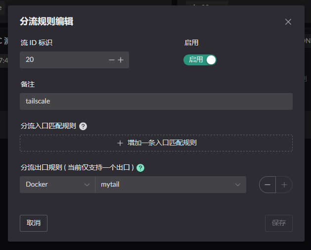
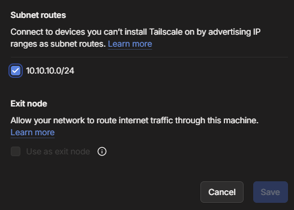

# Tailscale

Deploying Tailscale roughly comes down to:

1. Set up NAT1 mapping
2. Start the tailscale container and create a Flow that uses it as the egress
3. Set up routing so programs on the LAN can reach the IPs / subnets inside tailscale

## Setting up NAT1

There are two ways to get FullCone NAT (NAT1); either one works.

1. Pin [the port tailscale uses](https://tailscale.com/kb/1278/tailscaled#flags-to-tailscaled) and open it with a static NAT mapping.
2. Leave the tailscale port dynamic, but add the tailscale DERP `domain` or `IP` to a DNS or IP rule and turn the NAT1 switch on.

Both only take effect once the `Route LAN` service is enabled on the `bridge` the container belongs to, as shown below. 

> Static NAT configuration (the internal target port is the container port, the IP is the container IP) 

> Rule configuration  
> Not yet configured in practice; see the ZeroTier page for the approach.

## Starting the container

::: warning
You must set the bridge name!

```yaml
networks:
  my-tailscale-bridge:
    driver: bridge
    driver_opts:
      # Must be set. Otherwise a dynamic interface name is used, and a restart changes it,
      # which stops the LAN service from starting properly.
      com.docker.network.bridge.name: tail-br0
```

:::

Start the container from the [image](https://github.com/landscape-router/landscape-apps/pkgs/container/landscape-apps%2Ftailscale) built in the [apps](https://github.com/landscape-router/landscape-apps) repository. The compose file below may be out of date; for the latest, see [docker-compose](https://github.com/landscape-router/landscape-apps/blob/main/tailscale/docker-compose.yaml).

Then start it with your own compose configuration. Note the `--port=41641` argument, which pins the port.

```yaml
services:
  tailscale:
    image: ghcr.io/landscape-router/landscape-apps/tailscale:latest
    container_name: mytail
    restart: unless-stopped
    cap_add:
      - NET_ADMIN
      - SYS_ADMIN
      - PERFMON
    devices:
      - /dev/net/tun
    environment:
      - TS_AUTHKEY=${TS_AUTHKEY}
      - TS_STATE_DIR=/var/lib/tailscale
      - TS_EXTRA_ARGS=${TS_EXTRA_ARGS}
      - TS_USERSPACE=false
      - TS_TAILSCALED_EXTRA_ARGS=--port=41641
    sysctls:
      net.ipv4.ip_forward: '1'
      net.ipv6.conf.all.forwarding: '1'
    volumes:
      - ${DATA_PATH}:/var/lib/tailscale
      - /root/.landscape-router/unix_link/:/ld_unix_link/:ro
    networks:
      my-tailscale-bridge:
        ipv4_address: 10.100.1.10
    dns:
      - 10.100.1.1

networks:
  my-tailscale-bridge:
    driver: bridge
    driver_opts:
      # Must be set, otherwise a dynamic interface name is used
      com.docker.network.bridge.name: tail-br0
    ipam:
      config:
        - subnet: 10.100.1.0/24
          gateway: 10.100.1.1
```

Then create a Flow that uses this container as its egress. 

Note that you have to approve this node's routes in the tailscale admin console. 

 Other clients also need the `--accept-routes` option when starting, for example:

```shell
tailscale up --accept-routes
```

## Configuring the "route" rules

Click the `Destination IP` button on the relevant Flow to configure it. Only Flows with a matching rule take effect. 

For instance, my LAN client's MAC address is `00:a0:98:27:41:47` and that client is currently governed by the `Flow 11` rules. So I configure `Destination IP` on `Flow 11` and pick the egress as `Flow 20`, the one created when starting the container. 

That way, when the LAN client reaches `100.64.0.0/10` or `192.168.2.0/24`, those packets take the Flow 20 (tailscale) egress and are forwarded into the `mytail` container.

> The `192.168.2.0/24` example assumes you also deployed tailscale on the far side, in which case you can configure the remote subnet directly and reach it both ways.

## Verifying the result

1. From a `tailscale client` **not** deployed on the router (100.118.21.86), ping the `00:a0:98:27:41:47` client — handled by `100.76.59.45` in the container. 
2. From the `00:a0:98:27:41:47` client, ping the `tailscale client` **not** deployed on the router (100.118.21.86). 
