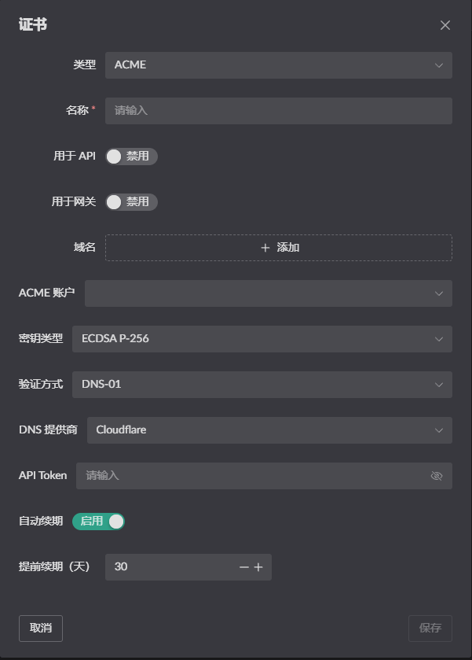
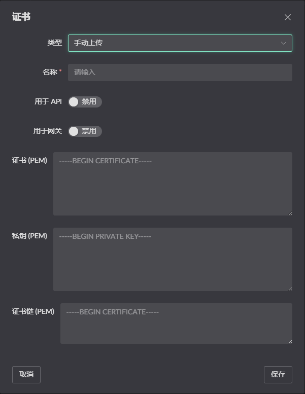
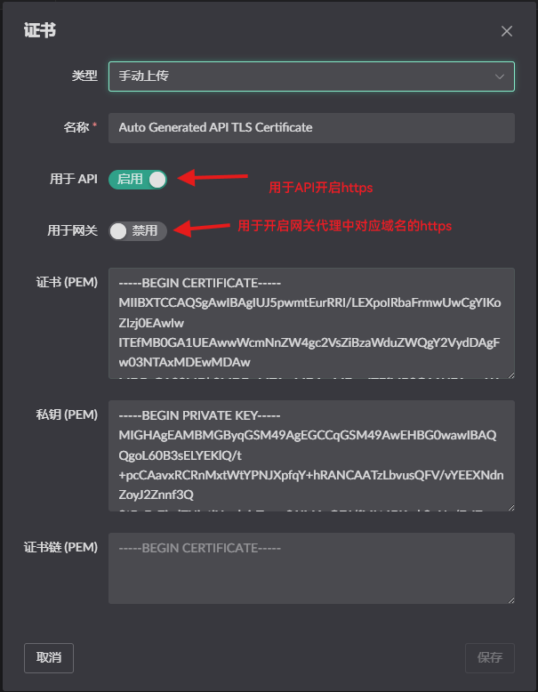

# Certificate Management

::: warning
Supported from [0.17.3] onwards; the feature is still being refined.
:::

## ACME account setup

## Managing certificates

1. Request certificates through an ACME account 
2. Self-signed certificates 
3. Upload a local certificate 

### Certificate scope

A certificate can be used for API authentication, and for domains served by the HTTP reverse proxy 
