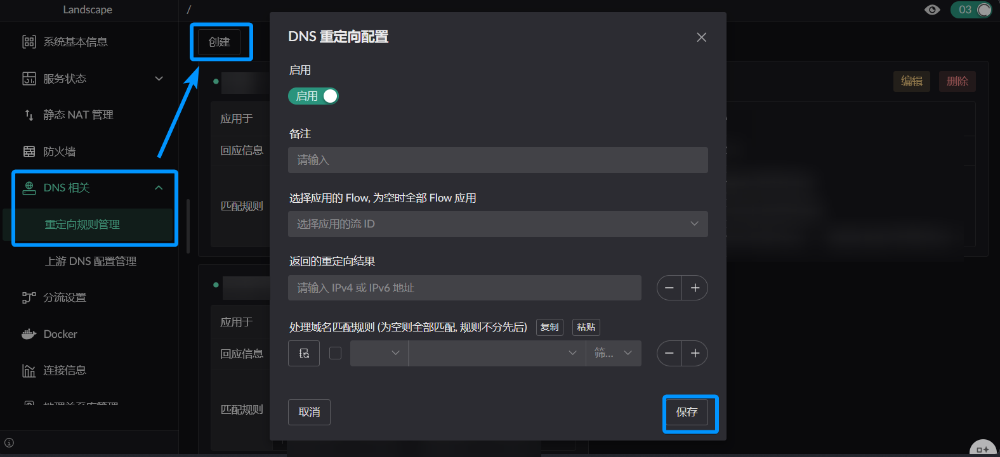

# DNS

## Redirect rules

- Pick which Flows the rule applies to; leave empty to apply to all Flows
- The redirect result to return
- Domain match rules (add the domains you want redirected)

## Upstream DNS servers

