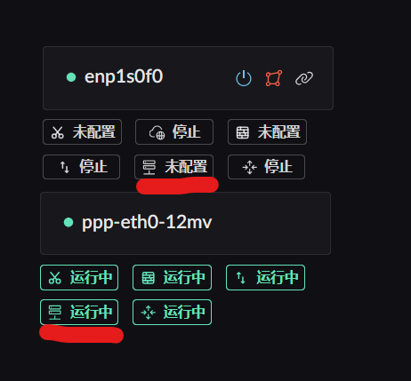
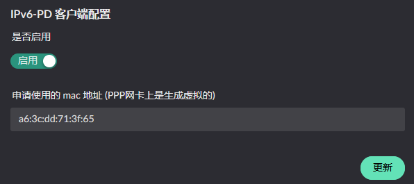
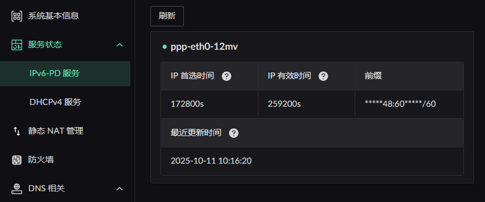

# IPv6 Configuration

First make sure your ISP lets clients request a prefix, and that the prefix it hands out is `/60` or larger. If it does not, none of the features below can be used.

## IPv6 PD

Start by obtaining the prefix. You request it on the corresponding interface by enabling the PD service on your WAN interface. Find the service button first, as shown below: 

After clicking it, just hit update unless you need to change the MAC address. 

If the prefix was obtained successfully, you can review it in the sidebar under "Service Status" -> "IPv6-PD Service": 

## IPv6 RA

The advertised addresses can be private ones you choose yourself — obtaining an IPv6 prefix is not a requirement. Find the advertisement service button first. Note that this service only appears on interfaces in the LAN zone:

Clicking it opens the service configuration panel: 

> **Advertisement interval** is how often the server **proactively** and **periodically** multicasts to the LAN.

An advertised prefix comes from one of two sources: static, or obtained dynamically via PD. Click add next to the prefix configuration to open the dialog.

### Adding a static prefix

Configure it to suit your needs. 

### Adding a PD-obtained prefix

Just pick the interface running the PD service. When configuring RA, the target interface does not need to have obtained a prefix yet, but the service must be enabled. 

::: warning
The `subnet index` must be **>= 1** — **index 0 is reserved for WAN**, and using 0 is rejected (`RA pool_index must be >= 1`).

Within the RA configuration of `the same interface`, `different` prefixes must not reuse a `subnet index`.  
Across `different interfaces`, a prefix must not reuse the same `subnet index` either.

For example, say you have interfaces A and B, dynamic prefixes PD1 and PD2, and a static prefix S1.

If S1 on interface A uses `subnet index 1` and PD1 uses `subnet index 2`, then interface A cannot add `any` prefix at subnet index `1 or 2`.  
On interface B, PD1 can use any subnet index `except 2`. PD2 can use any index.
:::

There is also a constraint on the parent prefix length: a static parent prefix only accepts **/56 to /63**, and the parent prefix must be shorter than /64.

Once configured, click update. Note that prefix edits do not take effect until you click the update button.

## IPv6 NPT

Currently, whether a prefix is _statically configured_ or _obtained via PD_, Landscape checks on egress whether that prefix matches the one the **outgoing interface** obtained through its _PD service_. If they differ, the packet is rewritten to use that interface's prefix. So there is no need to worry about making requests with the wrong prefix.

## IPv6 static mapping (effective from 0.8.1)

::: warning
For now you also need to open the mapped ports in the [firewall](../firewall.md).
:::

Find "Static NAT Management" in the right-hand menu and click create on the page. You will see the following screen: 

There are three cases for how IPv6 is allocated:

1. A `static` IPv6 prefix is assigned on the LAN
2. Only a `dynamic` PD prefix is assigned on the LAN
3. Both dynamic and static prefixes are assigned on the LAN

For case 1, fill in the `complete IP` address as the internal IPv6 target. That way, if you have two WAN ports, WAN1 and WAN2, each with a different PD prefix, you can map both prefixes to the internal host at once.

For cases 2 and 3, you can only fill in the `/64 suffix of the target IP` (the part SLAAC generates automatically). This means **only** the IP generated from the PD prefix already assigned to the host can be used; the host will not be reachable through prefixes obtained by other WAN ports.
