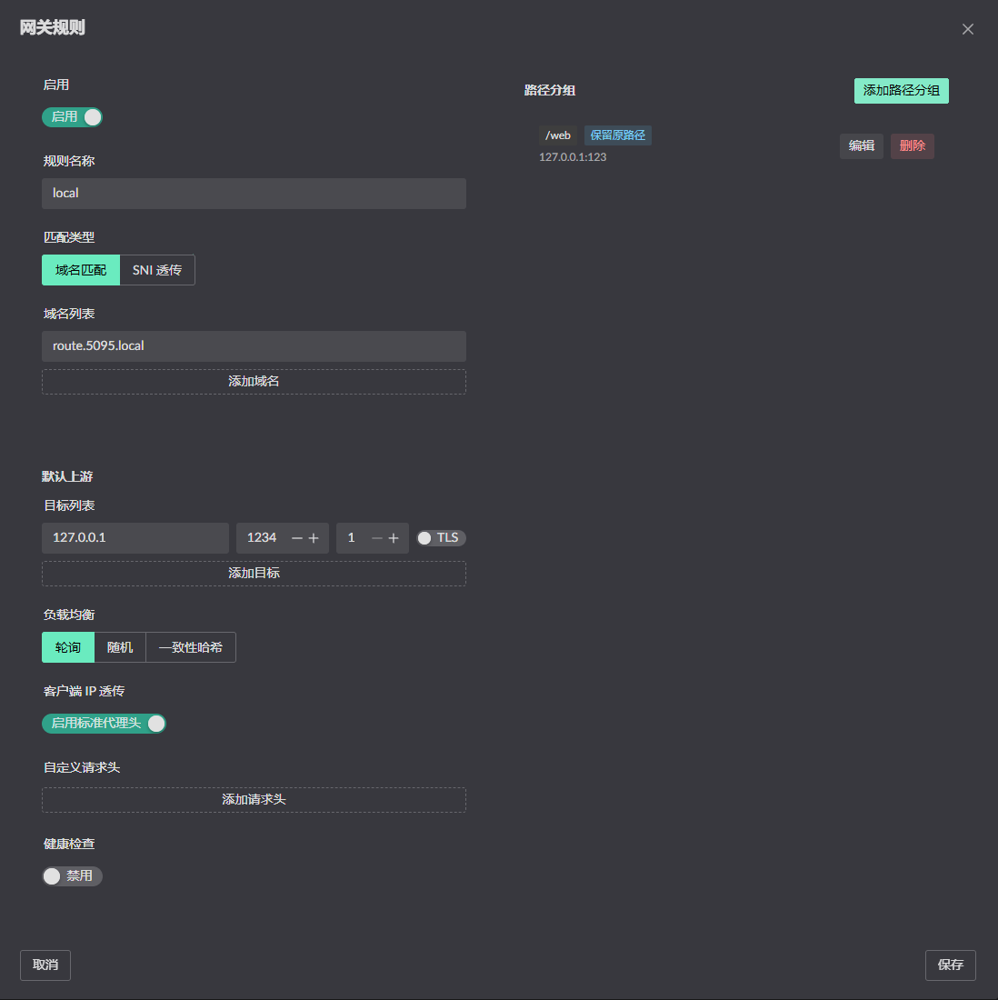
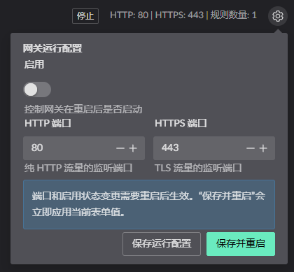

# HTTP Reverse Proxy

::: warning
Available after [0.17.3]; the feature is still being refined.
:::

## Proxy configuration

1. Combine with a certificate from Certificate Management to serve HTTPS (turn on the "use for gateway" switch on the matching domain)
2. Path-based routing is supported
3. TLS connections to the backend are supported 

4. The gateway proxy can be toggled on or off, and its listening ports managed 
