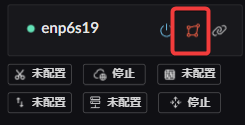

# Interface Zones

In Landscape Router, different zones offer different services, so you have to switch an interface to the right zone before you can configure it.

## Where the switch button is

## Services available on WAN

Unless you have special requirements, the defaults are fine to start with.

1-1 TCP MSS clamping  
1-2 Firewall service  
1-3 Interface NAT  
2-1 IPv6-PD client  
2-2 WAN route forwarding

## Services available on LAN

Configure as needed.

1-1 DHCPv4 server (including MAC-to-IP binding)  
1-2 ICMPv6-RA service  
1-3 LAN route forwarding (should be enabled)

