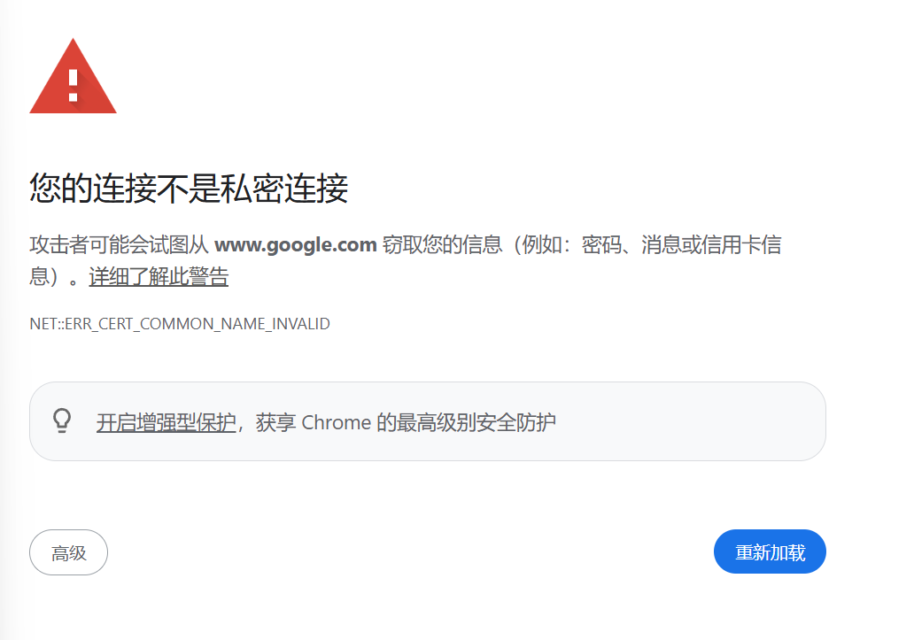

# Your Connection is Not Private

This browser warning can occur when IPv4 and IPv6 traffic from the same device
match different Flow rules.

One common cause is an ingress rule that matches only the device's IPv4
address. If both protocol families should use the same Flow, match the device
by MAC address instead. 
