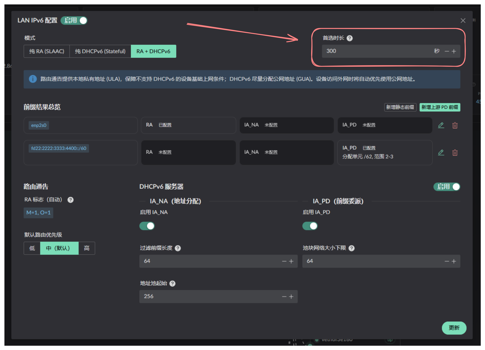
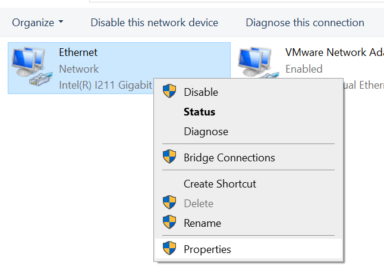
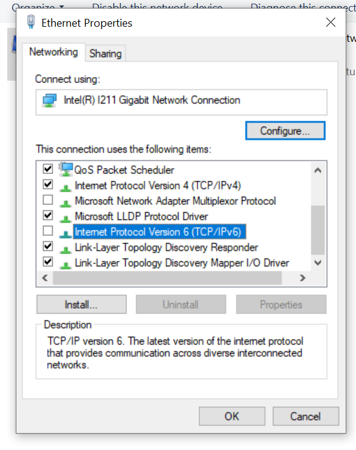

# Images Load Slowly After Rebooting with IPv6 Enabled

Some images may load slowly after the router is rebooted with IPv6 enabled
because the resource may still be using an IPv6 address while the old IPv6
address is being released.

Landscape controls this through the LANv6 **preferred lifetime**. Computers
usually keep the address for twice that duration, so avoid setting it too
high. The default value of 300 seconds is a reasonable choice. Otherwise,
waiting up to 10 minutes will allow the issue to resolve by itself.

To refresh the address manually, open the network control panel and open the
connection properties:

Clear the checkbox and click **OK**. Open the properties again and select the
checkbox to trigger a manual refresh.

