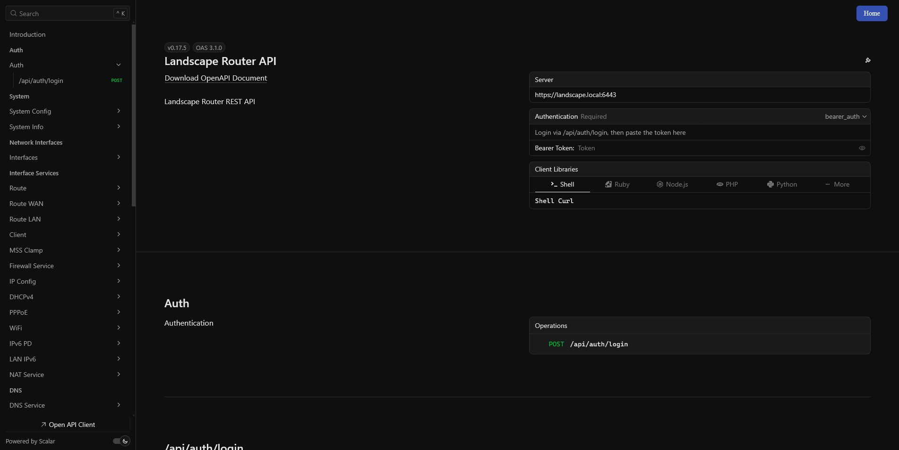

# API
Landscape 中, 你在 Ui上的所有操作, 都可通过 API 进行实现.  

当你部署完成之后, 访问 [https://landscape.local:6443/api/docs](https://landscape.local:6443/api/docs) 打开 REST API 文档

## npm 库
此外还提供了 npm 库: [ @landscape-router/types](https://www.npmjs.com/package/@landscape-router/types)

## 界面展示
