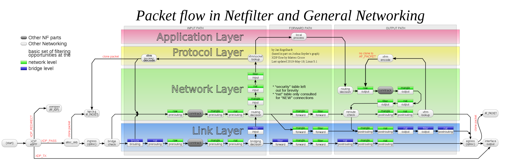
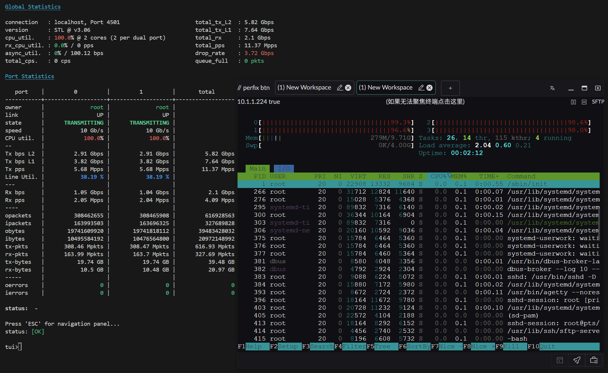
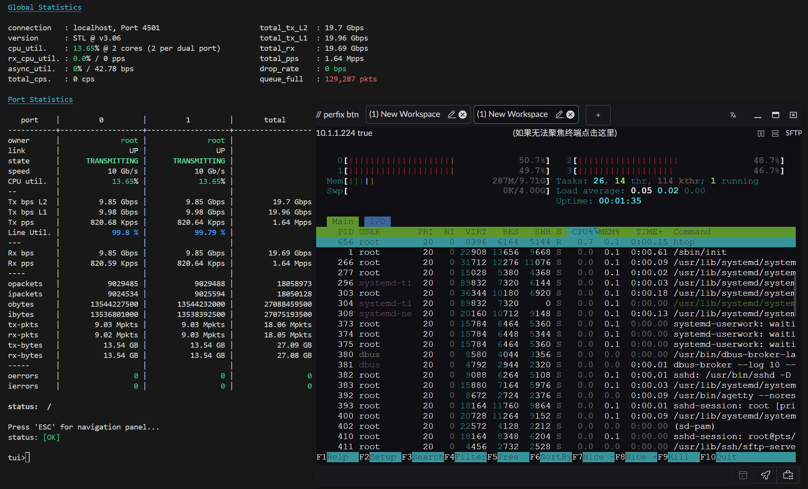
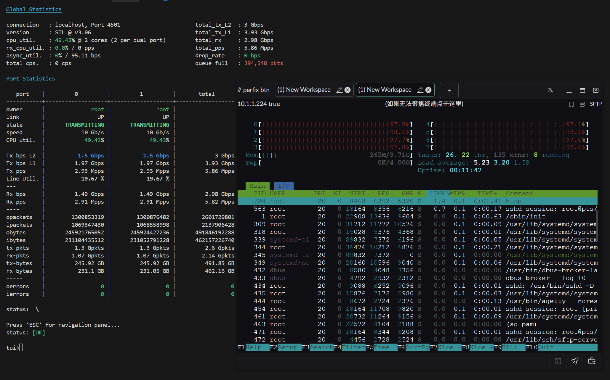
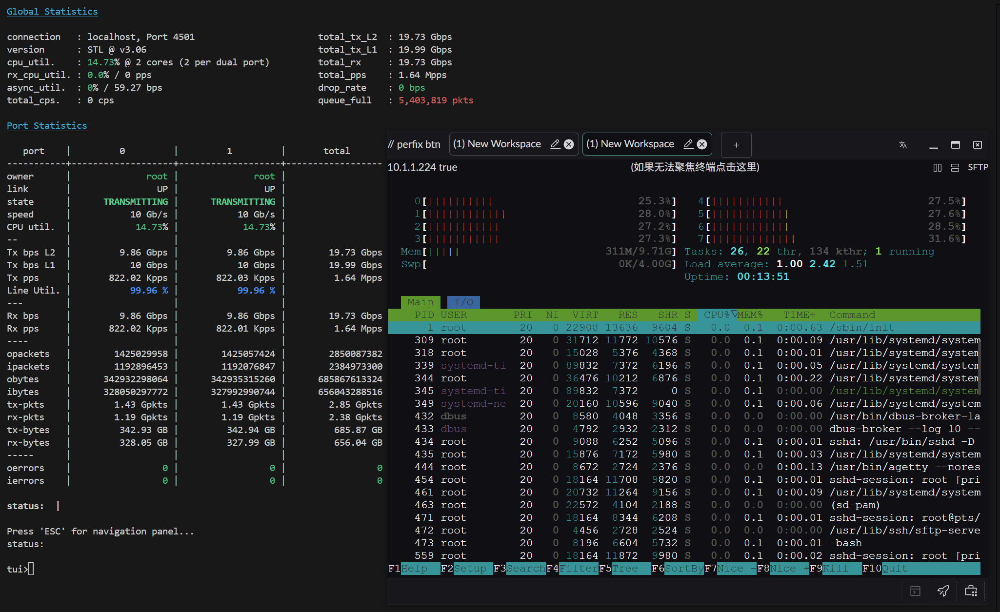

# eBPF 路由

## 概述

Landscape Router 使用 eBPF 技术在内核层面实现高性能数据包转发，绕过传统的 Netfilter 框架，大幅提升路由性能。

## 前置要求

当前 LAN 和 WAN 要能正常通信，需要开启对应网卡的路由转发功能。


:::tip 配置位置
在网卡配置界面中，找到对应的 WAN 和 LAN 网卡，开启"路由转发服务"选项。
:::

---

## 加速原理

### Netfilter 数据包流程

下图展示了 Netfilter 的完整数据包处理流程：



> 图片来源：[Wikipedia - Netfilter](https://en.wikipedia.org/wiki/Netfilter#/media/File:Netfilter-packet-flow.svg)（CC BY-SA 3.0 许可）

### 传统路由 vs eBPF 路由

#### 传统方式（Netfilter/iptables/nftables）

数据包需要经过多个处理阶段：

```text
网卡接收 → 进入内核网络栈 → Netfilter Hooks → 路由判断 → NAT → 转发判断 → 发送
```

#### eBPF 加速方式

:::tip 核心优势
Landscape Router 的转发工作在 **Ingress/Egress (qdisc)** 层完成，即在进入 Netfilter **之前**就决定转发目标并直接发送到网卡。
:::

加速路径：

```text
网卡接收 → eBPF 处理（TC 层） → 直接转发到目标网卡
         ↓ 绕过 Netfilter
```

### 性能特点

| 特性 | 说明 |
|------|------|
| **转发位置** | TC（Traffic Control）层，在 Netfilter 之前 |
| **NAT 集成** | 目前 NAT 连接信息尚未完全共享到 eBPF 实现 |
| **直连流量** | 对直连流量几乎无损耗 |
| **容器判断** | 是否转发到 Docker 容器的判断也在此完成 |

:::warning 当前限制
由于 NAT 连接信息尚未完全集成到 eBPF 路由中，当前加速效果还不是最优。这是从 0 到 1 的实现，后续会持续优化。
:::

---

## 性能测试

### 测试指标说明

- **RX-PPS**：每秒接收数据包数量（Received Packets Per Second）
- **RX-BPS**：每秒接收数据速率（Received Bits Per Second）

### 测试环境 1

**配置**：
- 操作系统：Arch Linux（内核 6.12.63-1-lts）
- CPU：AMD 2700X（PVE 虚拟 4 物理核心）
- 网卡：直通 X520-DA2（10Gbps）

**测试结果**：

#### 小包性能（64 字节）


#### 大包性能（1500 字节）


---

### 测试环境 2

**配置**：
- 操作系统：Arch Linux（内核 6.12.63-1-lts）
- CPU：AMD 2700X（PVE 虚拟 4 物理核心 / 8 线程）
- 网卡：直通 X520-DA2（10Gbps）

**测试结果**：

#### 小包性能（64 字节）


#### 大包性能（1500 字节）


---

## 优化建议

:::tip 性能优化
1. **网卡 XPS/RPS 配置**：参考[基础操作](../other-features/basic/basic.md)文档，合理配置网卡的 XPS（Transmit Packet Steering）和 RPS（Receive Packet Steering），将网卡负载分散到不同 CPU 核心
2. **多核心配置**：从测试 1 到测试 2 可以看出，增加线程数能显著提升性能
3. **直通网卡**：使用 PCI 直通方式比虚拟网卡性能更好
:::

## 未来优化方向

- 已实现：eBPF 层基础转发
- 已实现：Docker 容器流量判断
- 进行中：NAT 连接信息集成
- 计划中：更多性能优化和功能增强

---

## 相关文档

- [分流控制](./flow.md) - 了解如何配置流量转发规则
- [基础操作](../other-features/basic/basic.md) - 网卡 XPS/RPS 优化配置
- [防火墙设置](../other-features/firewall.md) - 配合 eBPF 路由的安全策略
