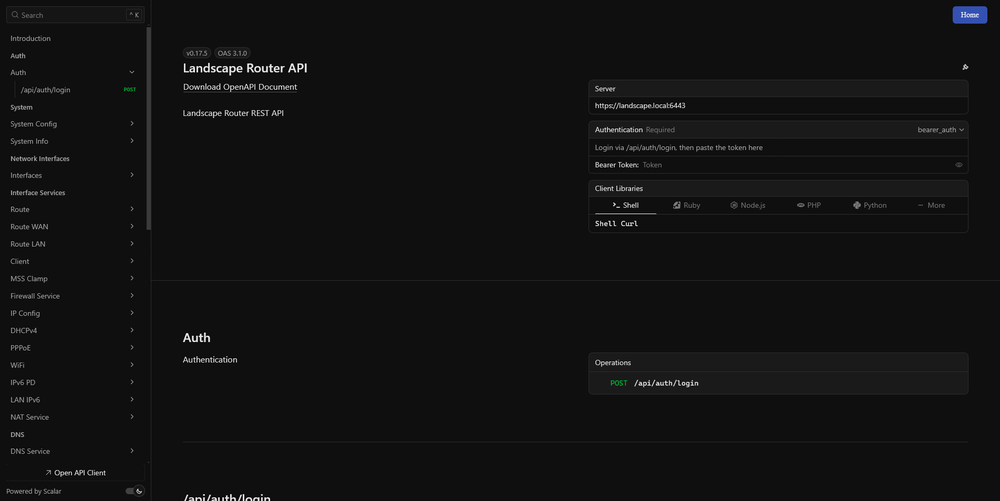

# API

In Landscape, everything you can do in the UI can also be done through the API.

After deployment, open [https://landscape.local:6443/api/docs](https://landscape.local:6443/api/docs) to view the REST API documentation.

## npm Package

There is also an npm package available: [@landscape-router/types](https://www.npmjs.com/package/@landscape-router/types)

## Plugins and Helper Programs Using the Library

- [landscape browser traffic-splitting tracker plugin](https://github.com/landscape-router/landscape-browser-extension)

## Screenshot

