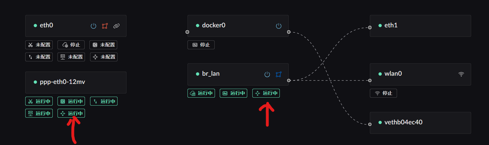
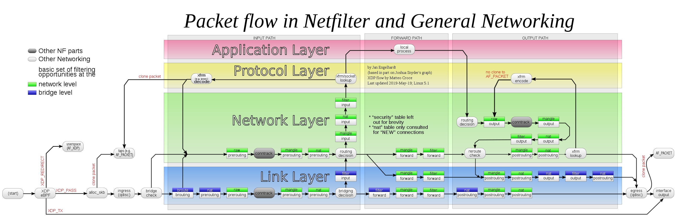
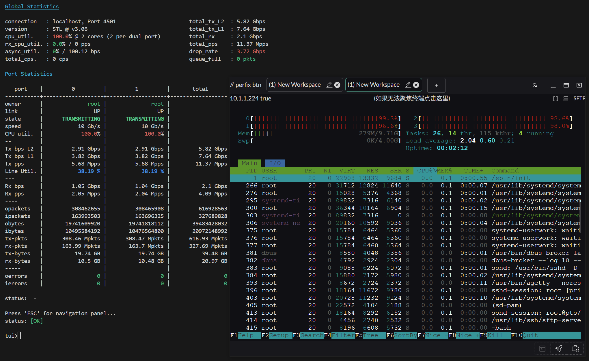
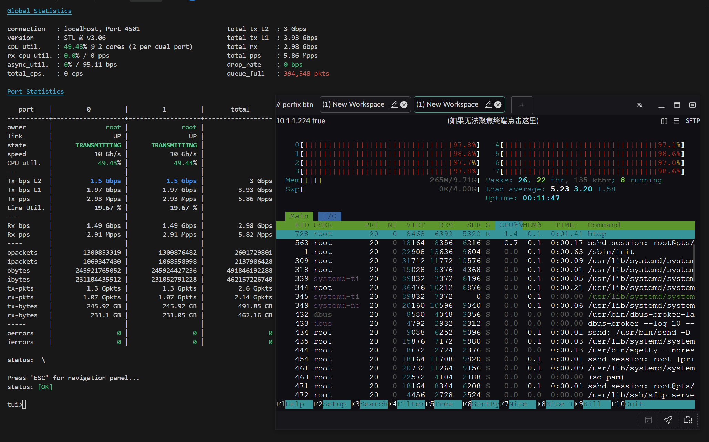
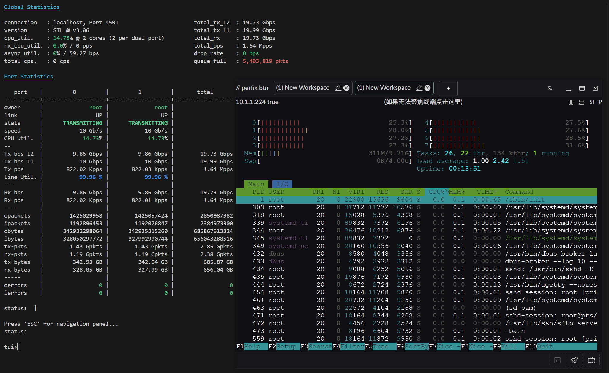

# eBPF 路由加速

## 概述

Landscape Router 使用 eBPF 技术在内核层面实现高性能数据包转发，绕过传统的 Netfilter 框架，大幅提升路由性能。

## 前置要求

当前 LAN 和 WAN 要能正常通信，需要开启对应网卡的路由转发功能。



::: tip
配置位置在网卡配置界面中，找到对应的 WAN 和 LAN 网卡，开启"路由转发服务"选项。
:::

---

## 加速原理

### Netfilter 数据包流程

下图展示了 Netfilter 的完整数据包处理流程：



> 图片来源：[Wikipedia - Netfilter](https://en.wikipedia.org/wiki/Netfilter#/media/File:Netfilter-packet-flow.svg)（CC BY-SA 3.0 许可）

### 传统路由 vs eBPF 路由

#### 传统方式（Netfilter/iptables/nftables）

数据包转发需经过 Netfilter 的多个 Hook 点，以 LAN → WAN 为例：

```text
网卡接收 → Pre-routing（连接跟踪）
        → 路由判断
        → Forward（防火墙过滤）
        → Post-routing（SNAT / Masquerade）
        → 发送
```

WAN → LAN 方向同理，区别在于 DNAT（端口映射）发生在 Pre-routing 阶段，由连接跟踪保证回包自动还原。

#### TC（Traffic Control）层方案

Landscape Router 的转发工作在 **Ingress/Egress (qdisc)** 层完成，即在进入 Netfilter **之前**就决定转发目标并直接发送到网卡，完全绕过后续的 Netfilter 处理链路。

加速路径：

```text
网卡接收 → 驱动 → SKB 分配 → eBPF 处理（TC 层）→ bpf_redirect() → 目标网卡
```

#### XDP（eXpress Data Path）方案

XDP 在内核网络栈的**最早入口**——网卡驱动层——接管数据包处理。它在 SKB（Socket Buffer）分配之前执行，能够实现远高于 TC 的转发性能。

加速路径：

```text
网卡接收 → XDP 处理（驱动层，SKB 分配前） → bpf_redirect() 直接转发到目标网卡
```

### XDP 启用方式

在启动 Landscape Router 时传入 `--try-xdp` 参数即可尝试启用 XDP 加速：

```bash
landscape-webserver --try-xdp
```

也可限制为指定网卡：

```bash
landscape-webserver --try-xdp=eth0,eth1
```

如果网卡驱动不支持 native XDP，会自动降级到 TC 路径，不影响正常运行。

## 性能测试

### 测试指标说明

- **RX-PPS**：每秒接收数据包数量（Received Packets Per Second）
- **RX-BPS**：每秒接收数据速率（Received Bits Per Second）

### 测试环境 1

**配置**：

- 操作系统：Arch Linux（内核 6.12.63-1-lts）
- CPU：AMD 2700X（PVE 虚拟 4 物理核心）
- 网卡：直通 X520-DA2（10Gbps）

**测试结果**：

#### 小包性能（64 字节）



#### 大包性能（1500 字节）


---

### 测试环境 2

**配置**：

- 操作系统：Arch Linux（内核 6.12.63-1-lts）
- CPU：AMD 2700X（PVE 虚拟 4 物理核心 / 8 线程）
- 网卡：直通 X520-DA2（10Gbps）

**测试结果**：

#### 小包性能（64 字节）



#### 大包性能（1500 字节）



---

### 测试环境 3（XDP + NAT 转发）

**配置**：

- 操作系统：Arch Linux（ChachyOS Server）
- CPU：Intel 9100T（4 核心 / 4 线程）
- 网卡：直通 X520-DA2（10Gbps）

**测试工具**：TRex ASTF（状态化流量）

**测试结果**（双向 64 字节小包）：


