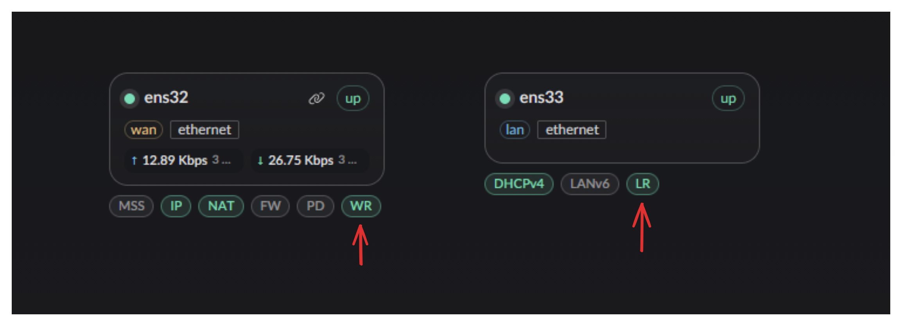
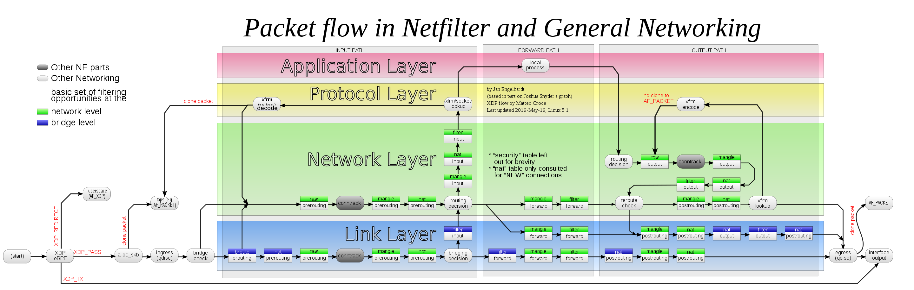
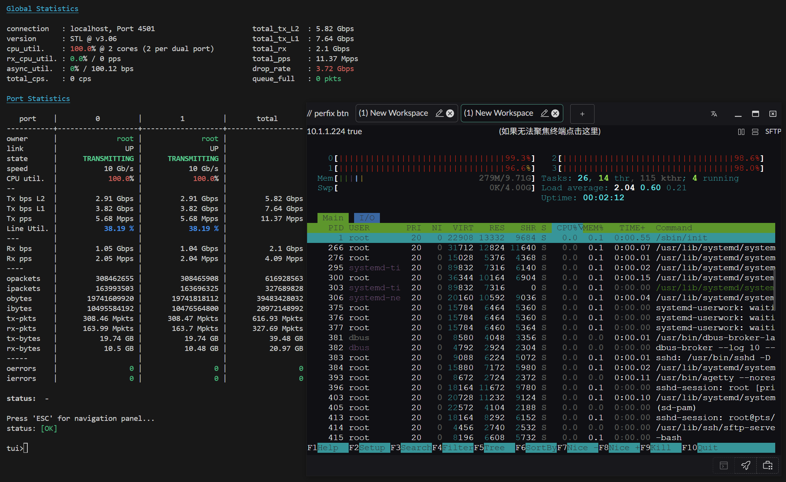
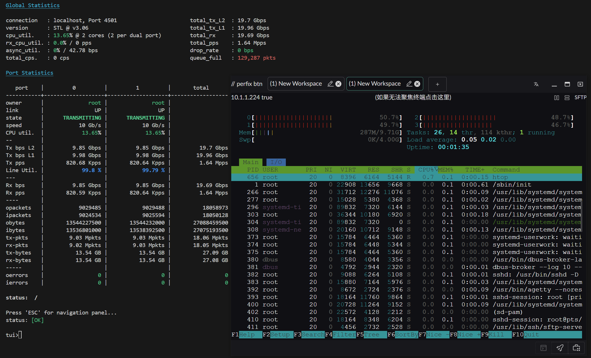
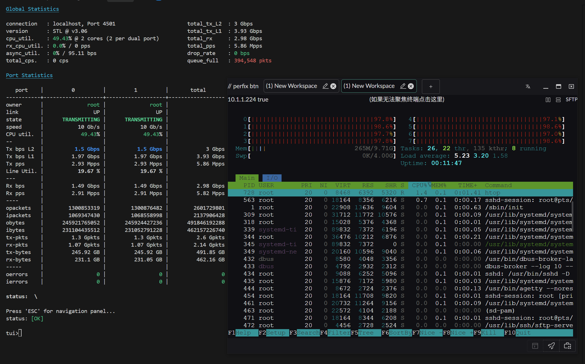
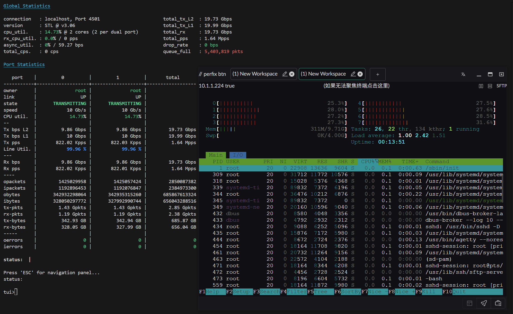
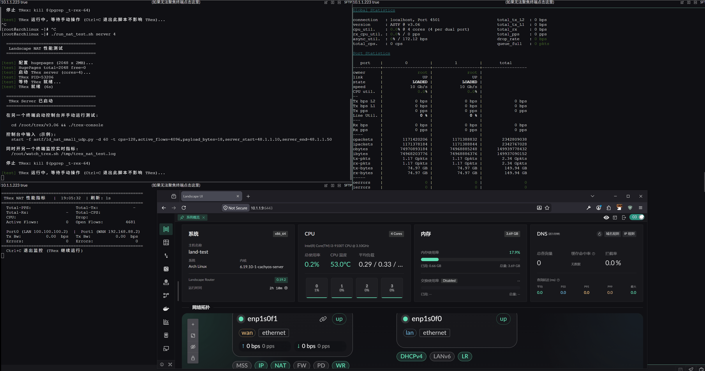

# eBPF Routing Acceleration

## Overview

Landscape Router uses eBPF to process eligible forwarded packets in the
kernel. Depending on the attachment mode, this accelerated path can bypass the
traditional Netfilter forwarding path.

## Prerequisites

For LAN and WAN to communicate normally, route forwarding must be enabled on the corresponding interfaces.



::: tip
Open the interface configuration page, select the relevant WAN and LAN
interfaces, and enable the `Route Forwarding Service` option.
:::

---

## How the Acceleration Works

### Netfilter Packet Flow

The diagram below shows the full Netfilter packet flow:



> Image source: [Wikipedia - Netfilter](https://en.wikipedia.org/wiki/Netfilter#/media/File:Netfilter-packet-flow.svg) (CC BY-SA 3.0)

### Traditional Routing vs eBPF Routing

#### Traditional approach (Netfilter / iptables / nftables)

Forwarded packets must pass through multiple Netfilter hook points. Taking LAN → WAN as an example:

```text
NIC receive → Pre-routing (connection tracking)
            → Routing decision
            → Forward (firewall filtering)
            → Post-routing (SNAT / Masquerade)
            → Transmit
```

The WAN → LAN direction is symmetric, except DNAT (port forwarding) occurs in the Pre-routing stage, with connection tracking ensuring reply packets are automatically restored.

#### TC (Traffic Control) layer approach

On Landscape's accelerated path, forwarding occurs at the **ingress/egress
(qdisc)** layer. Landscape selects the target interface before the packet
enters the Netfilter forwarding path and redirects it directly.

Acceleration path:

```text
NIC receive → driver → SKB alloc → eBPF processing (TC layer) → bpf_redirect() → target NIC
```

#### XDP (eXpress Data Path) approach

XDP processes packets at the NIC driver layer, before SKB (socket buffer)
allocation. Avoiding that allocation can reduce per-packet overhead compared
with the TC path.

Acceleration path:

```text
NIC receive -> XDP processing (driver layer, before SKB alloc) -> bpf_redirect() to target NIC
```

### Enabling XDP

Pass the `--try-xdp` flag when starting Landscape Router:

```bash
landscape-webserver --try-xdp
```

Or restrict to specific interfaces:

```bash
landscape-webserver --try-xdp=eth0,eth1
```

If the NIC driver does not support native XDP, Landscape falls back to the TC
path.

## Performance Tests

These results describe the listed test environments. Actual throughput depends
on the CPU, NIC, driver, packet size, and enabled services.

### Metric Definitions

- **RX-PPS**: received packets per second
- **RX-BPS**: received bits per second

### Test Environment 1

**Configuration**:

- Operating system: Arch Linux (kernel 6.12.63-1-lts)
- CPU: AMD 2700X (PVE virtual machine with 4 physical cores)
- NIC: Passthrough X520-DA2 (10Gbps)

**Results**:

#### Small packet performance (64 bytes)



#### Large packet performance (1500 bytes)



---

### Test Environment 2

**Configuration**:

- Operating system: Arch Linux (kernel 6.12.63-1-lts)
- CPU: AMD 2700X (PVE virtual machine with 4 physical cores / 8 threads)
- NIC: Passthrough X520-DA2 (10Gbps)

**Results**:

#### Small packet performance (64 bytes)



#### Large packet performance (1500 bytes)



---

### Test Environment 3 (XDP + NAT Forwarding)

**Configuration**:

- Operating system: Arch Linux (CachyOS Server)
- CPU: Intel 9100T (4 cores / 4 threads)
- NIC: Passthrough X520-DA2 (10Gbps)

**Tool**: TRex ASTF (stateful traffic)

**Result** (bidirectional 64-byte small packets):



---
