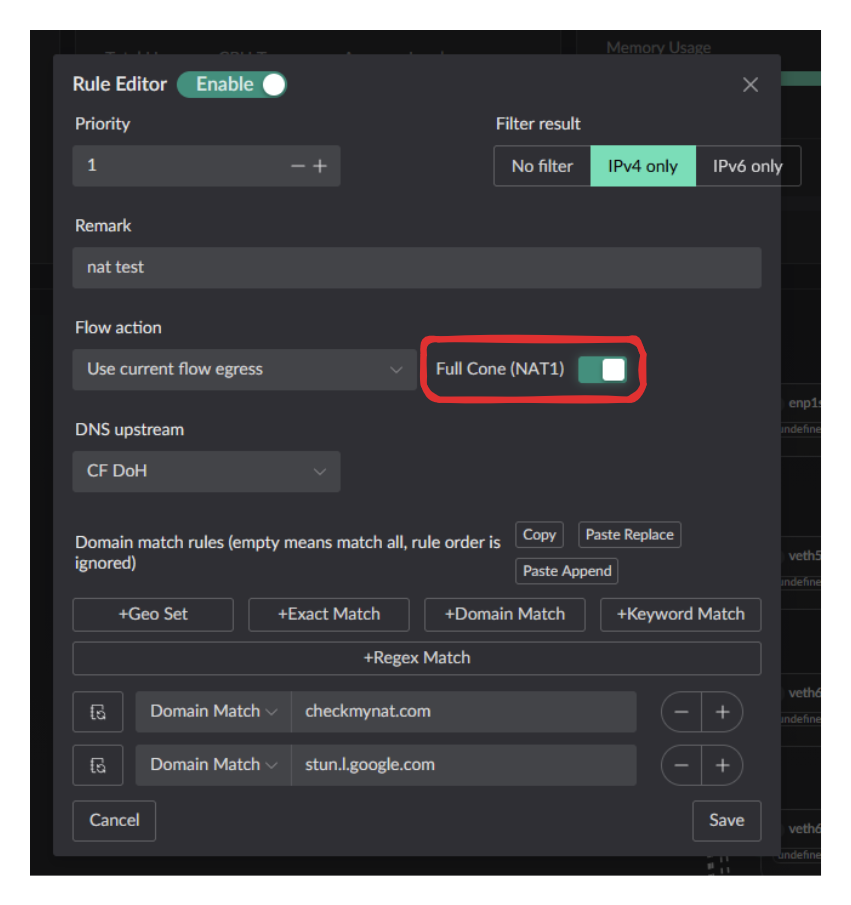
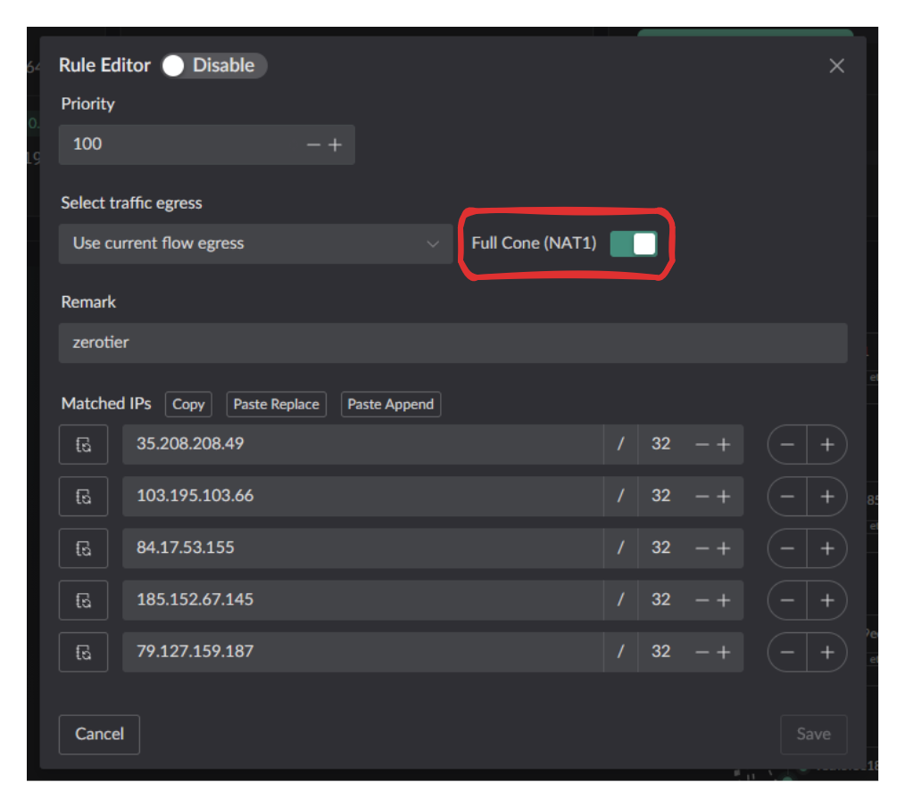
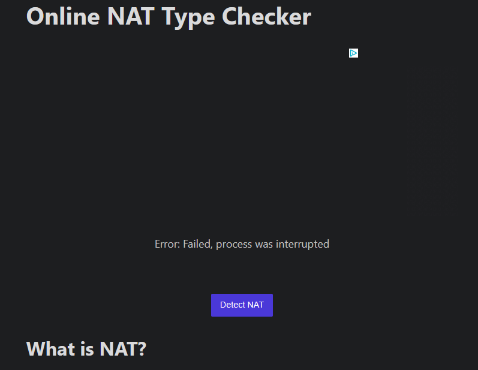
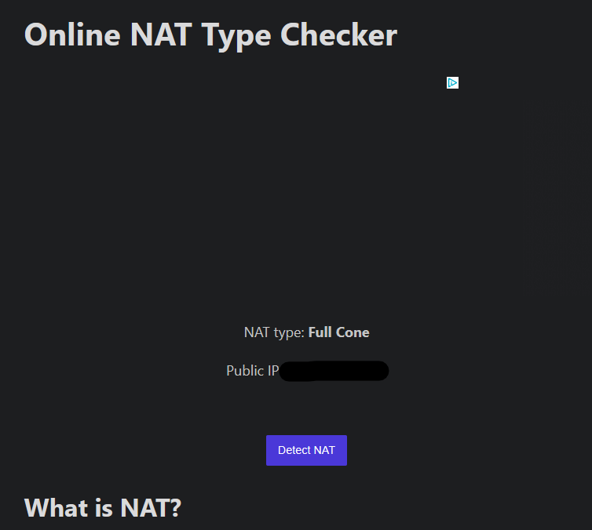

# Destination-Locked NAT by Default

Conventional Symmetric NAT may create a separate mapping when the same
internal endpoint communicates with a different external destination.

Landscape adds a destination-locking policy. For a given internal IP address,
port, and protocol, the first external destination is allowed by default.
Packets from that endpoint to another destination are dropped instead of
creating another mapping.

## Default behavior

With conventional Symmetric NAT, one internal endpoint can create different
mappings for different external destinations:

```text
Client A:port X -> Server B
  uses Router A':port Y

Client A:port X -> Server C
  uses another mapping, such as Router A':port Z
```

Landscape locks the endpoint to the first destination while the mapping is
active:

- `Client A:port X` -> `Server B` is allowed.
- `Server B` -> `Router A':port Y` is allowed and translated back to
  `Server B` -> `Client A:port X`.
- `Client A:port X` -> `Server C` is dropped; no second mapping is created.
- `Server C` -> `Router A':port Y` is dropped.

This is a Landscape-specific policy rather than a separate standardized NAT
category.

## Why this default?

Some applications create many long-lived outbound flows and may compete with
other traffic for uplink capacity. Peer-assisted CDN (PCDN) software is one
example.

Landscape's default policy limits reuse of a single internal endpoint across
destinations. It should be understood as a connection-isolation policy, not a
bandwidth limit.

## Enabling Full Cone behavior

Some applications may benefit from more permissive NAT behavior, including:

- peer-to-peer games
- mesh VPNs
- some VoIP deployments

Full Cone NAT remains available for matching traffic through explicit rules.

1. If you already know the port, use a static NAT mapping to allow that client
   port to use **Full Cone NAT**.
2. If you know the target domain or IP, use a DNS rule or IP rule in the UI to
   control where **Full Cone NAT** is enabled.





## Test result

When accessing [checkmynat](https://www.checkmynat.com/) with the default
behavior, this test reports:

```text
Error: Failed, process was interrupted
```



After enabling the **Full Cone** switch and testing again, the same test
reports Full Cone NAT:


