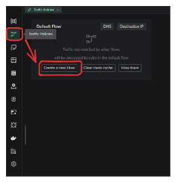
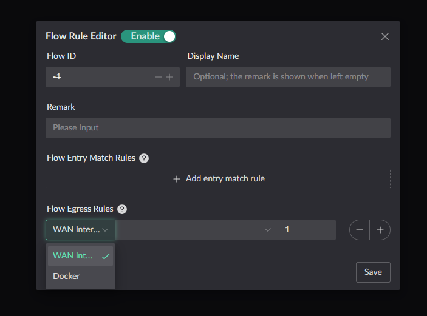
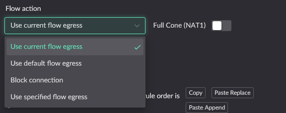
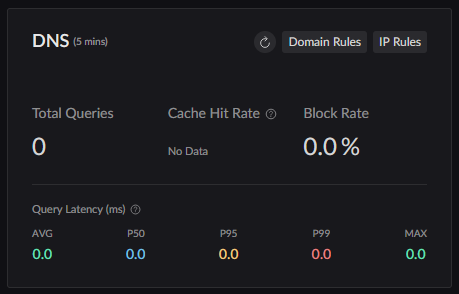
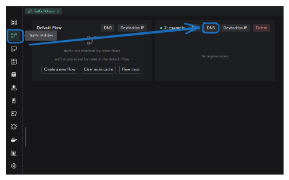
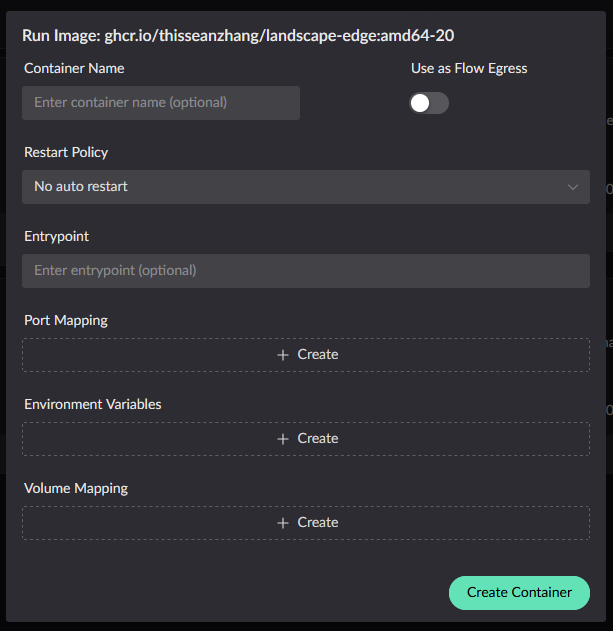

# Traffic Shaping

Traffic Shaping groups clients into Flows and applies destination-based DNS,
routing, and egress policies to their traffic.

> Share feedback in [GitHub Discussions](https://github.com/ThisSeanZhang/landscape/discussions/88).

## Quick Navigation

- [Basic Concepts](#basic-concepts) - Understand core concepts like Flow, entry and exit
- [Flow Definition](#flow-definition) - How to create and configure a Flow
- [Destination Rules](#destination-rules) - DNS and IP rules in detail
- [Rule Setting Location](#rule-setting-location) - Where to configure in the UI
- [Docker Container as Flow Exit](#how-to-use-docker-container-as-flow-exit) - Advanced usage

---

## Basic Concepts

### Core Terms

| Term         | Description                                                              |
| ------------ | ------------------------------------------------------------------------ |
| **Flow**     | A policy with entry rules, destination rules, and an exit                |
| **Entry**    | Rules that match clients by IP address or MAC address                    |
| **Exit**     | A WAN interface or Docker container through which traffic leaves         |
| **Priority** | The rule order; lower numeric values take precedence (range: 0 to 65535) |

### Flow Types

#### Default Flow (Flow ID 0)

Traffic not matched by a custom Flow enters the default Flow. Its exit is the
default route configured in the topology.

> **Example**: enable **Set as default route** in the
> [PPPoE configuration](../reference/pppoe.md).

#### Custom Flows (Flow IDs 1-255)

Entry rules determine which clients use each custom Flow.

### Rule Matching Mechanism

::: tip Matching logic

1. Evaluate the DNS and IP rules.
2. When more than one rule matches, use the rule with the lowest numeric
   priority.
3. Stop evaluation after a rule is selected and apply its traffic action.
4. Apply at most one destination rule to each packet.
   :::

::: warning
Priority conflicts: when a DNS rule and an IP rule have the same priority value, the DNS rule wins.
:::

---

## Flow Definition

### Core Questions

Traffic shaping focuses on three questions:

1. **Who**: which client does the traffic come from?
2. **Where**: which exit should the traffic go out through?
3. **How**: based on what (domain / IP) is the exit chosen?

### Creating a Flow

Click the button in the image below to create a new Flow:



This configuration window will pop up:



### Entry and Exit Configuration

**Entry** defines which clients use this Flow.

**Exit** defines where traffic leaves when no destination rule selects another
action.

::: info
Domain and IP rules can send selected traffic through a different exit.
:::

### Special Configuration Scenarios

::: details Entry and exit are optional

- **Exit only** (empty entry)
  Other Flows can use this Flow as an egress target, but no client enters it
  directly.

- **Entry only** (empty exit)
  Traffic is dropped unless a rule selects another Flow's exit.

- **Neither configured**
  The Flow can be used as a drop target for traffic forwarded by another Flow.
  :::

---

## Destination Rules

### DNS Rules

::: info
Each Flow has an independent DNS cache, so the same domain can have different
cached answers in different Flows.
:::

#### DNS Rule Components

Each DNS rule can define the following parts:

| Component          | Description                                                                          |
| ------------------ | ------------------------------------------------------------------------------------ |
| **Domain match**   | Which domain names trigger this rule                                                 |
| **DNS upstream**   | Which upstream server resolves the domain                                            |
| **Traffic action** | Which exit matched clients use when accessing this domain                            |
| **Priority**       | When conflicting with an IP rule, which one wins (the smaller the value, the higher) |


#### Fallback Rule

::: warning
Each Flow should have a fallback DNS rule for domains that do not match a more
specific rule.
:::

Fallback rule example:


### Target IP Rules

IP rules are similar to DNS rules, minus the "DNS upstream" part:

- ✅ Traffic action
- ✅ Priority
- ❌ DNS upstream (not needed)

### Traffic Actions

Traffic actions are the core concept of a Flow, controlling the behavior of matched traffic.



#### Action Types

| Action                      | Description                                      |
| --------------------------- | ------------------------------------------------ |
| **Current flow's exit**     | Use the default exit defined by the current Flow |
| **Default flow's exit**     | Use the default flow's (Flow 0) exit             |
| **Block connection**        | Discard the packet                               |
| **Use specified flow exit** | Use the exit of another specified Flow           |

#### Forwarding Example

Suppose there are Flow A and Flow B, and client C is configured to use B's exit when accessing website D:

```text
┌─────────────────────────────── Flow A (default exit) ────────────────────────────────┐
│                                                                                       │
│   [C initiates access] ───► Determine: target == D ? ───► No ───► Use A exit to send  │
│                              │                                                        │
│                              │ Yes                                                    │
│                              ▼                                                        │
└────────────────────────────────────────────────────────────────────────────────────────┘
                               │
┌─────────────────────────────── Flow B (special exit) ─────────────────────────────────┐
│                               └──► Use B exit to send                                  │
└────────────────────────────────────────────────────────────────────────────────────────┘
```

::: tip Use cases

- C accesses website D → use B exit
- C accesses other websites → use A exit
  :::

---

## Rule Setting Location

### Default Flow (Flow 0) Destination Matching Rules

Access configuration through the **DNS card** in the upper right of the homepage:



### Custom Flows (IDs 1-255) Destination Matching Rules

Access configuration through **Traffic Shaping Settings** in the sidebar:



---

## How to Use Docker Container as Flow Exit

### Prerequisites

Two programs are needed:

1. **Relay program** (`redirect_pkg_handler`)
   Download from [Release](https://github.com/ThisSeanZhang/landscape/releases/latest)

2. **Worker program**
   Can be any program: networking program, packet analysis program, etc.

::: danger
A container must include the
[relay program](https://github.com/ThisSeanZhang/landscape/blob/main/landscape-ebpf/src/bin/redirect_pkg_handler.rs)
before it can be used as a Flow exit.
:::

### Using the Official Image

The project provides a reference image:
[landscape-edge](https://github.com/ThisSeanZhang/landscape/pkgs/container/landscape-edge).

#### Starting from the UI

In the UI's image-run dialog, enable **Use as Flow exit**:



#### Starting from the CLI

**Docker Run**

```shell
# For lkit deployments, use /root/.lkit/landscape/data/unix_link/ as the host path.
docker run -d \
  --name your_service \
  --sysctl net.ipv4.conf.lo.accept_local=1 \
  --cap-add=NET_ADMIN \
  --cap-add=BPF \
  --cap-add=PERFMON \
  --privileged \
  -v /root/.landscape-router/unix_link/:/ld_unix_link/:ro \
  ghcr.io/thisseanzhang/landscape-edge:amd64-xx # replace xx with the image version
```

**Docker Compose**

```yaml
services:
  your_service:
    image: ghcr.io/thisseanzhang/landscape-edge:amd64-xx # replace xx with the image version
    sysctls:
      - net.ipv4.conf.lo.accept_local=1
    cap_add:
      - NET_ADMIN
      - BPF
      - PERFMON
    privileged: true
    volumes:
      # For lkit deployments, use /root/.lkit/landscape/data/unix_link/ as the host path.
      - /root/.landscape-router/unix_link/:/ld_unix_link/:ro # Required mapping
      # Mount the worker program and its startup files under /app/server.
```

### Worker Program

The image bundles a [**demo worker program**](https://github.com/ThisSeanZhang/landscape/blob/main/landscape-ebpf/src/bin/redirect_demo_server.rs):

- **Location**: `/app/server`
- **Function**: creates a TProxy listening on port `12345`
- **Relay program location**: `/app/redirect_pkg_handler`
- **Default forwarding port**: `12345` (changeable via the environment variable `LAND_PROXY_SERVER_PORT`)

### Custom Worker Program

#### Replacing the Worker Program

Mount your worker program to the `/app/server` directory:

```text
Local directory structure:
/xx/flow/
├── config.json
├── run.sh          # Startup script
└── server          # Your worker program
```

Mapping to the container:

```yaml
volumes:
  - /xx/flow:/app/server
```

When the container starts, `/app/server/run.sh` will be executed automatically.

::: tip
The [reference image](https://github.com/ThisSeanZhang/landscape/pkgs/container/landscape-edge)
already includes the relay program.
:::

### Custom Image Integration

To integrate the relay program into an existing image:

1. **Download the relay program**
   Get `redirect_pkg_handler` from [Release](https://github.com/ThisSeanZhang/landscape/releases)

2. **Configure the startup script**

```bash
#!/bin/bash

# Configure routing table
ip rule add fwmark 0x1/0x1 lookup 100
ip route add local default dev lo table 100

# Start the worker program
/app/server/run.sh /app/server &

# Start the relay program
/app/redirect_pkg_handler &

wait
```

---

## Relay Program Parameters

Every argument of `redirect_pkg_handler` has a corresponding environment variable:

| Argument                    | Environment variable                 | Default   | Description                               |
| --------------------------- | ------------------------------------ | --------- | ----------------------------------------- |
| `-s`, `--saddr`             | `LAND_PROXY_SERVER_ADDR`             | `0.0.0.0` | Worker program IPv4 listen address        |
| `--saddr6`                  | `LAND_PROXY_SERVER_ADDR_V6`          | `::`      | Worker program IPv6 listen address        |
| `-p`, `--sport`             | `LAND_PROXY_SERVER_PORT`             | `12345`   | Worker program listen port                |
| `-m`, `--mode`              | `LAND_PROXY_HANDLE_MODE`             | `tproxy`  | `tproxy` / `route` / `multiple_tproxy`    |
| `--enable-icmp-passthrough` | `LAND_PROXY_ENABLE_ICMP_PASSTHROUGH` | `false`   | See ICMP passthrough below                |
| `--icmp-mark-value`         | `LAND_PROXY_ICMP_MARK_VALUE`         | `2`       | The mark applied when ICMP passes through |
| `--sock_path`               | `LAND_SOCK_PATH`                     | -         | Unix socket path for registration         |
| `--log-level`               | `LAND_REDIRECT_LOG_LEVEL`            | `INFO`    | Log level                                 |

### ICMP Passthrough

The TProxy mechanism handles only TCP and UDP. The relay program **drops
incoming ICMP packets by default**, so `ping` does not work on paths routed
through a Flow exit container. This is the expected default behavior.

After enabling `--enable-icmp-passthrough`, ICMP packets are marked with `--icmp-mark-value` and handed over to the local protocol stack, so `ping` works.

::: warning Enabling the flag alone is not enough
Passthrough only prevents packets from being dropped; outbound traffic still needs forwarding and NAT configured inside the container, and the **mark must match `--icmp-mark-value`**:

```sh
echo 1 > /proc/sys/net/ipv4/ip_forward
echo 1 > /proc/sys/net/ipv6/conf/all/forwarding
iptables  -t nat -A POSTROUTING -m mark --mark 0x2/0x2 -j MASQUERADE
ip6tables -t nat -A POSTROUTING -m mark --mark 0x2/0x2 -j MASQUERADE
```

The official image's `start.sh` already contains these lines but they are **commented out by default**. Uncomment them when needed, or put them in your own `/app/server/run.sh`.
:::

---

## Related Resources

- [GitHub Discussions](https://github.com/ThisSeanZhang/landscape/discussions/88)
- [Release downloads](https://github.com/ThisSeanZhang/landscape/releases)
- [Relay program source](https://github.com/ThisSeanZhang/landscape/blob/main/landscape-ebpf/src/bin/redirect_pkg_handler.rs)
- [Official image](https://github.com/ThisSeanZhang/landscape/pkgs/container/landscape-edge)
