# 基础上网配置

> 本文引导你完成 Landscape Router 的基础网络配置：为网卡分配区域、设置 IP 地址、启用防火墙，让你的路由器可以正常上网。

## 起始状态介绍

当前虚拟机中有两张网卡: `ens18`, `ens19`
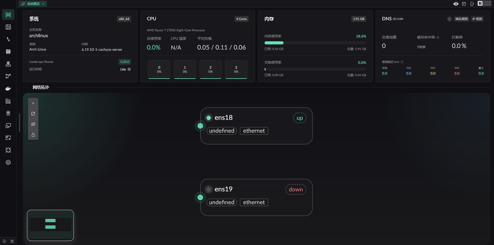

## 切换网卡区域

首先需要将网卡切换到具体的区域之后才能进行配置.

::: tip 简单理解
**WAN** = 接光猫/外网的网口，**LAN** = 接电脑/交换机的网口。

详细说明参考：[区域 (Zone)](../reference/interface-zone)
:::

点击对应的网卡, 网卡将会高亮. 并在右侧展开`网卡面板`, 点击 `ZONE` 即可打开区域切换设置.

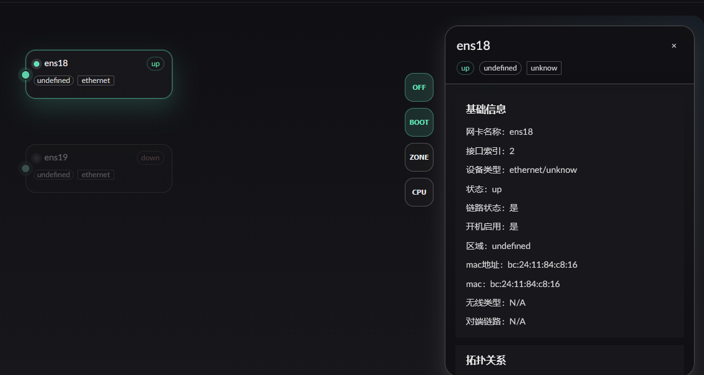
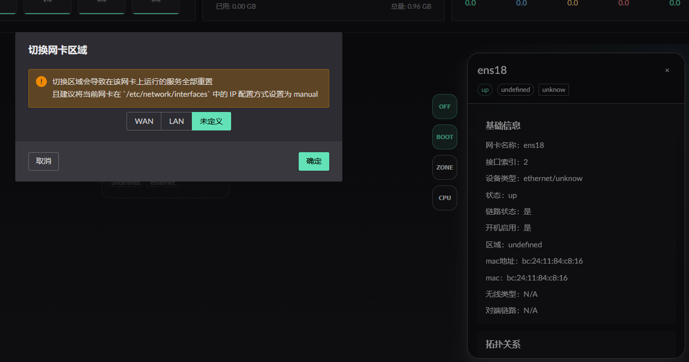

最终效果, 两张网卡在正确的区域, 并且都处于 UP 状态.

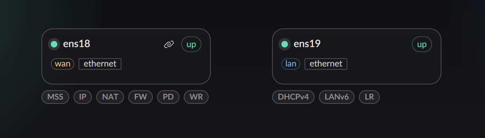

::: details 我的网卡状态为 `DOWN` 怎么办
当网卡的状态是处于 `DOWN` 时, 需要将网卡启动, 并设置开机启动. 点击网卡面板左侧的 `ON` / `BOOT` 按钮. 依次开启即可.
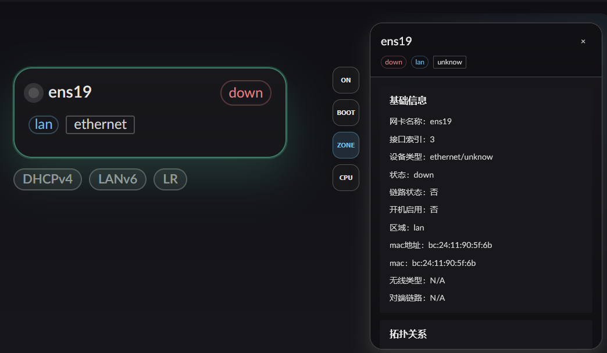

如果设置了之后网卡还是 DOWN. 请确保网线是否已接入
:::

## 配置 WAN 口让路由自己能上网

点击所在网卡的卡片下方的 `IP` 按钮:
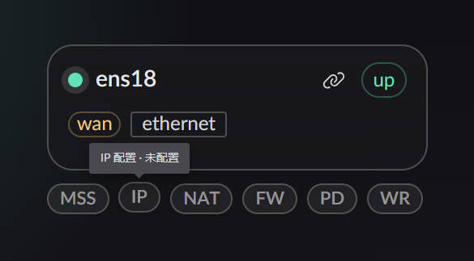

WAN 口需要配置 IP 才能连上互联网，有三种方式，根据你的网络环境选择一种。

::: tabs
== DHCP 自动获取

适合光猫拨号、上级路由器已开启 DHCP 的场景。

1. 确保网卡已分配为 **WAN** 区域
2. 选择 **DHCP 客户端** 配置方式
3. 填写主机名称（可选，留空则使用当前主机名）
4. 点击保存

== PPPoE 拨号

适合光猫桥接模式，需要用宽带账号密码拨号。

1. 确保网卡已分配为 **WAN** 区域
2. 进入页面 **IPv4 相关**，点击 **PPPoE** 标签
3. 在 WAN 网卡上添加 PPPoE 账号
4. 填入宽带账号和密码
5. 在 PPPoE 账号中开启 **设为默认路由**
6. AC Name 通常留空即可

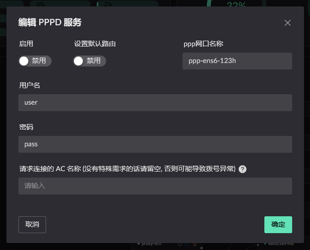

== 静态 IP

适合企业专线、需要固定 IP 的场景。

1. 确保网卡已分配为 **WAN** 区域
2. 选择 **静态 IP** 方式
3. 填入 IP 地址、子网掩码、网关
4. 如需作为默认路由，开启 **IPv4 默认路由**
5. 点击保存

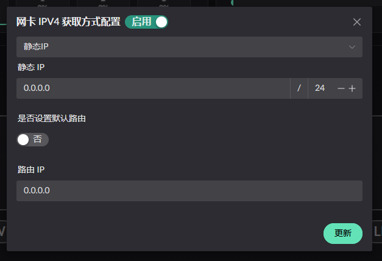

:::

到目前为止我们配置了路由自己的上网方式. 接下来我们配置对 LAN 侧的 IP 分配

## 配置 LAN 口, 为内网分配 IP

LAN 口连接内网设备，通常启用 DHCPv4 服务。

1. 确保网卡已分配为 **LAN** 区域

2. 点击网卡下方的 `DHCPv4` 服务按钮
   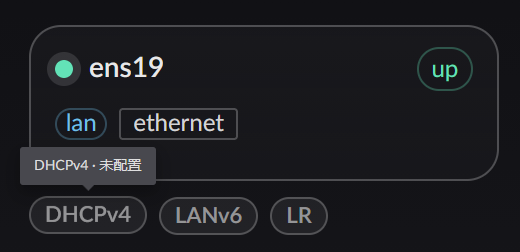

3. 配置所使用的子网
   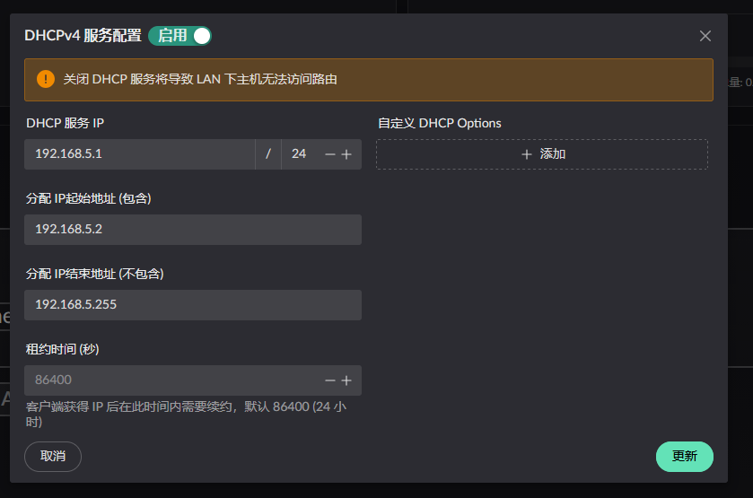
4. 点击保存

## 配置 WAN / LAN 转发路由服务

在进行了以上步骤配置后. 当前的网络状态:

1. LAN 可以通过 DHCPv4 的配置访问路由
2. 当前路由可以上网.
3. LAN 侧的设备无法进行上网.

::: danger 开启 WAN NAT 服务需注意!!!
打开 `NAT 服务` 前, 假设您是从 `WAN 网卡` 访问的, 需要设置 `静态 NAT 映射`. 否则将会`失联`!
:::

::: details 静态 NAT 映射方式
点击左侧菜单 `静态 NAT` 进入 静态 NAT 配置页面.
点击添加按钮, 按照如下配置, 即可在 wan 进行访问. 如果通过 lan 连接. 则可以忽略
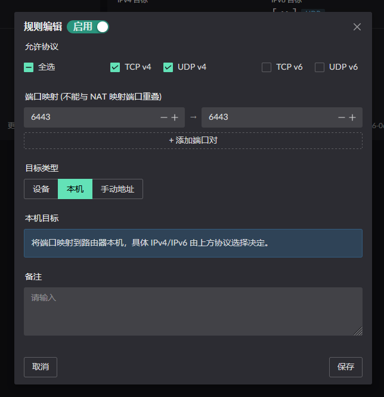

:::

这是需要打开 WAN/LAN 的路由转发服务, 以及 NAT 服务:
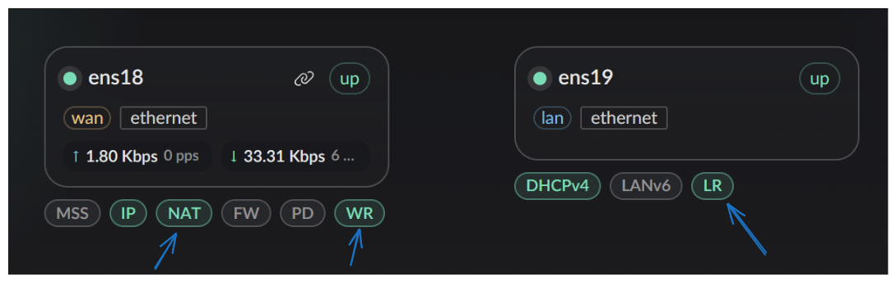

## 验证网络连通性

配置完成后，检查网络是否正常工作：

1. 打开 **指标监控 → 连接信息** 查看当前连接状态
2. 在内网设备上执行 `ping 8.8.8.8` 测试外网连通
3. 执行 `nslookup baidu.com` 测试 DNS 解析

::: tip 下一步
基础网络配置完成后，建议继续配置 [DNS 配置](./dns-setup) 和 [分流配置](./flow-setup)。
:::
