# Basic Network Setup

> This guide walks you through Landscape Router's basic network configuration: assigning zones to your network interfaces and setting up IP addresses, so your router can get online.

## The starting state

The virtual machine currently has two network interfaces: `ens32`, `ens33`.
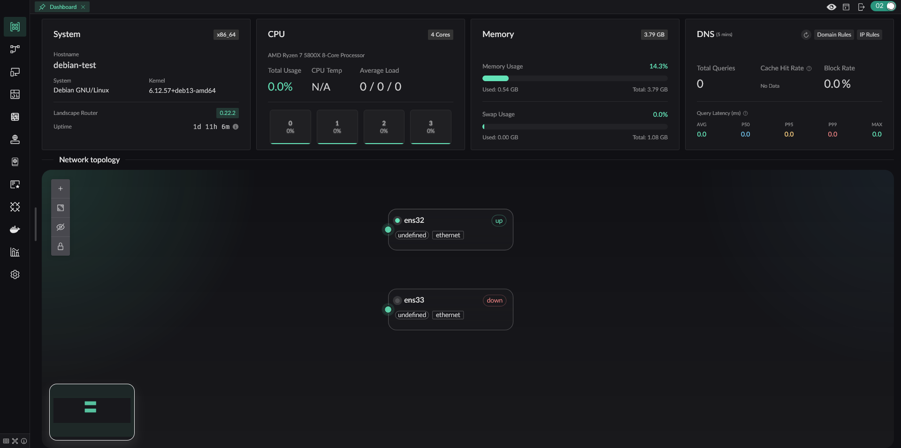

## Switching interface zones

Before anything can be configured, each interface must first be switched to a specific zone.

::: tip In simple terms
**WAN** = the port connected to the modem / external network  
**LAN** = the port connected to your PC / switch.

For details, see: [Zone](../reference/interface-zone)
:::

Click the interface you want; it will highlight. The `interface panel` expands on the right — click `ZONE` to open the zone switching settings.

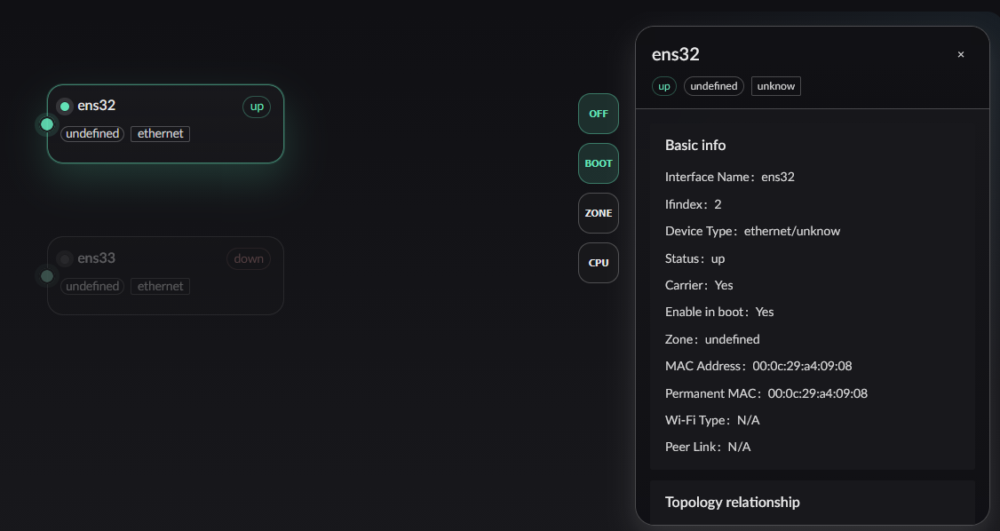
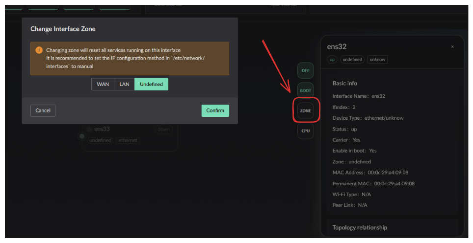

The final result: both interfaces are in the correct zones and are both `UP`.

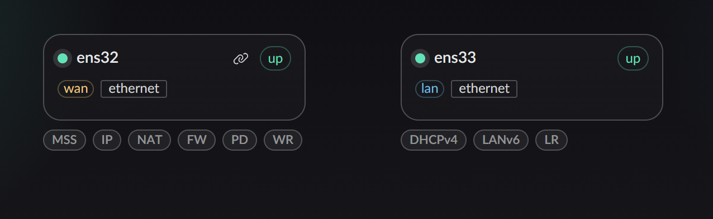

::: details My interface is `DOWN`, what should I do
When an interface is `DOWN`, you need to bring it up and set it to start on boot. Click the `ON` / `BOOT` buttons on the left of the interface panel, enabling them one by one.
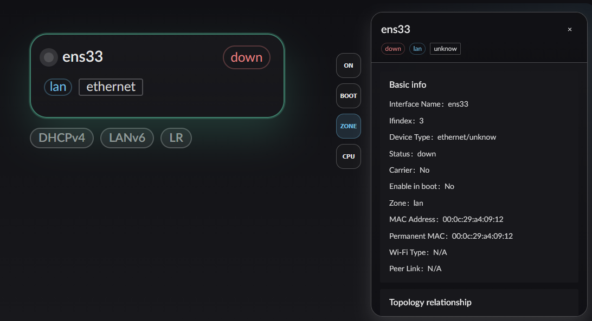

If the interface is still DOWN after that, make sure the network cable is plugged in.
:::

## Configuring the WAN port so the router can get online

Click the `IP` button below the interface card:
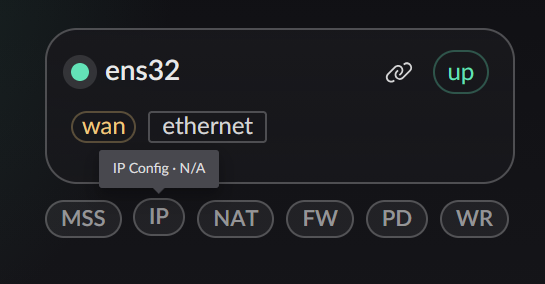

The WAN port needs an IP address to reach the internet. There are three ways to do it — pick the one that matches your network environment.

::: tabs
== DHCP client

For scenarios where the modem dials up or the upstream router already has DHCP enabled.

1. Make sure the interface is assigned to the **WAN** zone
2. Select the **DHCP client** configuration method
3. Fill in a hostname (optional; leave empty to use the current hostname)
4. Click save

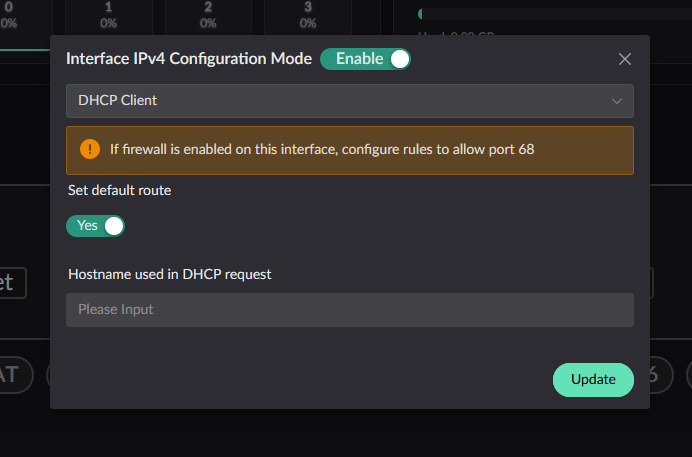

== PPPoE dial-up

For when the modem is in bridge mode and you need to dial up with your broadband account and password.

1. Make sure the interface is assigned to the **WAN** zone
2. Go to the **IPv4** section of the page and click the **PPPoE** tab
3. Add a PPPoE account on the WAN interface
4. Fill in the broadband account and password
5. Enable **Set as default route** on the PPPoE account
6. AC Name can usually be left empty

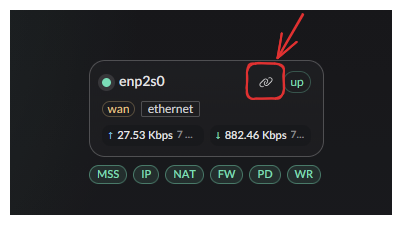

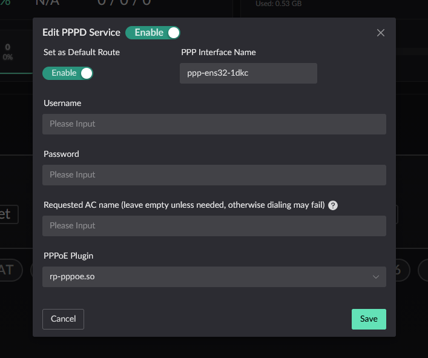

== Static IP

For enterprise dedicated lines or scenarios requiring a fixed IP.

1. Make sure the interface is assigned to the **WAN** zone
2. Select the **Static IP** method
3. Fill in the IP address, subnet mask and gateway
4. If it should be the default route, enable **IPv4 default route**
5. Click save

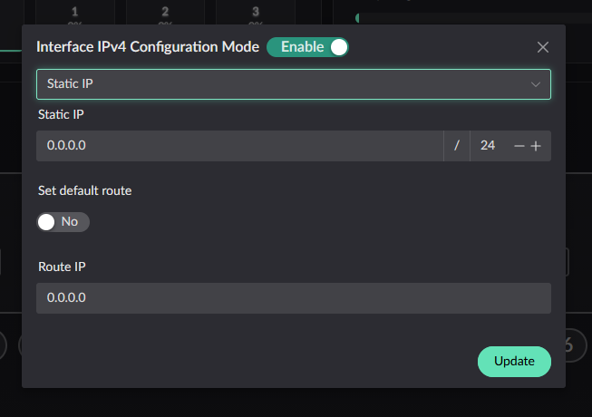

:::

So far we have configured how the router itself gets online. Next, we configure IP assignment on the LAN side.

## Configuring the LAN port to assign IPs to the internal network

The LAN port connects internal devices; the DHCPv4 service is usually enabled on it.

1. Make sure the interface is assigned to the **LAN** zone

2. Click the `DHCPv4` service button below the interface
   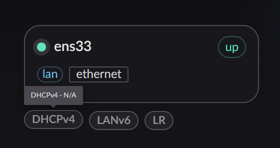

3. Configure the subnet to use
   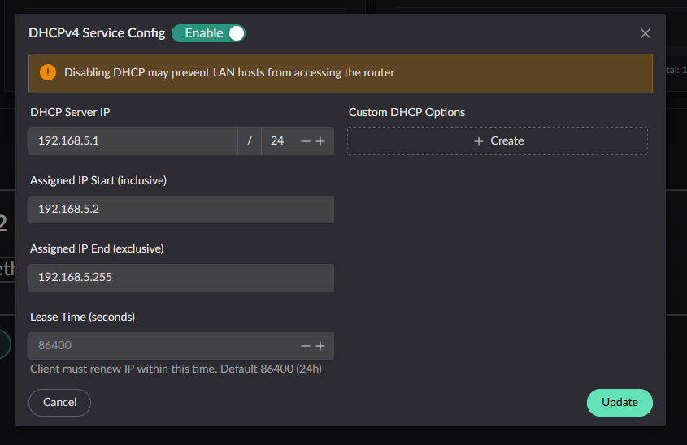
4. Click save

## Configuring WAN / LAN forwarding and routing services

After the steps above, the current network state is:

1. LAN devices can reach the router via the DHCPv4 configuration
2. The router itself can get online
3. LAN-side devices cannot access the internet

::: danger Enable WAN NAT with care!!!
Before enabling the `NAT service`, if you access the router **from the WAN interface**, you must set up a `Static NAT mapping`. Otherwise you will **lose connection**!
:::

::: details Static NAT mapping
Click **Static NAT** in the left menu to open the static NAT configuration page.
Click the add button and configure as shown below to access the router from WAN. If you connect via LAN, you can ignore this.
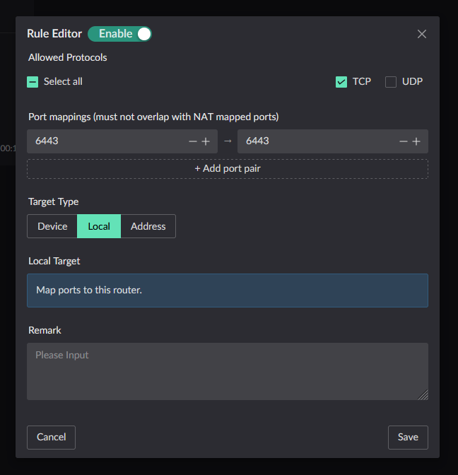

:::

Now enable the WAN/LAN routing and forwarding services, as well as the NAT service:
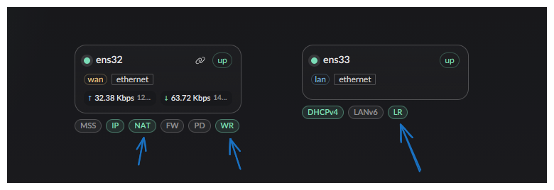

## Verifying network connectivity

After configuration, check that the network works normally:

1. Open **Metrics Monitoring → Connection Info** to view the current connection status
2. Run `ping 8.8.8.8` on an internal device to test internet connectivity
3. Run `nslookup baidu.com` to test DNS resolution

::: tip Next steps
After the basic network configuration, we recommend continuing with [DNS Setup](./dns-setup) and [Flow Setup](./flow-setup).
:::
