# DNS 配置

> 本文引导你完成 DNS 相关配置：设置上游 DNS 服务器、创建重定向规则，确保内网设备可以正常解析域名。

Landscape 默认启用的上游 DNS 服务商是 Cloudflare. 可以进行更换.

## 配置上游 DNS 服务器

上游 DNS 是 Landscape Router 用来解析域名的外部 DNS 服务。

1. 在左侧菜单中选择 **DNS 相关**
2. 找到 **上游 DNS** 二级菜单
3. 点击添加新上游, 或是修改已有上游, landscape 提供了多种预设, 以供快速填充.
   
4. 可添加多个上游 DNS 实现不同的域名使用不同的 DNS 进行解析, 如下我添加了一个并修改了默认的. 用于之后的演示
   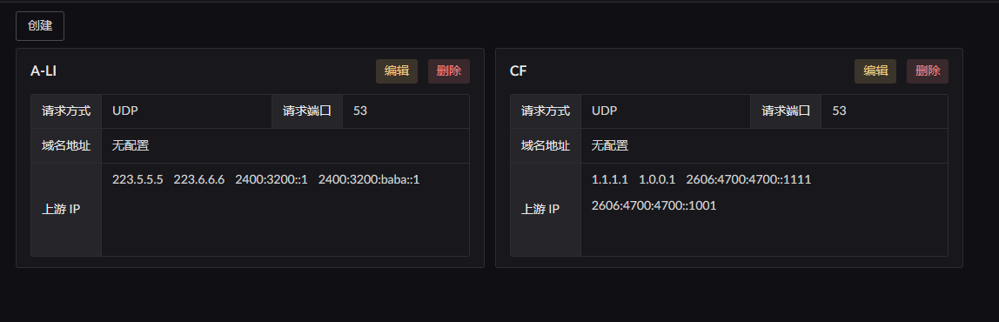

## 使用刚刚配置的 DNS 上游

刚刚我们进行了上游的配置, 但是`什么域名`要使用`什么上游`, 是在额外的位置进行配置.

我们点击左侧菜单 `分流设置` 进入`分流配置`页面. 点击 `默认 Flow` 卡片上的 `DNS` 按钮
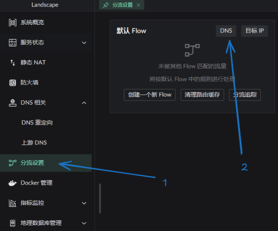

将会弹出 DNS 规则列表:
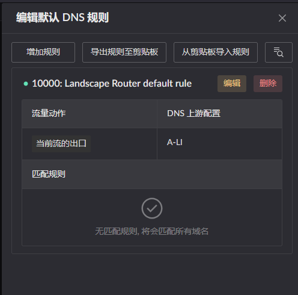
这个列表中有一条 `默认` 规则, 我们主要关心这几件事:

1. 这个规则的优先级是 `10000`
2. 这条规则的上游是 `A-LI`, 也就上一步配置的 DNS
3. 这条规则的配置 `规则为空` -> 并且有提示, 将会匹配所有的规则

也就是说明. 当前访问所有的域名都将命中这一条规则.
我们可以通过点击头部右侧的查询进行查询 DNS 验证规则的生效情况.
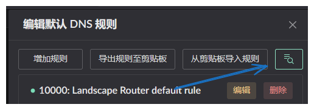

打开后可以看到这几个部分:

1. 是`哪个 Flow` 的 DNS 检查 -> Flow0 也就是默认 Flow
2. `查询的域名`是什么, 按钮是快速查询的域名
3. 被查询域名是被`哪条规则所处理` -> 可以看到是刚刚那条默认规则
4. 上游 DNS 的查询`结果`
5. 内部缓存结果, 可以用于对比缓存与实时`差别`
   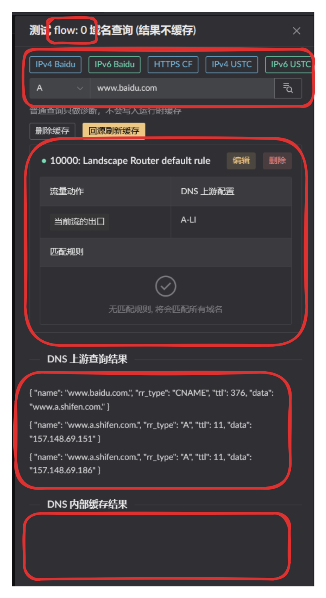

可以看到当前 `www.baidu.com` 是被默认流处理了. 那么我们现在增加一个规则.  
展示两种情况:
::: tabs
== 新增规则优先级小于 10000

  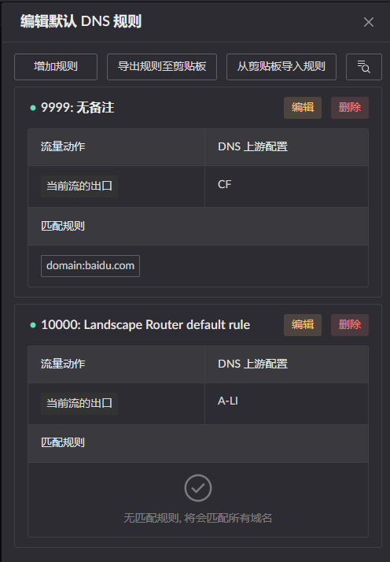
  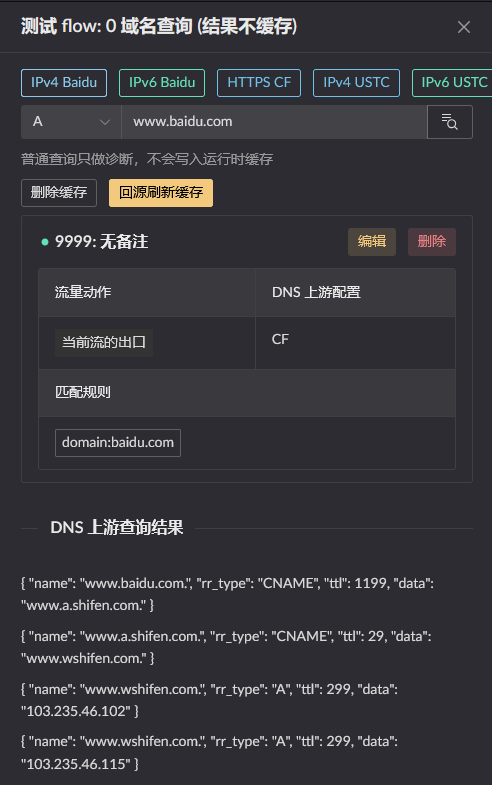
  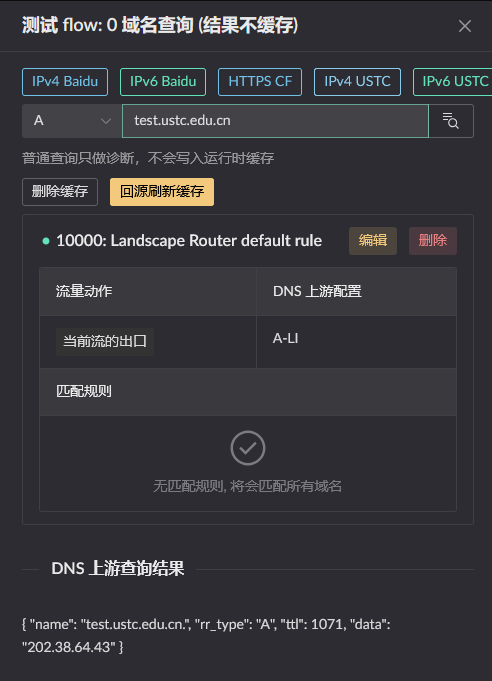

1. 查询 `www.baidu.com` -> 被 9999 捕获 -> 结束
2. 查询 `test.ustc.edu.cn` -> 9999 不能匹配, 跳过 -> 被 10000 捕获 -> 结束

== 新增规则优先级大于 10000

  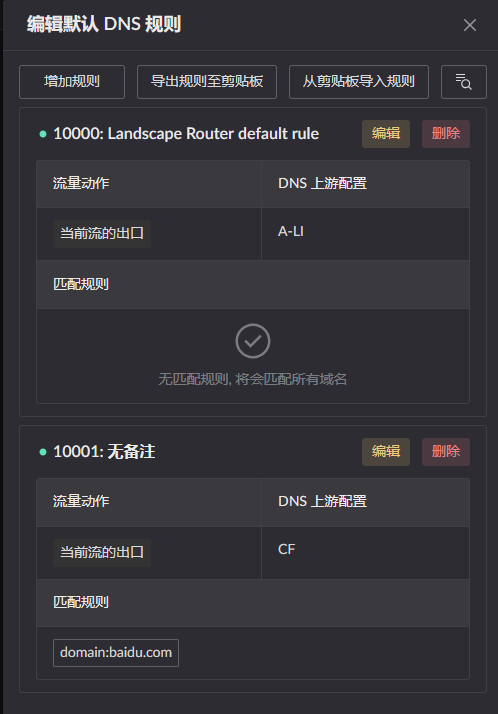
  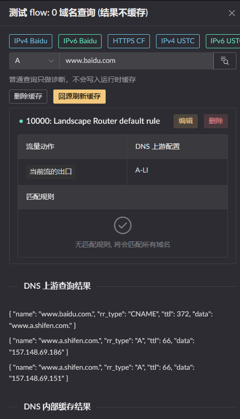
  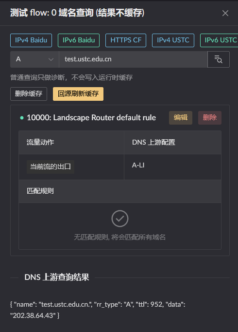

1. 查询 `www.baidu.com` -> 被 10000 捕获 -> 结束
2. 查询 `test.ustc.edu.cn` -> 被 10000 捕获 -> 结束

:::

可以看到 DNS 规则的匹配是按照优先级进行的, 当域名从上往下匹配到第一个规则, 则按那个规则进行处理.
