# DNS Setup

> This guide walks you through DNS configuration: setting upstream DNS servers and creating redirect rules, so devices on your LAN can resolve domains properly.

By default Landscape uses Cloudflare as the upstream DNS provider. You can change it.

## Configuring upstream DNS servers

An upstream DNS is the external DNS service Landscape Router uses to resolve domains.

1. Pick **DNS** in the left-hand menu
2. Find the **Upstream DNS** submenu
3. Click add to create a new upstream, or edit an existing one. Landscape ships several presets you can use to fill the form quickly.
   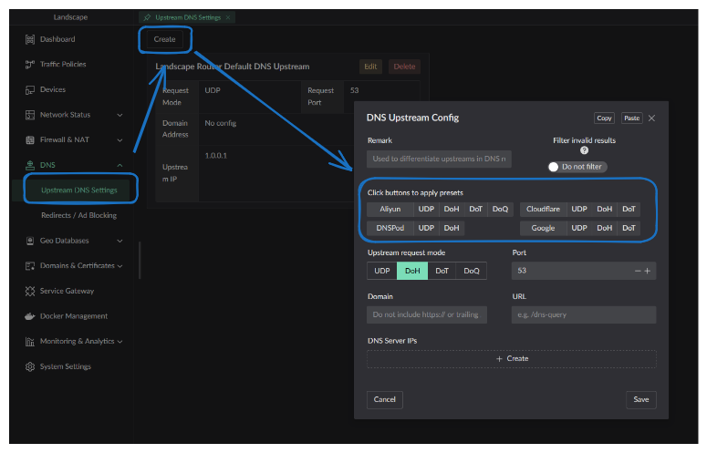
4. You can add multiple upstreams so different domains resolve through different servers. Below I added one and modified the default, which the rest of this page builds on.
   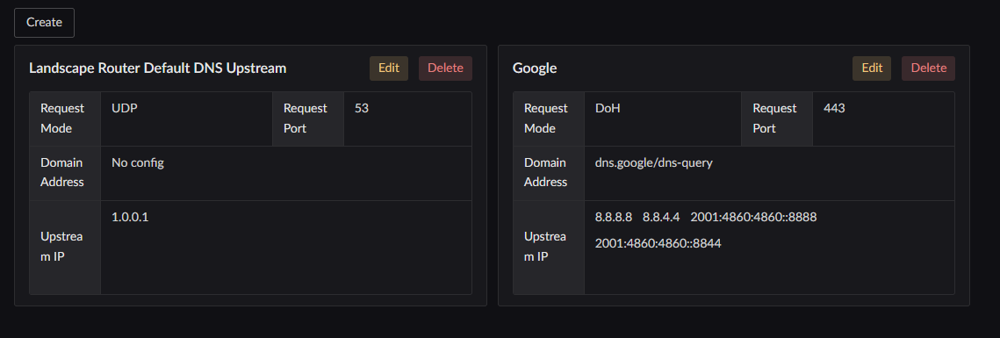

## Using the upstream you just configured

We have configured an upstream, but `which domain` uses `which upstream` is decided somewhere else.

Click `Flow Settings` in the left-hand menu to open the `flow configuration` page, then click the `DNS` button on the `Default Flow` card.
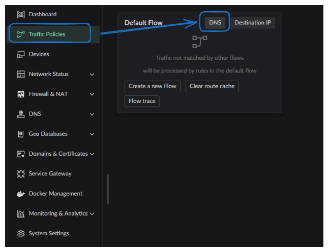

The DNS rule list opens:
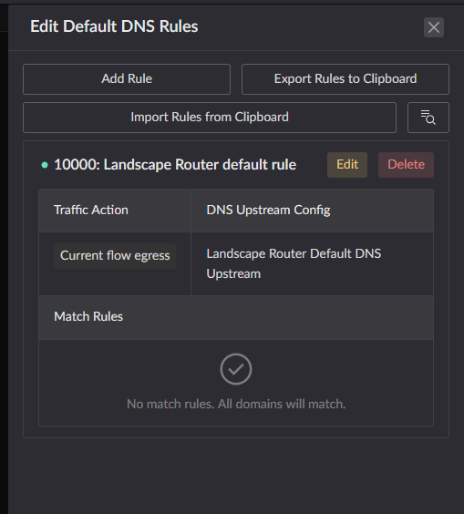

There is one `default` rule in this list. Three things matter here:

1. The rule's priority is `10000`
2. Its upstream is `Default`
3. Its match rules are `empty` — and the hint says it will match everything

In other words, every domain you visit right now hits this one rule.
You can use the query button at the top right to run a DNS query and check how rules are being applied.
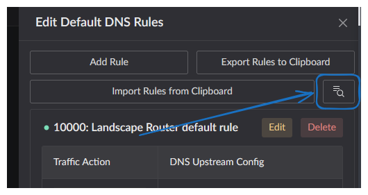

Once open you will see these parts:

1. `Which Flow` the DNS check runs against — Flow0, i.e. the default Flow
2. The `domain being queried`; the buttons are shortcuts for common domains
3. `Which rule handled` the queried domain — here it is that default rule
4. The `result` from the upstream DNS
5. The internal cache result, useful for spotting `differences` between cache and live answers
   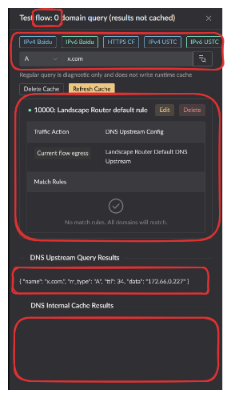

So `x.com` is currently handled by the default flow. Now let us add a rule.  
Two cases to compare:

::: tabs
== New rule with priority lower than 10000

  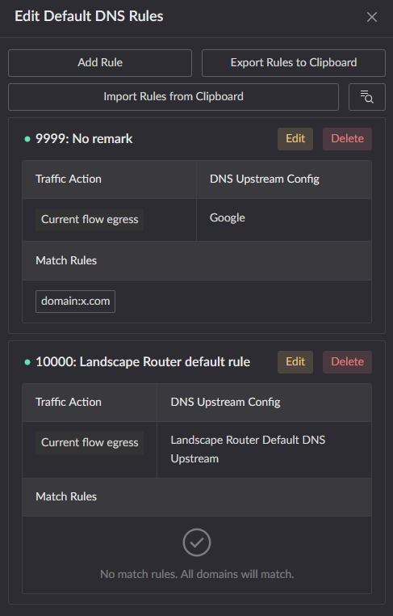
  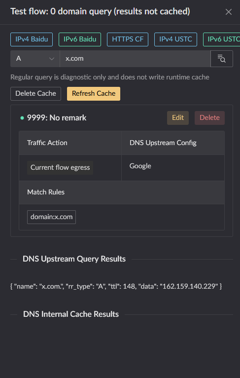
  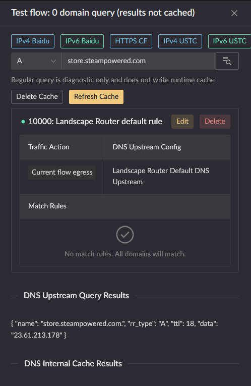

1. Query `x.com` -> caught by 9999 -> done
2. Query `store.steampowered.com` -> 9999 does not match, skipped -> caught by 10000 -> done

== New rule with priority higher than 10000

  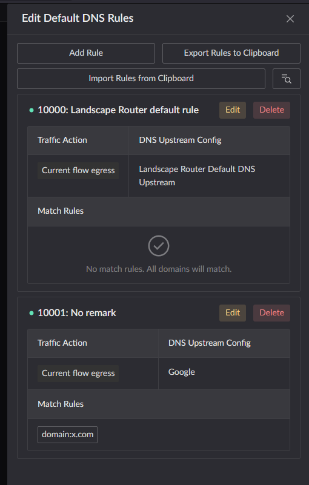
  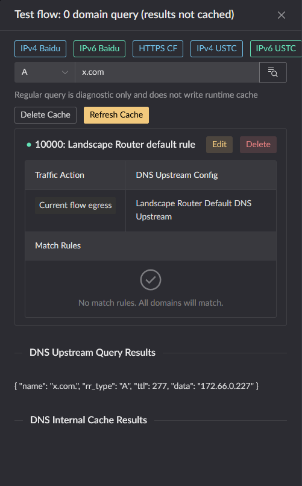
  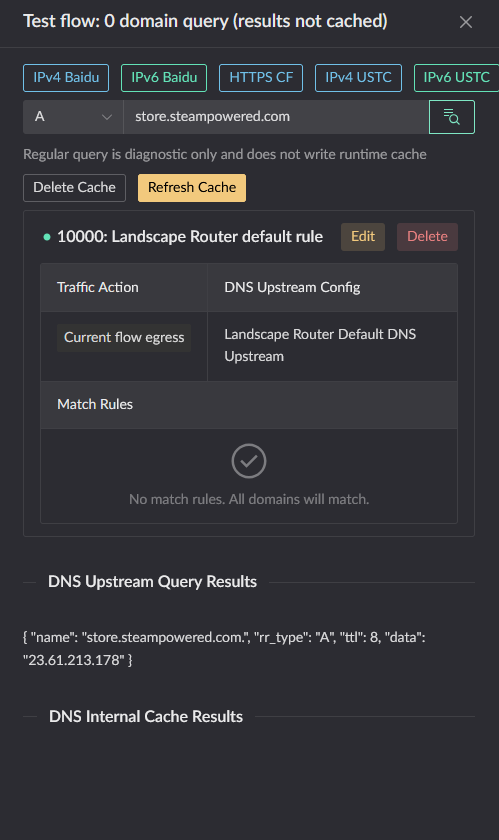

1. Query `x.com` -> caught by 10000 -> done
2. Query `store.steampowered.com` -> caught by 10000 -> done

:::

As you can see, DNS rules are matched in priority order: a domain is matched from the top down, and the first rule it hits is the one that handles it.
