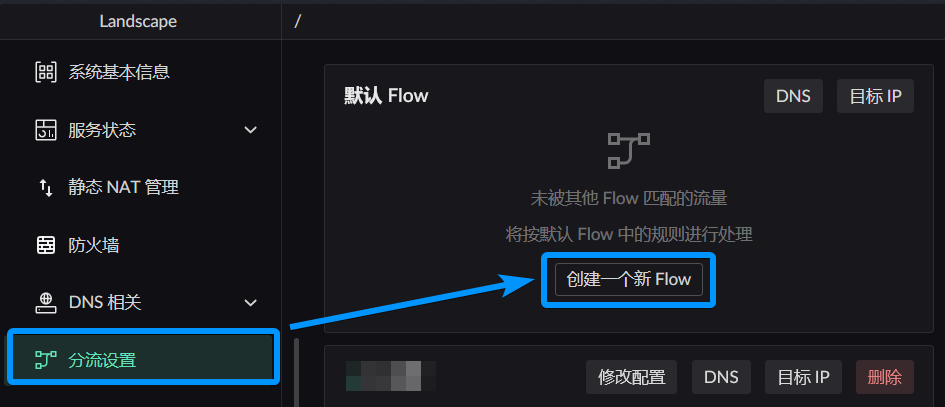
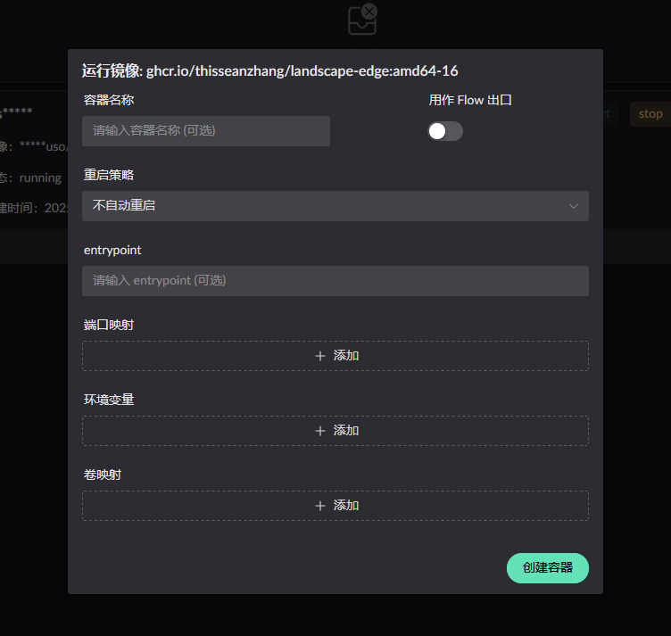

# 分流配置

> 本文引导你完成分流 (Flow) 的配置：理解核心概念、创建第一个分流、设置规则，实现对不同流量的精细控制。

## 第一步：理解核心概念

在开始配置之前，先了解三个核心概念：

| 概念           | 说明                                               | 简单类比           |
| -------------- | -------------------------------------------------- | ------------------ |
| **Flow（流）** | 一组流量策略，决定数据包「从哪来、到哪去」         | 一条自定义的管道   |
| **入口**       | 匹配来源设备（IP/MAC），决定「谁的流量」进入这个流 | 管道的入水口过滤器 |
| **出口**       | 流量的最终出口（Docker 容器或 WAN 网卡）           | 管道通向的地方     |

### 默认流 (Flow 0)

系统内置的默认流，所有**未被其他流匹配**的流量走这里，出口是拓扑中设置的**默认路由**。

### 自定义流 (Flow 1~255)

你创建的流，按入口规则匹配。匹配成功后流量走该流定义的出口。

::: tip 匹配逻辑

1. 检查 DNS 规则和 IP 规则
2. 优先级数值越小越优先
3. 匹配上即发往出口，不再继续匹配
   :::

更多细节参考：[分流控制详细文档](../features/traffic-flow)

## 第二步：创建你的第一个 Flow

1. 进入侧边栏 **分流设置**
2. 点击创建新 Flow 按钮：

3. 弹出配置窗口，填写：

| 配置项   | 说明                                          |
| -------- | --------------------------------------------- |
| **入口** | 匹配源 IP 或 MAC，指定哪些设备走这个流        |
| **出口** | 选择 WAN 网卡或 Docker 容器，流量最终从哪出去 |

::: info 灵活配置
不是入口的所有流量

## 第三步：配置 DNS 规则

DNS 规则控制**访问什么域名时走什么出口**。

1. 进入 Flow 的 DNS 规则配置：

每条 DNS 规则包含：

| 组成部分     | 说明                                |
| ------------ | ----------------------------------- |
| **域名匹配** | 触发规则的域名（如 `*.google.com`） |
| **DNS 上游** | 解析该域名使用的上游 DNS            |
| **流量动作** | 匹配后流量走哪个出口                |
| **优先级**   | 数值越小越优先                      |

### 兜底规则（必须配置）

每个 Flow 至少需要一条兜底 DNS 规则，处理**未匹配任何域名规则**的流量：

## 第四步：配置 IP 规则（可选）

如果需要对特定 IP 段做分流，可以配置 IP 规则：

- **目标 IP/CIDR**：匹配的目标地址
- **流量动作**：选择出口
- **优先级**：与 DNS 规则优先级冲突时的判定依据

::: warning 优先级冲突
当 DNS 规则和 IP 规则

## 第五步：验证分流效果

1. 在匹配入口规则的设备上访问特定网站
2. 打开 **指标监控 → 连接信息** 查看该连接归属的 Flow
3. 确认流量是否通过预期的出口发出

## 高级用法：Docker 容器作为出口

如果需要用 Docker 容器（如代理程序）作为流出出口：

1. 准备包含**接应程序** (`redirect_pkg_handler`) 的 Docker 镜像
2. 在 UI 创建容器时勾选 **用作 Flow 出口**

详细说明参考：[分流控制 - Docker 容器出口](../features/traffic-flow#如何使用-docker-容器作为流出口)

## 相关阅读

- [分流控制详细文档](../features/traffic-flow)
- [DNS 配置](./dns-setup)
- [DNS 服务常见问题](../faq/dns)
