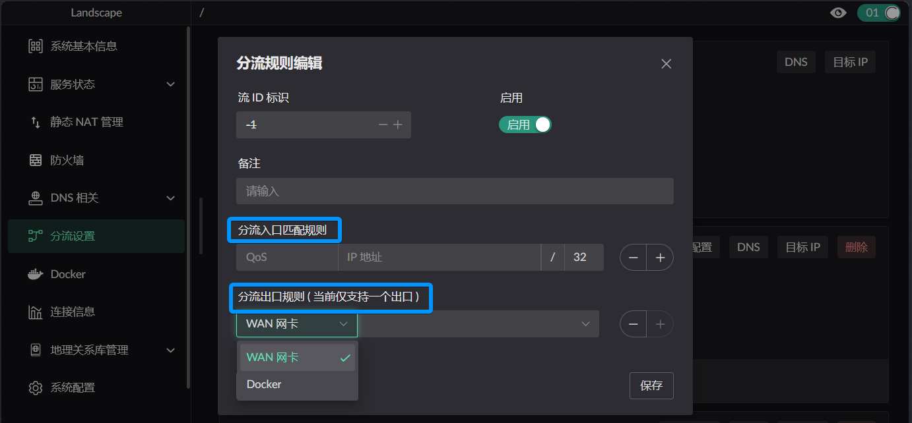
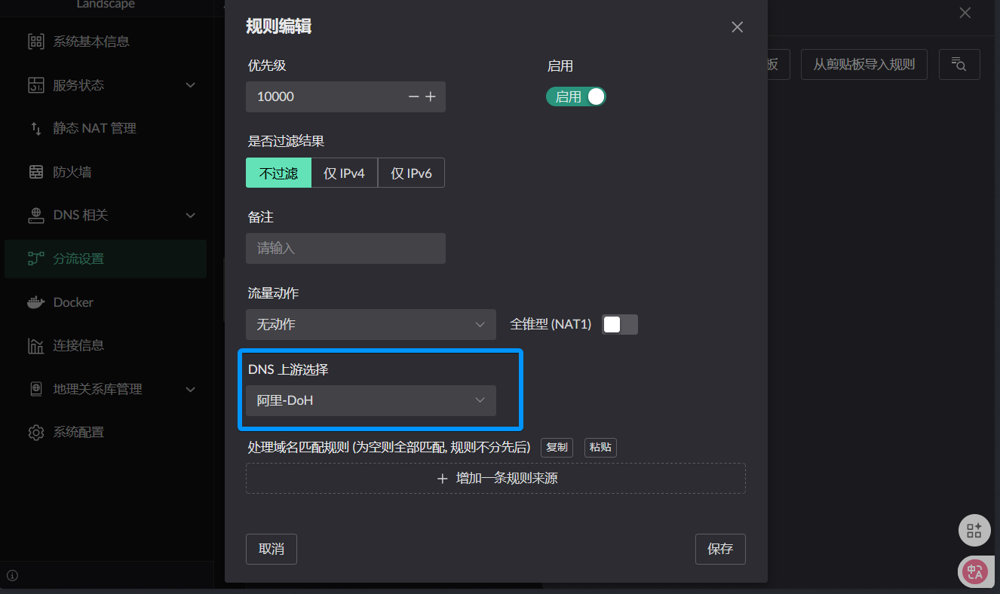
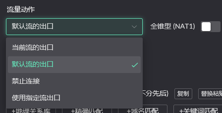
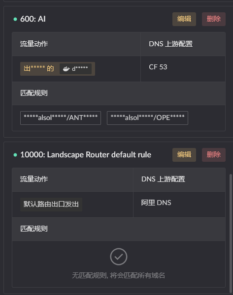

# 分流配置

> 本文引导你完成分流 (Flow) 的配置：创建 Flow、设置入口/出口、配置 DNS 和 IP 分流规则，实现对不同流量按不同路径转发。

## 核心概念速览

在开始之前，先了解几个核心概念：

| 概念         | 说明                                                           | 类比               |
| ------------ | -------------------------------------------------------------- | ------------------ |
| **Flow**     | 一组流量策略，包含入口规则、出口、分流规则                     | 一条自定义管道     |
| **入口规则** | 匹配来源设备（设备/MAC/IP），决定「谁的流量」进入这个 Flow     | 管道的入水口过滤器 |
| **出口**     | 流量的最终出口（WAN 网卡或 Docker 容器），可配置多个并设置权重 | 管道通向的地方     |
| **分流规则** | DNS 规则和 IP 规则，决定进入 Flow 的流量「具体走哪个出口」     | 管道内部的分岔口   |

### 两种 Flow

- **默认 Flow (ID 0)**：系统内置，所有未被其他 Flow 匹配的流量走这里，出口为默认路由。
- **自定义 Flow (ID 1~255)**：你创建的 Flow，按入口规则匹配设备，支持 DNS/IP 规则对流量做进一步细分。

::: tip 更多细节
参考：[分流控制详细文档](../features/traffic-flow)
:::

## 场景设定

在接下来的配置中，我们假设以下场景贯穿全文：

> 家里有**两条宽带**：电信（WAN1）和联通（WAN2）。
>
> - **电视盒子**走电信宽带
> - **其余设备**走联通宽带
> - 电视盒子访问 **淘宝** 等部分域名时，切回联通宽带（利用联通线路对国内站点的优化）

这个场景会帮助你理解每一步配置的实际意义。

## 创建自定义 Flow

### 进入分流设置页面

点击左侧菜单 **分流设置** 进入分流页面，你会看到：

- **默认 Flow 卡片** — 展示默认流的 DNS / IP 规则入口，底部有「创建一个新 Flow」按钮和「分流追踪」按钮
- **自定义 Flow 卡片** — 每个你创建的 Flow 对应一张卡片，显示入口规则和出口信息

### 新建 Flow

点击「创建一个新 Flow」按钮：

弹出的配置窗口如下：

配置项说明：

| 配置项       | 说明                                           |
| ------------ | ---------------------------------------------- |
| **流 ID**    | Flow 的唯一标识，范围 1~255，不可重复          |
| **启用**     | 开关控制 Flow 是否生效                         |
| **备注**     | 便于你自己识别这个 Flow 的用途                 |
| **入口规则** | 匹配哪些设备进入这个 Flow                      |
| **出口规则** | 匹配到的流量默认从哪些出口发出，支持多出口加权 |

Flow 的配置有三种常见模式：

::: tabs
== 入口规则 + 出口（最常用）

入口匹配指定设备，匹配到的设备流量**默认**走设定的出口。还可以通过 DNS/IP 规则将部分流量重定向到其他出口。

在本场景中，为电视盒子创建 Flow 1，入口匹配电视盒子，出口选电信 WAN。

== 仅配置出口

只设置出口，不设入口规则。这样的 Flow 本身不直接接收流量，但可被其他 Flow 的 DNS/IP 规则**作为分流目标**引用。

例如：创建一个 Flow 2（仅出口，指向联通 WAN），供 Flow 1 的域名规则引用，让特定域名切回联通。

== 仅配置入口

只设置入口，不设出口。匹配进来的流量**默认被丢弃**，除非通过 DNS/IP 规则重定向到其他 Flow 的出口。

:::

在我们的场景中，选择第一种模式。

### 配置入口规则

入口规则决定**哪些设备**的流量进入这个 Flow。支持三种匹配方式：

| 匹配方式 | 说明                                           | 适用场景             |
| -------- | ---------------------------------------------- | -------------------- |
| 设备     | 从已登记设备中选择                             | 设备已通过 DHCP 登记 |
| MAC 地址 | 手动输入 MAC 地址                              | 设备未登记或静态 IP  |
| IP 地址  | 输入 IP 地址 + 前缀长度（如 `192.168.1.0/24`） | 按子网批量匹配       |

#### 场景操作

为电视盒子创建 Flow 1，点击「增加一条入口匹配规则」：

- 选择 **MAC 地址**模式，输入电视盒子的 MAC 地址
- 流 ID 设为 `1`，备注写「电视盒子 - 电信」
- 出口类型选 **WAN 网卡**，选择电信对应的 WAN 网卡

::: tip 入口规则注意

- 多个入口规则之间是「或」关系，满足任一条即进入此 Flow
- 匹配优先级：IP > MAC
- 不同 Flow 的入口规则不应有重叠，否则只有其中一个 Flow 生效
  :::

### 配置出口

出口支持两种类型，每种可设置权重（权重越高分配流量越多）：

| 出口类型 | 说明                     |
| -------- | ------------------------ |
| WAN 网卡 | 选择 WAN 区域的网卡      |
| Docker   | 选择用作 Flow 出口的容器 |

::: info 多出口负载均衡
如果配置了多个出口，流量将按权重比例分配。例如电信权重 3、联通权重 1，约 75% 的流量走电信。
:::

配置完成后点击保存。现在电视盒子的流量会走电信宽带。

## 配置 DNS 分流规则

仅仅把设备指向一条宽带还不够 —— 如果想让**特定域名**走不同出口，需要配置 DNS 分流规则。

### 规则结构

每条 DNS 规则定义：

| 组成部分     | 说明                                                 |
| ------------ | ---------------------------------------------------- |
| **域名匹配** | 触发规则的域名（如 `*.taobao.com`）                  |
| **DNS 上游** | 解析该域名时使用的上游 DNS（可选，不填使用默认上游） |
| **流量动作** | 匹配后流量如何处理                                   |
| **优先级**   | 数值越小优先级越高，用于多条规则冲突时的判定         |

### 为 Flow 添加 DNS 规则

1. 在 Flow 1 的卡片上点击 **DNS** 按钮，打开 DNS 规则侧边栏
2. 点击添加规则，进入编辑窗口：

### 流量动作详解

流量动作决定了匹配到的流量最终怎么走：

| 动作               | 说明                            |
| ------------------ | ------------------------------- |
| **当前流的出口**   | 使用当前 Flow 配置的出口发送    |
| **默认流的出口**   | 使用默认路由（Flow 0 出口）发送 |
| **禁止连接**       | 丢弃该流量，禁止访问            |
| **使用指定流出口** | 重定向到另一个 Flow 的出口      |

#### 场景操作

为 Flow 1 添加 DNS 规则，让电视盒子访问淘宝时切回联通宽带：

1. 首先创建 Flow 2 —— 仅配置出口，指向联通对应的 WAN 网卡
2. 回到 Flow 1，点击 DNS 进入 DNS 规则侧边栏
3. 添加规则：域名匹配 `*.taobao.com`，流量动作选「**使用指定流出口**」→ Flow 2
4. 优先级设为 `1000`

### 兜底规则（必须配置）

每个 Flow 至少需要一条**兜底 DNS 规则**，处理那些**没匹配到任何域名规则**的流量。Flow 1 需要加一条：

- 域名匹配保持**为空**（匹配所有域名）
- 流量动作选**当前流的出口**
- 优先级设较大值（如 `10000`），确保在所有具体域名规则之后才被命中

::: tip 匹配顺序

1. DNS 规则按优先级从小到大依次匹配
2. 命中第一条匹配的规则后即停止
3. 无匹配时，流量走该 Flow 的默认出口
   :::

## 配置 IP 分流规则（可选）

IP 规则与 DNS 规则类似，但匹配的是**目标 IP 地址**而非域名。

### 什么时候用 IP 规则？

- 已知目标服务的 IP 段且较为固定
- 需要按 IP 归属地分流（配合 GeoIP 标签）
- 不需要经过 DNS 解析即可确定流量归属

### 场景操作

在 Flow 1 中添加一条 IP 规则，让到 `1.1.1.0/24` 网段的流量直连默认路由：

1. 在 Flow 1 卡片上点击 **目标 IP** 按钮
2. 添加规则，目标 IP 填写 `1.1.1.0/24`
3. 流量动作选择**默认流的出口**
4. 优先级设为 `500`

::: warning DNS 与 IP 规则冲突
当同一数据包同时被 DNS 规则和 IP 规则匹配、且优先级相同时，DNS 规则优先。
:::

## 验证分流效果

配置完成后，Landscape 提供**分流追踪**工具帮助你在发送实际流量之前验证规则效果。

在默认 Flow 卡片上点击**分流追踪**按钮，工具分为两步：

### 第一步：匹配源客户端

选择或手动输入客户端（设备 / MAC / IP），点击「查询 Flow 匹配」，查看该客户端会被哪个 Flow 处理。

### 第二步：查询目标

输入域名或 IP 地址，系统会：

1. 对域名进行 DNS 解析
2. 展示解析到的每个 IP 分别命中哪条 DNS 规则 / IP 规则
3. 展示最终的出口动作
4. 对比路由缓存与当前配置是否一致

::: tip 缓存一致性
如果追踪结果提示缓存与配置不一致，点击「清除路由缓存」按钮让新规则立即生效。
:::

#### 场景验证

1. 第一步选择电视盒子 → 确认匹配到 **Flow 1**
2. 第二步输入 `www.taobao.com` → 确认出口指向 **Flow 2**（联通 WAN）
3. 第二步输入 `www.baidu.com` → 确认走 Flow 1 的**默认出口**（电信 WAN）

也可以在设备上实际访问后，打开**指标监控 → 连接信息**查看实时连接的 Flow 归属。

## 下一步

- [分流控制详细文档](../features/traffic-flow) — 了解 Flow 的完整设计和高级用法（多出口加权、Docker 容器出口等）
- [DNS 配置](./dns-setup) — 配置上游 DNS 服务器
- [基础上网配置](./basic-network-setup) — 回顾基础网络配置
