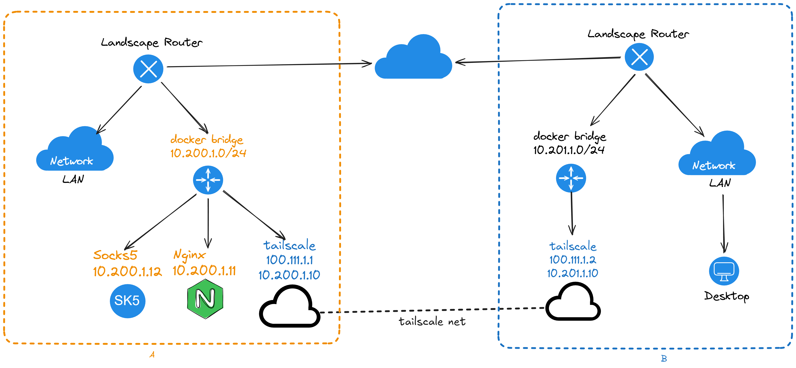
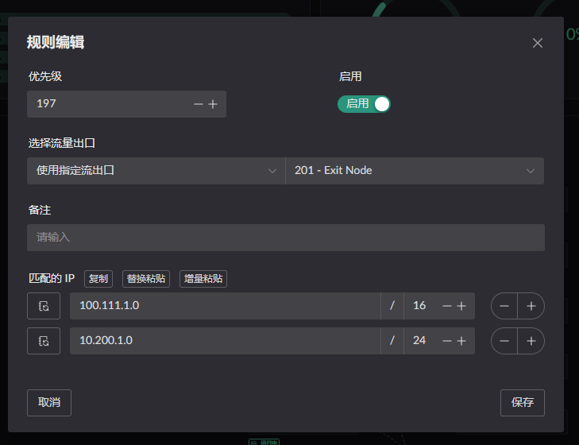
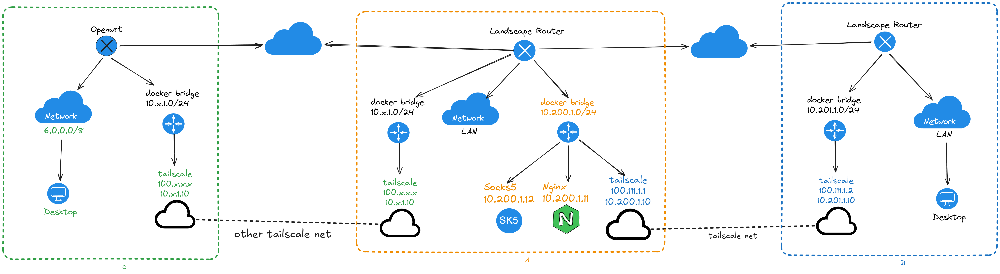

# Site-to-Site Networking

A site-to-site network securely connects two or more physically separate LANs
over a public network. Hosts on each site can then reach the routed subnets at
the other site.

> The result is a private routed network spanning the sites.

## Topology

Once configured, the topology looks like this:

::: info
The diagram does not show the LAN subnets on Side A or Side B. Add each site's
LAN CIDR to the `--advertise-routes` argument in the Tailscale startup
configuration so the sites can reach each other.
:::



In the diagram, hosts on Side B's LAN can reach the containers on Side A
through `10.200.1.0/24`, regardless of the Tailscale node address.

## Deployment configuration

Start with the compose file for Side A:

```yaml
services:
  tailscale:
    image: ghcr.io/landscape-router/landscape-apps/tailscale:latest
    container_name: <container name>
    restart: unless-stopped
    cap_add:
      - NET_ADMIN
      - SYS_ADMIN
      - PERFMON
    devices:
      - /dev/net/tun
    environment:
      - TS_AUTHKEY=<key>
      - TS_STATE_DIR=/var/lib/tailscale
      - TS_EXTRA_ARGS=--accept-dns=false --advertise-routes=10.200.1.0/24,<the CIDR of side A's LAN, or another docker bridge CIDR> --accept-routes
      - TS_USERSPACE=false
      - TS_TAILSCALED_EXTRA_ARGS=--port=41641
    sysctls:
      net.ipv4.ip_forward: '1'
      net.ipv6.conf.all.forwarding: '1'
    volumes:
      - <persistent storage path>:/var/lib/tailscale
      - /root/.landscape-router/unix_link/:/ld_unix_link/:ro
    networks:
      my-tailscale-bridge:
        ipv4_address: 10.200.1.10
    dns:
      - 10.200.1.1
  # Nginx for testing
  ng1:
    image: nginx
    container_name: ng1
    restart: unless-stopped
    networks:
      my-tailscale-bridge:
        ipv4_address: 10.200.1.11
    dns:
      - 10.200.1.1
  # A SOCKS5 service for testing
  sock-server:
    image: serjs/go-socks5-proxy
    container_name: sk5
    restart: unless-stopped
    environment:
      REQUIRE_AUTH: false
    networks:
      my-tailscale-bridge:
        ipv4_address: 10.200.1.12
    dns:
      - 10.200.1.1

networks:
  my-tailscale-bridge:
    driver: bridge
    driver_opts:
      # Keep the bridge name fixed so it remains stable across restarts.
      com.docker.network.bridge.name: test_tail-br0
    ipam:
      config:
        - subnet: 10.200.1.0/24
          gateway: 10.200.1.1
```

After starting the container, approve its routes in the Tailscale admin
console, as described in [Tailscale networking](../overlay/tailscale.md#starting-the-container).

`Side B`'s configuration:

```yaml
services:
  tailscale:
    image: ghcr.io/landscape-router/landscape-apps/tailscale:latest
    container_name: <container name>
    restart: unless-stopped
    cap_add:
      - NET_ADMIN
      - SYS_ADMIN
      - PERFMON
    devices:
      - /dev/net/tun
    environment:
      - TS_AUTHKEY=<key>
      - TS_STATE_DIR=/var/lib/tailscale
      - TS_EXTRA_ARGS=--accept-dns=false --advertise-routes=<the CIDR of side B's LAN> --accept-routes
      - TS_USERSPACE=false
      - TS_TAILSCALED_EXTRA_ARGS=--port=41641
    sysctls:
      net.ipv4.ip_forward: '1'
      net.ipv6.conf.all.forwarding: '1'
    volumes:
      - <persistent storage path>:/var/lib/tailscale
      - /root/.landscape-router/unix_link/:/ld_unix_link/:ro
    networks:
      my-tailscale-bridge:
        ipv4_address: 10.201.1.10
    dns:
      - 10.201.1.1

networks:
  my-tailscale-bridge:
    driver: bridge
    driver_opts:
      # Keep the bridge name fixed so it remains stable across restarts.
      com.docker.network.bridge.name: test_tail-br0
    ipam:
      config:
        - subnet: 10.201.1.0/24
          gateway: 10.201.1.1
```

After starting the container, approve its routes in the Tailscale admin
console, as described in [Tailscale networking](../overlay/tailscale.md#starting-the-container).

In addition to the Tailscale routes configured in [Configuring route rules](../overlay/tailscale.md#configuring-route-rules), add the other site's LAN
CIDR. Side B can then reach both Tailscale addresses and the Docker containers
on the far side; add the container CIDR as well. 

Side A likewise needs Side B's LAN CIDR.

## Appendix: Using Side A as a Relay to Join Another Tailscale Network



Advertise `10.200.1.0/24` on the Tailscale client connected to C as well. Side
B can then reach C's LAN through Side A. The path to C can use any overlay
networking tool.
