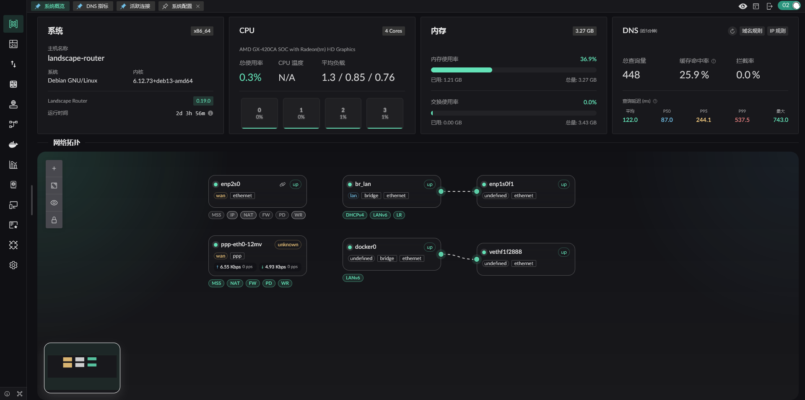

# Landscape - 以 eBPF 为基础的 Linux 路由平台

Landscape Router 是一个使用了 eBPF / Rust / Vue 开发  
可以帮助您将 Linux 配置成 **路由器** 的工具

## 整体界面

## 核心特性

- eBPF 分流, 直连流量性能不受影响, 可基于入口条件 (源 IP CIDR、MAC) 与目标条件 (目标 IP、域名、Geo 规则) 进行匹配
- 每个流 Flow 独立 DNS 配置以及缓存（避免 DNS 缓存冲突和数据泄露）
- 支持将流量导入 Docker 容器, 可在容器中运行支持 TProxy 的程序进行扩展
- 支持地理关系库管理, 支持 DAT / TXT 格式
- 默认采用更严格的 NAT4, 但可为指定 IP / 域名启用 NAT1, 方便组网等场景
- 提供 API, UI 上的所有操作都可以通过 API 完成

## 为什么编写 Landscape

最直接的原因，是希望继续使用自己熟悉的 Linux 发行版来做路由，而不是被限定在某一种系统上。除了 Debian 之外，Landscape 已经有 Arch、openSUSE 等发行版的实际使用反馈。

是可以通过组合 Linux 上现成的各种程序来搭建一套路由方案，而且确实能稳定运行；但这类方案通常配置分散、维护成本高，还要额外处理配置文件的存储与迁移。Landscape 将这些配置集中到一个目录中管理，新版本可直接替换运行，启动后会自动迁移配置；需要回退时，也支持降级。

此外，内网里常常会有 BT/PT 之类需要 NAT1 的程序，但并不希望其他 PCDN 程序偷跑流量。为此，Landscape 提供了更细粒度的 NAT 控制，可以按域名或 IP 决定不同流量采用怎样的 NAT 行为。

内网中的不同设备往往需要不同的分流策略，同时也希望在容器发生故障时，直连流量仍然能够继续工作，不会被一并拖垮。
