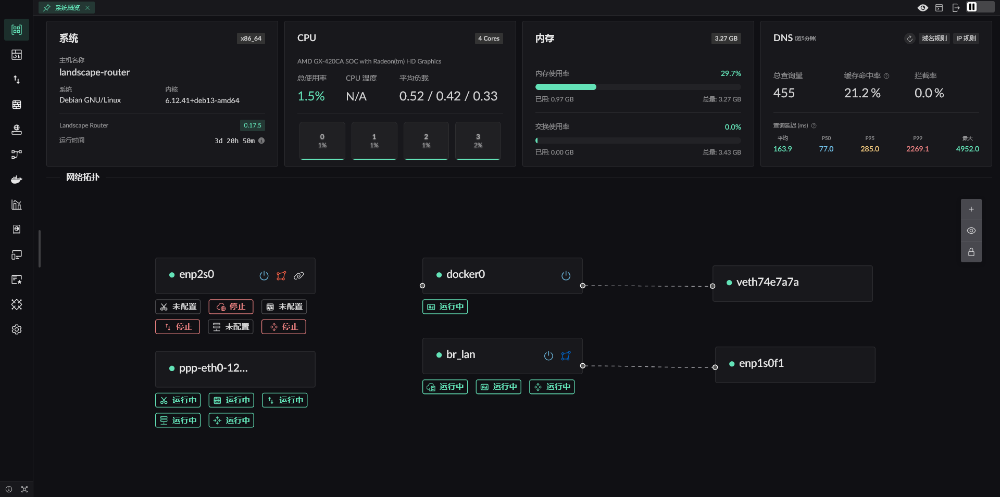

# Landscape - 以 eBPF 为基础的 Linux 路由平台

Landscape Router 是一个使用了 eBPF / Rust / Vue 开发  
可以帮助您将 Linux 配置成 **路由器** 的工具

## 整体界面

## 核心特性
* eBPF 分流, 直连流量性能不受影响, 可基于入口条件 (源 IP CIDR、MAC) 与目标条件 (目标 IP、域名、Geo 规则) 进行匹配
* 每个 Flow 都有独立的 DNS 配置和缓存, 以减少 DNS 污染与泄露
* 支持将流量导入 Docker 容器, 可在容器中运行支持 TProxy 的程序进行扩展
* 支持地理关系库管理, 支持 DAT / TXT 格式
* 默认采用更严格的 NAT4, 但可为指定 IP / 域名启用 NAT1, 方便组网等场景
* 提供 API, UI 上的所有操作都可以通过 API 完成

---

## 为什么编写 Landscape
最直接的原因，是希望继续使用自己熟悉的 Linux 发行版来做路由，而不是被限定在某一种系统上。除了 Debian 之外，Landscape 已经有 Arch、openSUSE 等发行版的实际使用反馈。

是可以通过组合 Linux 上现成的各种程序来搭建一套路由方案，而且确实能稳定运行；但这类方案通常配置分散、维护成本高，还要额外处理配置文件的存储与迁移。Landscape 将这些配置集中到一个目录中管理，新版本可直接替换运行，启动后会自动迁移配置；需要回退时，也支持降级。

此外，内网里常常会有 BT/PT 之类需要 NAT1 的程序，但并不希望其他 PCDN 程序偷跑流量。为此，Landscape 提供了更细粒度的 NAT 控制，可以按域名或 IP 决定不同流量采用怎样的 NAT 行为。

内网中的不同设备往往需要不同的分流策略，同时也希望在容器发生故障时，直连流量仍然能够继续工作，不会被一并拖垮。

## 主要功能
> ✅ 已经实现并且已经测试  
> ⚠ 可行但是未测试  
> ❌ 未实现  

- <u>部署方式</u>
    - ✅ 主路由
    - ❌ 单臂路由
- <u>IP 配置</u>
    - *静态 IP 配置*
        - ✅ 指定 IP 
        - ✅ 配置网关指定默认路由
    - *DHCP Client*
        - ✅ 指定主机名称
        - ❌ 自定义 Option
    - *PPPoE ( PPPD 版 )*
        - ✅ 默认路由指定
        - ⚠ 多网卡拨号
        - ✅ 网卡名称指定
    - *PPPoE ( eBPF 版 )*
        - ✅ 协议主体实现
        - ❌ 网卡 GRO/GSO 导致的数据包大小超 MTU (未解决)
    - *DHCP Server*
        - ✅ 提供简单 IP 地址分配和续期服务
        - ✅ 自定义分配 IP 的 网关 网段 访问 配置
        - ✅ MAC 地址与 IP 绑定
        - ✅ IP 分配展示
        - ✅ 设备 24 小时在线情况展示
    - *IPv6支持*
        - ✅ 使用 DHCPv6-PD 向上级路由请求前缀
        - ✅ 使用 RA 对下级设备多前缀通告
        - ✅ 运行下级使用 PD 请求 IP 段
- <u>DNS</u>
    - ✅ 支持使用 DNS over HTTPS、DNS over TLS 和 DNS over Quic 向上游请求 DNS
    - ✅ 支持向内网客户端提供 DoH 服务, 使浏览器主动发起 ECH 请求
    - ✅ 支持指定网址使用特定上游 DNS
    - ✅ DNS 劫持 ( 返回 A / AAAA 解析 )， 当不指定 DNS 查询结果时为拦截
    - ✅ 对指定 DNS 解析结果进行 IP 标记, 使目标访问时可被控制
    - ✅ GeoSite 文件支持
    - ❌ 支持将 Docker 容器设置的域名 label 加入 DNS 解析中
    - ✅ 支持进行测试域名查询
- <u>分流 (eBPF) 实现</u>
    - ✅ 允许使用 IP / MAC 值进行区分流.
    - ✅ 每个流配置中含有自己独立的 DNS 配置, 以及 DNS 缓存.
    - ✅ 将被标记流量按照标记配置( 直连/丢弃/允许复用端口/重定向到 Docker 容器或者网卡 )进行转发 
    - ❌ 对指定数据设置跟踪标记
    - ✅ 外网 IP 行为控制, 按照标记的规则控制外网 IP, 并支持使用 `geoip.dat` 协助配置
    - ✅ IP 规则和 DNS 规则冲突时, 依据规则的优先级进行判定 (值越小越高)
    - ❌ 多 WAN 负载均衡
- <u>地理关系库管理</u>
    - ✅ 多 地理关系库 来源管理
    - ✅ Geo IP/Site 自动更新
    - ✅ 支持 TXT 格式的 IP 数据源
- <u>NAT (eBPF) 实现</u>
    - ✅ 基础 NAT 
    - ✅ 静态映射 / 开放指定端口
    - ✅ 默认 NAT4, 可依据标记动态允许指定 域名/IP 使用 NAT1
- <u> 指标模块 </u>
    - ✅ 每 5s 定时上报连接信息(字节数 / 数据包个数)
    - ✅ 展示当前连接 (还未结合 NAT 连接信息)
    - ✅ 开放指标导出 API
    - ✅ 历史指标查询
- <u> 证书管理 </u>
    - ✅ 支持 Let's Encrypt 账号管理
    - ⚠ 支持 ZeroSSL 账号管理
    - ✅ 支持使用 Cloudflare / 阿里云 DNS-01 认证
    - ⚠ 支持 腾讯云 / Google DNS-01 认证
    - ✅ 支持证书的 签发 / 续期 / 吊销 等操作. 也允许生成自己的自签名证书.
    - ✅ 证书可用于 API / DoH / HTTP 反代.
- <u> 内网 HTTP 反代 </u>
    - ✅ 支持按照 SNI 指定上游
    - ✅ 支持相同 SNI 指定不同 HTTP 前缀使用不同上游
    - ✅ 支持携带标准代理头
    - ⚠ 支持添加额外自定义请求头
- <u> Docker </u>
    - ✅ 支持简单运行和管理 Docker 容器
    - ⚠ 镜像拉取
    - ✅ 将流量导入运行 TProxy 的 Docker 容器
- <u> WIFI </u>
    - ✅ 使用 iw 命令切换无线网卡状态
    - ✅ 使用 hostapd 配置创建 WIFI 热点
    - ❌ 接入 WIFI 热点
- <u> 存储 </u>
    - ✅ 使用数据库替代当前配置存储
    - ✅ 导出当前所有配置为 `landscape_init.toml` 文件
    - ❌ UI 提供配置上传还原组件
    - ⚠ 增加 配置修改 组件
    - ❌ 指标库单独指定数据库地址
- <u> 杂项 </u>
    - ✅ 全局 API 导出, 可通过 API 代替 UI 操作, 假设你已经部署的情况下可通过 [https://landscape.local:6443/api/docs](https://landscape.local:6443/api/docs) 访问
    - ✅ 登录界面
    - ⚠ 添加英文版前端页面
    - ✅ 网卡 XPS/RSP 优化, 将网卡压力负载到不同的核心, 提升整体吞吐, 但是网卡中断绑定不是很熟悉, 如有建议欢迎 issue

其他还在继续更新中...

<!-- ## 目前已经试验的发行版

* Debian -->
