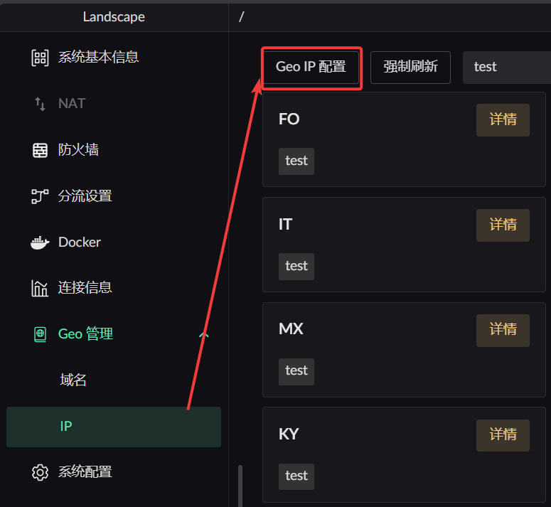
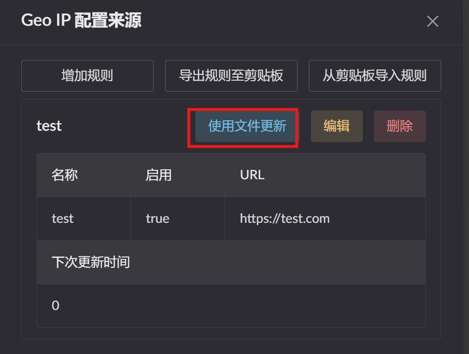
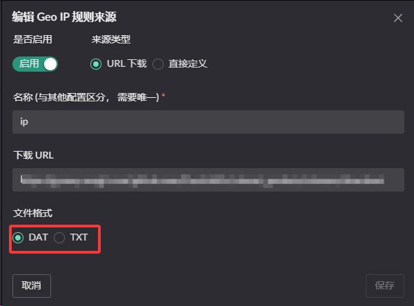

# Geo Database Management

## Overview

Both IP and domain forms are supported.  
`dat` format files are supported.  
Updates run automatically on a schedule.

## Adding a source

1. Click `Geo IP config`
2. Click `Add rule` in the dialog on the right

 

## Fetching from a URL

## Updating by uploading a file

## Forcing an update

## TXT files are supported too

