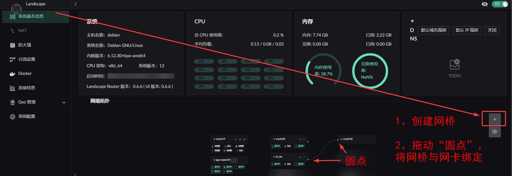
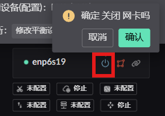
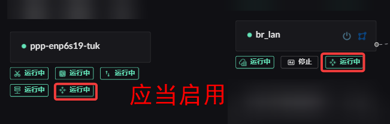

# 系统基本信息

## 创建网桥
1、创建网桥  
2、为网桥绑定网卡  
  

## 开启/关闭 网卡
 

## 无线网卡 
将 hostapt 配置填入输入框中即可

## 启用 Wan 和 Lan 网卡的路由转发功
  

## vlan 配置
>  当前为临时方案, 如果之后页面上支持创建 vlan 网卡后, 需要再手动删除添加的 vlan 配置

以 Debian 为例在 /etc/network/interfaces 中创建 vlan 网卡，设置为 manual 即可。
↓ 示例
```shell
# This file describes the network interfaces available on your system
# and how to activate them. For more information, see interfaces(5).

source /etc/network/interfaces.d/*

# The loopback network interface
auto lo
iface lo inet loopback

auto eth0
iface eth0 inet manual

# 创建 vlan id 为 10 的网卡，绑定到 物理接口 eth0
auto eth0.10
iface eth0.10 inet manual
    vlan-raw-device eth0       # 绑定物理接口

# 创建 vlan id 为 20 的网卡，绑定到 物理接口 eth0
auto eth0.20
iface eth0.20 inet manual
    vlan-raw-device eth0       # 绑定物理接口

```

