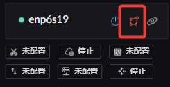

# 网卡区域
在 Landscape 路由中, 不同的网卡有各自独特的服务, 所以需要先切换网卡的区域才能进行配置

## 切换按钮位置
 

 

## WAN 可开启的服务
如无特殊要求, 可按照默认配置直接启动  
1-1 TCP MSS 钳制  
1-2 防火墙服务配置  
1-3 网卡NAT配置  
2-1 IPV6-PD 客户端配置  
2-2 Wan 路由转发服务  

  

## LAN 可开启的服务
按需配置  
1-1 DHCPv4 服务配置  （包含 Mac IP 地址绑定）  
1-2 ICMPV6-RA 服务配置  
1-3 Lan 路由 转发 （应当启用）  
  
