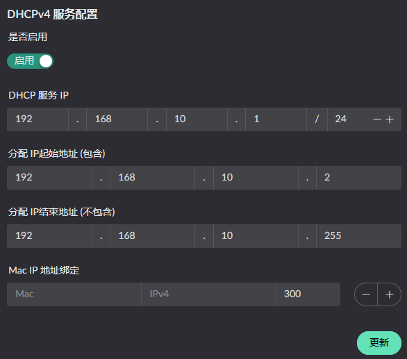

# DHCP v4 相关

## 服务配置
DHCP 服务的开启需要先将网卡的区域配置成 Lan, 然后找到如下服务按钮:

点击配置服务按钮后将呈现:

按需进行配置服务即可

## 内网 IP 分配情况
可在侧边栏: "服务状态" -> "DHCPv4 服务" 查看, 当前页面上可以看到 IP 的配置情况, 并且 DHCP 服务会每隔 1小时 进行一次 ARP 扫描.
扫描的范围是当前配置的 IP 网段.

> 其中 **橙黄色** 的条目是非本次启动分配的IP, 可能是  
> 1.上次分配但是还未重新进行 DHCP 请求的主机, 重新请求后就会正常展示  
> 2. 静态配置的 IP
