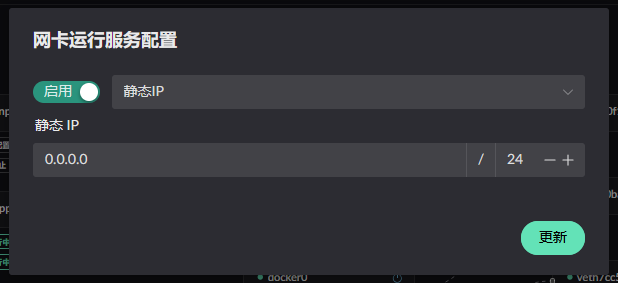
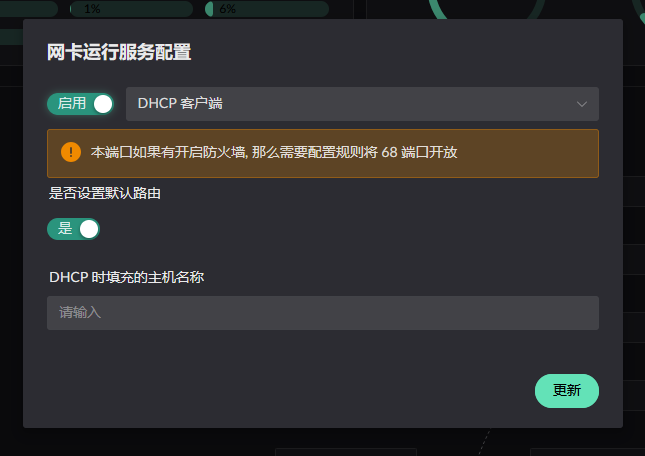
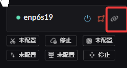
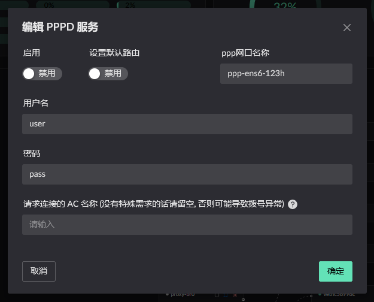

# 网卡 IP 设置

## 静态 IP
:::info
在网卡状态为: 未指定分区, WAN 时可以进行静态 IP 配置.
:::

当为 WAN 时可以额外指定当前网卡为 ***IPv4*** 的 **默认路由**

  
  

## DHCP 客户端
:::info
在网卡状态为: WAN 时才可进行此配置.  

主机名称可以不用设置, 默认使用当前主机的主机名称.
:::

## PPPoE
:::info
在网卡状态为: WAN 时才可进行此配置.  

因为 PPPoE 需要依赖现有网卡才能通信, 所以需要在已有的 WAN 网卡上进行设置.
:::

1. 在wan网卡上添加PPPOE账号  
2. 在PPPOE账号里设为默认路由  
3. AC Name 只有在你需要的时候进行填写, 默认留空即可

  
  
  
 