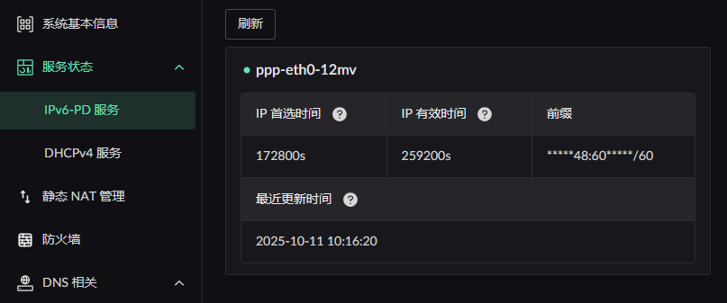
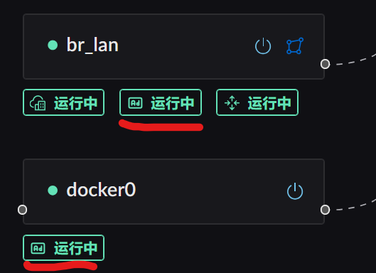
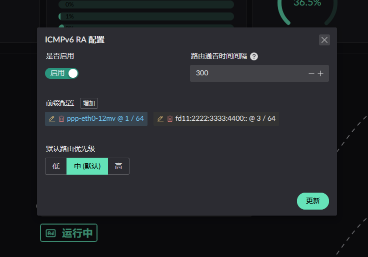
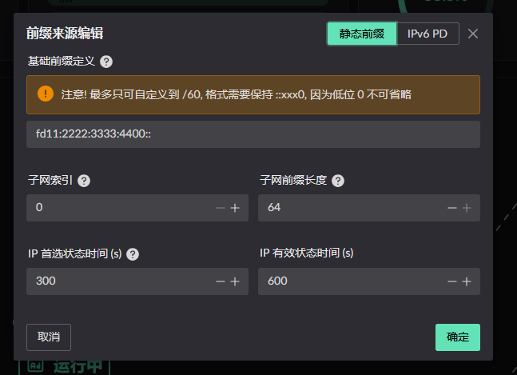

# IPv6 相关配置

首先要确定你当前的运营商是否支持客户端进行前缀申请, 并且支持的前缀为 `/60` 以上, 如不支持, 以下的功能都不可使用

## IPv6 PD
首先是前缀的获得, 你需要在对应的网卡进行前缀的申请, 具体的开启方式是在你的 WAN 网卡上开启 PD 服务.
如下图所示, 先找到对应的服务按钮:

点击后如无修改 MAC 地址的需求, 直接更新即可.

如正常获取到前缀, 可在侧边栏: "服务状态" -> "IPv6-PD 服务" 中查看分配到的前缀信息:

## IPv6 RA
通告中的 IP 可以自己通告私有地址, 并非必须申请到 IPv6 前缀. 首先找到通告服务按钮. 注意通告服务只能在区域为 LAN 的网卡上找到该服务:

点击后可展开服务配置界面:

> **通告间隔** 是指服务端 **主动** **定期** 向局域网进行组播的 **时间间隔**

通告的前缀有以下两种来源: 静态 / 动态 PD 获取, 点击前缀配置后的添加, 将会弹出添加界面
### 静态前缀添加
按照自己的要求配置即可

### PD 获得前缀添加
选择运行 PD 服务的网卡即可, 在 RA 配置时, 不要求目标网卡已获得前缀, 但是要开启服务

配置完成后点击更新即可, 需要注意前缀的编辑在没有更新前是不生效的

## IPv6 NPT
当前无论是 *静态配置* 的前缀还是 *PD 获得* 的前缀, 在从某个网卡发出时, 会检查当前的前缀是否与**当前网卡** *PD 服务* 获得前缀相同.
不同的情况下会转为该网卡的前缀发出. 所以可以不用担心使用错误的前缀进行请求
