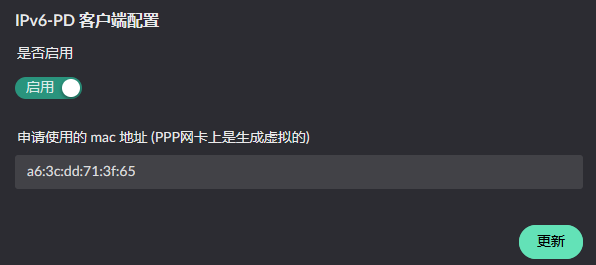
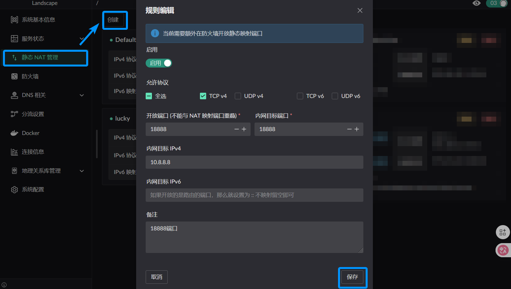

# IPv6 相关配置

首先要确定你当前的运营商是否支持客户端进行前缀申请, 并且支持的前缀为 `/60` 以上, 如不支持, 以下的功能都不可使用

## IPv6 PD
首先是前缀的获得, 你需要在对应的网卡进行前缀的申请, 具体的开启方式是在你的 WAN 网卡上开启 PD 服务.
如下图所示, 先找到对应的服务按钮:

点击后如无修改 MAC 地址的需求, 直接更新即可.

如正常获取到前缀, 可在侧边栏: "服务状态" -> "IPv6-PD 服务" 中查看分配到的前缀信息:

## IPv6 RA
通告中的 IP 可以自己通告私有地址, 并非必须申请到 IPv6 前缀. 首先找到通告服务按钮. 注意通告服务只能在区域为 LAN 的网卡上找到该服务:

点击后可展开服务配置界面:

> **通告间隔** 是指服务端 **主动** **定期** 向局域网进行组播的 **时间间隔**

通告的前缀有以下两种来源: 静态 / 动态 PD 获取, 点击前缀配置后的添加, 将会弹出添加界面

### 静态前缀添加
按照自己的要求配置即可

### PD 获得前缀添加
选择运行 PD 服务的网卡即可, 在 RA 配置时, 不要求目标网卡已获得前缀, 但是要开启服务

::: warning
在 `同一个网卡` 的 RA 配置中, `不同` 前缀的 `子网索引` 不可重复.  
在 `不同网卡` 的 RA 配置中, 前缀的 `子网索引` 在不同网卡中不可重复.

例如当前有 A / B 网卡, PD1/2 动态前缀, S1 静态前缀.

A 网卡上的 S1 配置了 `0 子网索引`, PD1 配置了 `1 子网索引`, 那么 A 网卡就不能再添加 `0 或者 1` 子网索引的 `任何` 前缀.  
B 网卡可以添加的前缀 `子网索引` 是 PD1 子网索引 `除1外` 的其他. PD2 子网索引 可以任意.
:::

配置完成后点击更新即可, 需要注意前缀的编辑在没有点击更新按钮前是不生效的

## IPv6 NPT
当前无论是 *静态配置* 的前缀还是 *PD 获得* 的前缀, 在从某个网卡发出时, 会检查当前的前缀是否与**当前网卡** *PD 服务* 获得前缀相同.
不同的情况下会转为该网卡的前缀发出. 所以可以不用担心使用错误的前缀进行请求

## IPv6 静态映射 (从 0.8.1 起生效)
::: warning
当前需要额外在 [防火墙](./firewall.md) 中开放静态映射端口
:::
在右侧的菜单栏找到: "静态 NAT 管理", 点击页面上的创建, 可以看到如下界面

IPv6 的分配有三种情况.
1. 在内网分配了`静态` IPv6 前缀
2. 在内网只分配了`动态` PD 前缀
3. 同时分配动态, 静态前缀在内网

对于情况 一, 你需要在内网目标 IPv6 中填写`完整 IP`地址, 这样假设你有 WAN1, WAN2 两个网口分别获得了不同的 PD 前缀, 你可以同时使用这两个前缀映射到内部主机.

对于情况 二/三 , 你只能填写内网`目标 IP 的 /64 后缀` (相对于是 SLAAC 自动生成的部分). 这样***只能***使用主机已分配PD前缀生成的 IP, 其他网口获得的前缀 IP 将无法访问目标主机.
