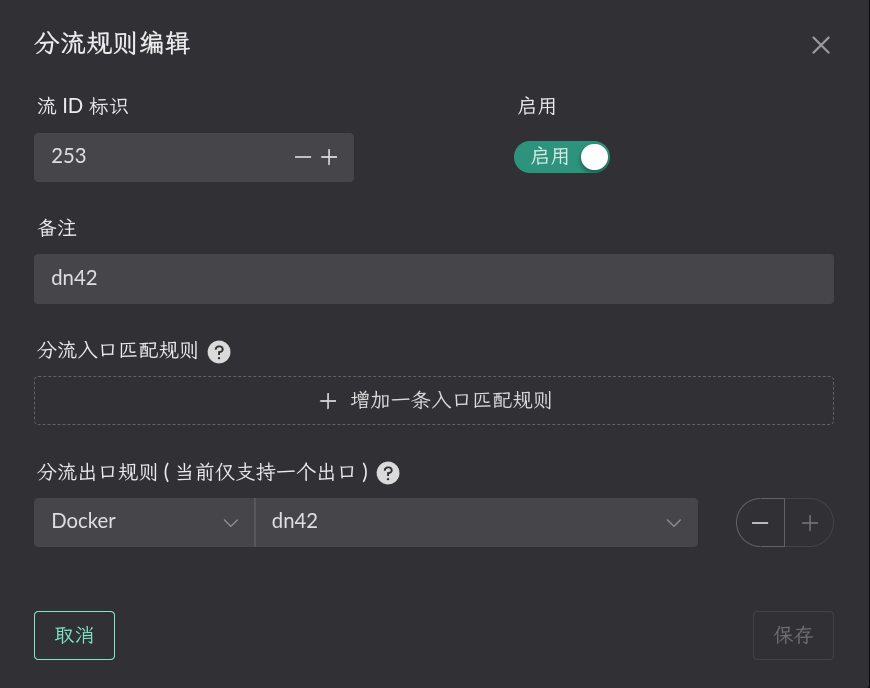
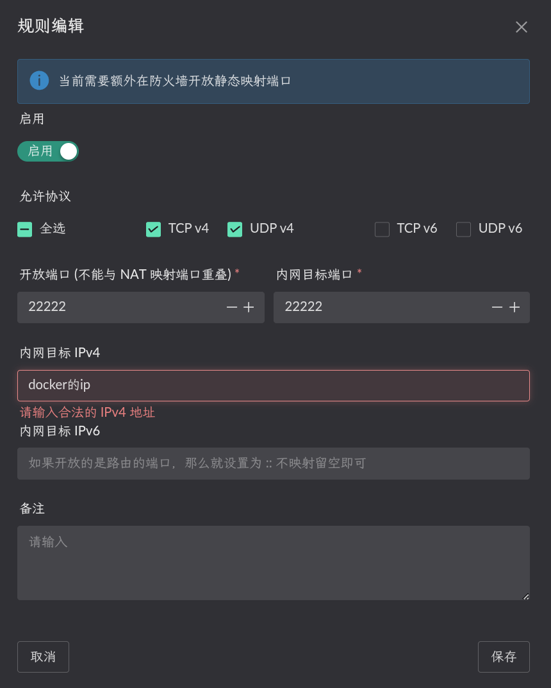
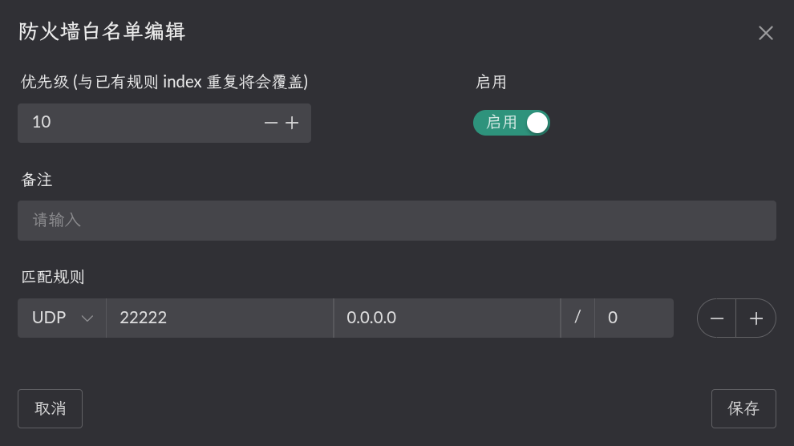
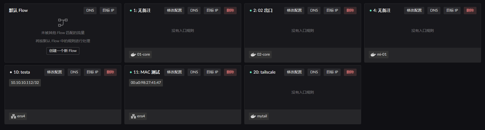
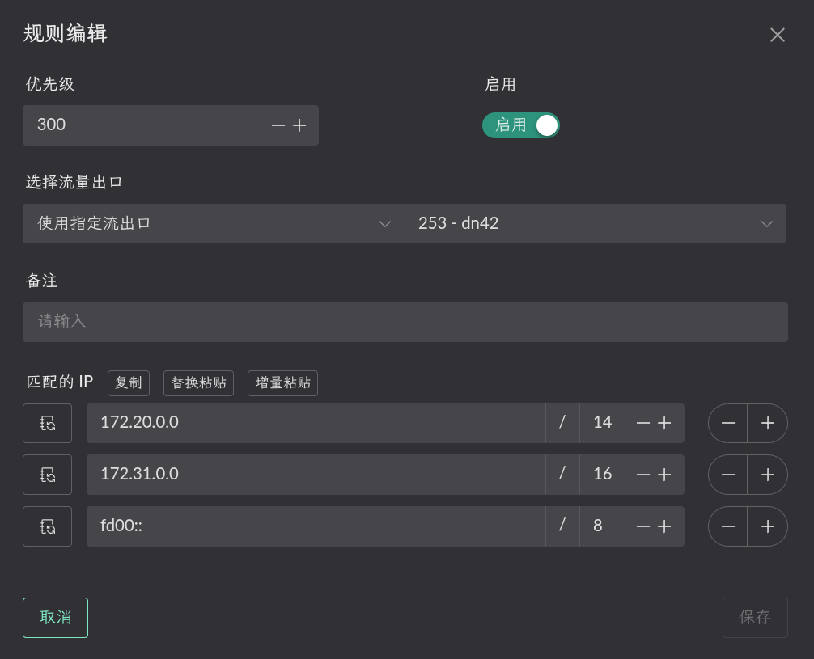
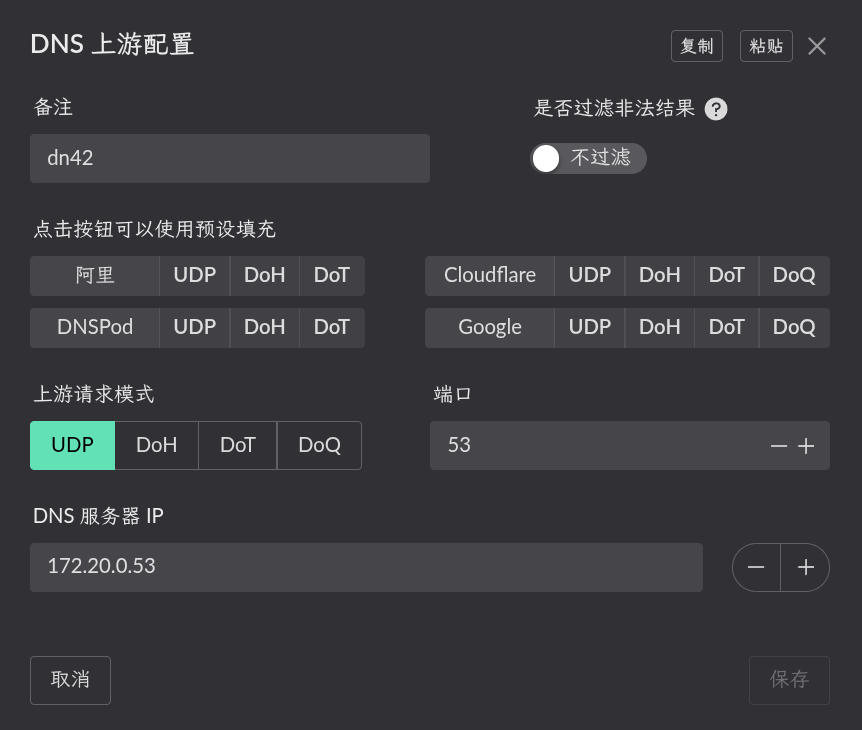
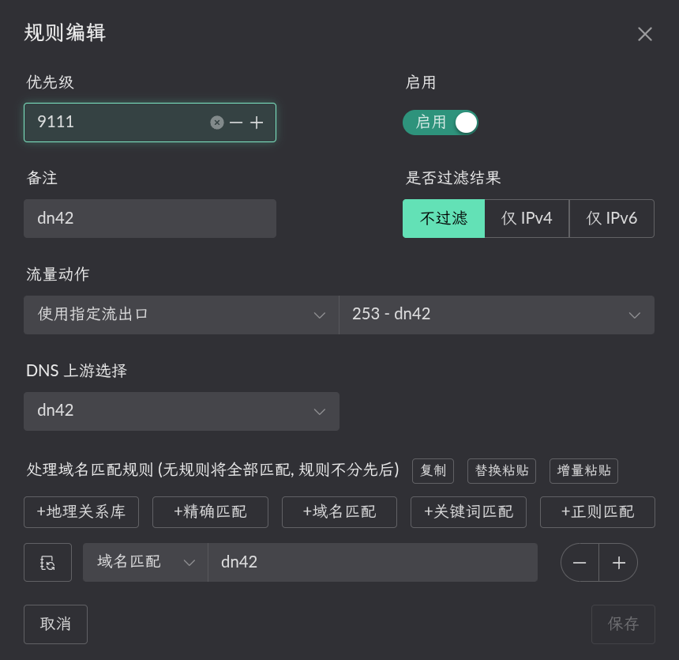

# dn42
连接dn42网络的步骤大致如下:
1. 创建一个容器用于wireguard与bird2
2. 添加bird2和wireguard配置文件，启动容器, 并以此容器为出口创建一个 Flow.
3. 开启 NAT1 映射
4. 设置路由和dns让内网中的程序可以访问 dn42 中的 IP / 网段 / 域名.

## 创建容器
首先需要创建一个dockerfile文件
```dockerfile
# 使用Alpine Linux作为基础
FROM alpine:latest
RUN sed -i 's/dl-cdn.alpinelinux.org/mirrors.tuna.tsinghua.edu.cn/g' /etc/apk/repositories
RUN apk update && apk add --no-cache \
    wireguard-tools \
    bird2 \
    libgcc \
    nano \
    iptables \
    tcpdump \
    iproute2 \
    tini \
    && rm -rf /var/cache/apk/*
# 创建配置目录
RUN mkdir -p /etc/wireguard /etc/bird
# 复制启动脚本和配置（稍后创建）
COPY entrypoint.sh /entrypoint.sh
COPY redirect_pkg_handler /redirect_pkg_handler
# 赋予脚本执行权限
RUN chmod +x /entrypoint.sh && chmod +x /redirect_pkg_handler
# 使用tini作为init进程处理信号
ENTRYPOINT ["/sbin/tini", "--", "/entrypoint.sh"]
```
在同目录创建entrypoint.sh文件
```bash
#!/bin/sh
set -e
echo "[redirect_pkg_handler] starting..."
/redirect_pkg_handler -m route &
# 启动所有WireGuard接口（配置需以.conf结尾）
for conf in /etc/wireguard/*.conf; do
    if [ -f "$conf" ]; then
        echo "启动WireGuard接口: $conf"
        wg-quick up "$conf" || echo "启动 $conf 失败，请检查配置"
    fi
done
# 等待网络就绪（特别是IPv6）
sleep 2
# 检查WireGuard接口状态
wg show
# 启动BIRD2守护进程
echo "启动BIRD2路由守护进程..."
exec bird -c /etc/bird/bird.conf -f
```
在landscape的release下载redirect_pkg_handler文件（musl版），此时当前文件夹下有以下内容
```bash
tree
.
├── dockerfile
├── easytier-core
├── redirect_pkg_handler
└── entrypoint.sh
```
然后执行，进行镜像编译
```shell
docker build -t <标签名称> .
```
## 启动容器
::: warning
网桥中的名称一定要设置 !!!
```yaml
networks:
  my-tailscale-bridge:
    driver: bridge
    driver_opts:
      # 一定要设置, 否则默认会使用动态网卡名称, 重启后网卡名称变动导致 LAN 服务不能正常开启
      com.docker.network.bridge.name: dn42-br0
```

然后按照你的 compose 配置进行启动即可.
```yaml
services:
  dn42:
    image: <编译的镜像名>
    container_name: dn42
    restart: unless-stopped
    cap_add:
      - NET_ADMIN
      - SYS_ADMIN
      - PERFMON
    sysctls:
      net.ipv4.ip_forward: "1"
      net.ipv6.conf.all.forwarding: "1"
      net.ipv4.conf.all.rp_filter: "0"
      net.ipv4.conf.default.rp_filter: "0"
    volumes:
      - /root/dn42/wireguard:/etc/wireguard
      - /root/dn42/bird:/etc/bird
      - /root/.landscape-router/unix_link/:/ld_unix_link/:ro
    networks:
      dn42-bridge:
        ipv4_address: <你申请的dn42 ipv4段ip>
        ipv6_address:  <你申请的dn42 ipv6段ip>

networks:
  dn42-bridge:
    driver: bridge
    enable_ipv6: true
    driver_opts:
      # 一定要设置, 否则默认会使用动态网卡名称, 重启后网卡名称变动导致 LAN 服务不能正常开启
      com.docker.network.bridge.name: dn42-br0
    ipam:
      config:
        - subnet: 
          gateway: 
        - subnet: 
          gateway: 
```
然后在 /root/dn42/bird下创建bird.conf，直接复制[dn42 wiki教程](https://wiki.dn42.us/howto/Bird2)过来修改即可

在/root/dn42/wireguard下创建你peer的wg配置
```conf
[Interface]
PrivateKey = 
# 监听端口
ListenPort = 
# DN42通信必须使用您在DN42注册的正式IP（如下示例）
# 请务必替换下面的示例IP为您自己的DN42 IPv4和IPv6
Address = 
table = off
# 可选：为BGP会话添加一个链路本地地址
PostUp = /etc/wireguard/scripts/up.sh %i
PostDown = /etc/wireguard/scripts/down.sh %i

[Peer]
PublicKey = 
# 对等节点的Endpoint
Endpoint = 
# 允许通过此隧道路由的DN42网络段
AllowedIPs = 172.20.0.0/14, 172.31.0.0/16, fd00::/8, fe80::/64
# 预共享密钥
PresharedKey =
# 保活间隔
PersistentKeepalive = 25
```
在/root/dn42/wireguard/scripts下创建up.sh

```bash
#!/bin/bash
# /etc/wireguard/scripts/up.sh
interface=$1
status=$2

ip address add 本地链路地址 dev $interface
iptables -t nat -A POSTROUTING -o $interface ! -s 172.16.0.0/12 -j SNAT --to-source 设置的docker ipv4
ip6tables -t nat -A POSTROUTING -o $interface ! -s fd00::/8 -j SNAT --to-source  设置的docker ipv6
```

以及down.sh

```bash
#!/bin/bash
# /etc/wireguard/scripts/notify.sh
interface=$1
status=$2
iptables -t nat -D POSTROUTING -o $interface ! -s 172.16.0.0/12 -j SNAT --to-source 设置的docker ipv4
ip6tables -t nat -D POSTROUTING -o $interface ! -s fd00::/8 -j SNAT --to-source  设置的docker ipv6
```

然后创建一个 Flow 并使用这个容器作为出口.


## 设置 NAT1
先在容器所属的 `网桥` 开启 `Lan 路由转发服务`. 如下图.


> 静态NAT配置 (内网目标端口为容器对应wg的端口, IP 为容器 IP)



> 在防火墙放开相应端口


## 配置 "路由" 规则
点击相应 Flow 的 `目标 IP` 按钮进行配置. 只有添加相应规则的 Flow 才会生效.


比如我当前 LAN 客户端的 MAC 地址是 `00:a0:98:27:41:47`, 这个客户端当前被 `Flow 11` 规则所管理. 所以我需要在 `Flow 11` 的 `目标 IP` 进行配置. 并选择流量的出口为刚刚启动容器时创建的 `Flow 253`.



这样, 当 LAN 客户端访问 dn42网段时, 这些数据包就会使用 Flow 253 (easytier) 的出口, 也就是被转发到 `dn42` 容器中.

## 配置dns
在`dns相关`的`上游dns配置管理`里，点击`创建`添加dn42网络段的dns



此时再回到分流设置， 在`Flow 11`的`DNS`里增加规则



这样, 当 LAN 客户端访问 dn42域名时, 这些数据包就会使用 Flow 253 (easytier) 的出口, 也就是被转发到 `dn42` 容器中.
