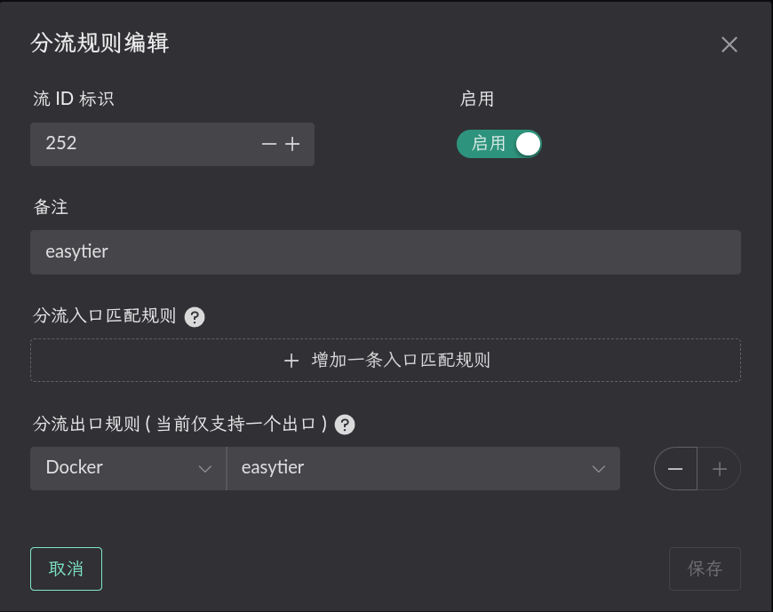
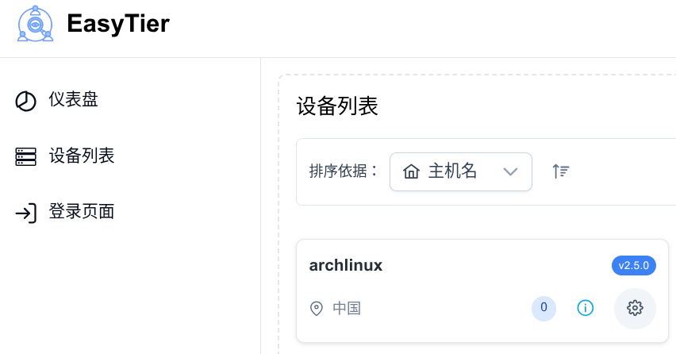
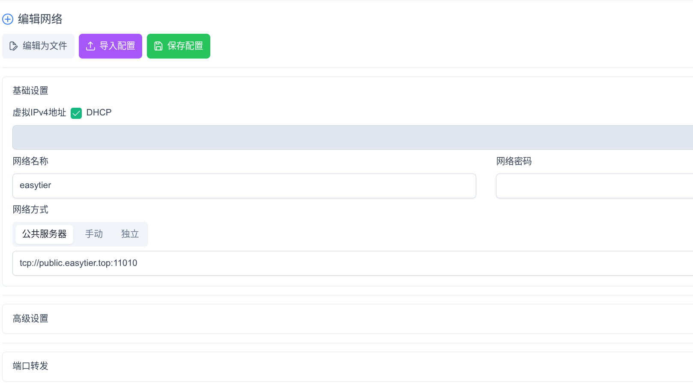
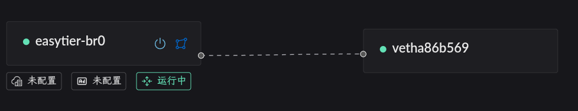
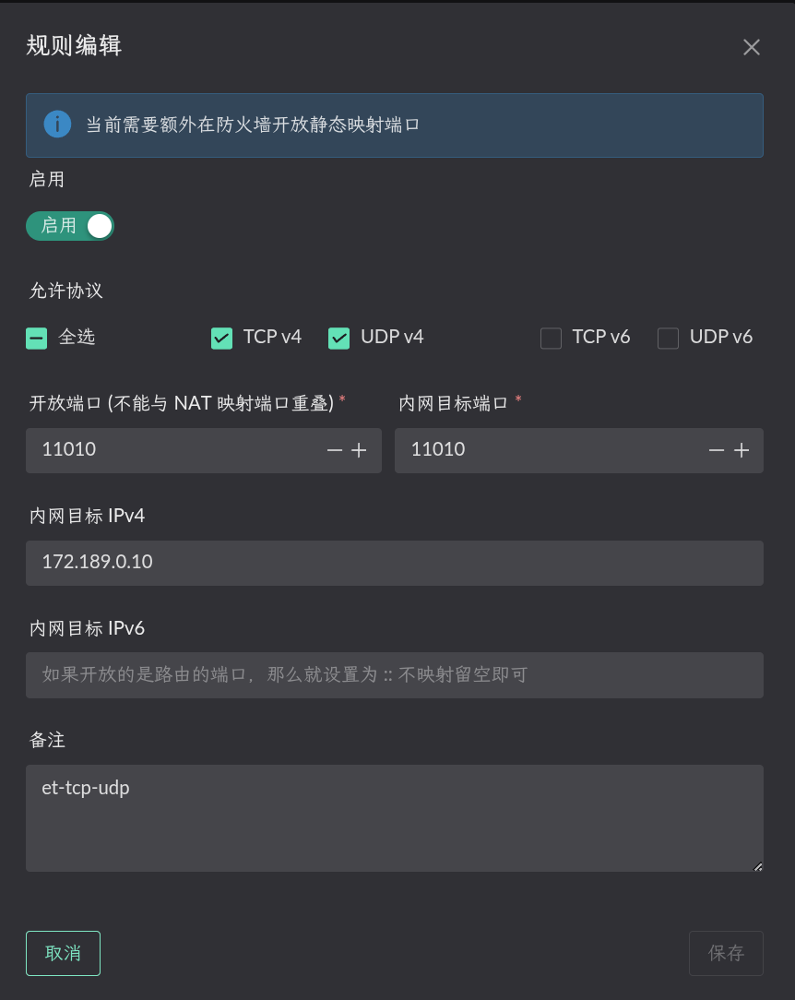
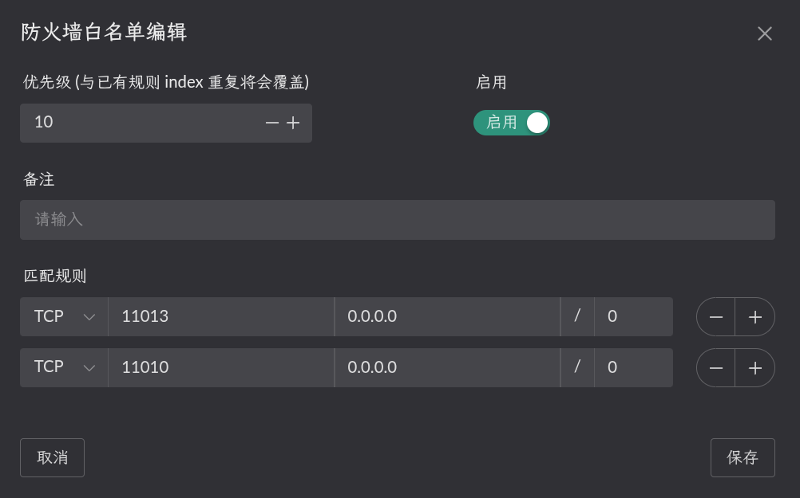
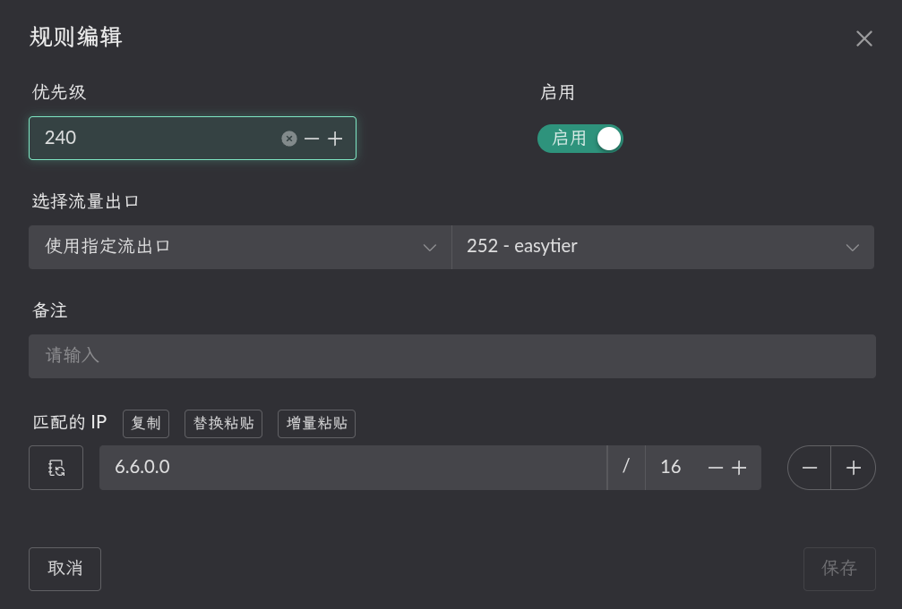

# Easytier
Easytier 的部署使用的步骤大致如下:
1. 创建一个easytier容器
2. 启动 easytier 容器, 并以此容器为出口创建一个 Flow.
3. 在easytier-web端添加配置
4. 开启 NAT1 映射
5. 设置路由让内网中的程序可以访问 easytier 中的 IP / 网段.

## 创建easytier容器
首先需要创建一个dockerfile文件
```dockerfile
FROM debian:bookworm

RUN echo "deb https://mirrors.ustc.edu.cn/debian/ stable main contrib non-free" > /etc/apt/sources.list && \
    echo "deb https://mirrors.ustc.edu.cn/debian/ stable-updates main contrib non-free" >> /etc/apt/sources.list && \
    echo "deb https://mirrors.ustc.edu.cn/debian-security stable-security main contrib non-free" >> /etc/apt/sources.list

RUN apt-get update && \
    apt-get install -y --no-install-recommends \
        ca-certificates \
        iproute2 \
        iptables \
        wireguard-tools \
        curl \
    && rm -rf /var/lib/apt/lists/*

COPY easytier-core /easytier-core
RUN chmod +x /easytier-core

COPY redirect_pkg_handler /redirect_pkg_handler
RUN chmod +x /redirect_pkg_handler

COPY start.sh /start.sh
RUN chmod +x /start.sh

ENTRYPOINT ["/start.sh"]
```
在同目录创建start.sh文件，注意修改启动参数，参照easytier官方文档搭建web端，或者直接[使用官方web端](https://easytier.cn/web#/auth)创建账号，这里使用官方web端，只填写账号即可
```bash
#!/bin/bash
set -eo pipefail

echo "[redirect_pkg_handler] starting..."
/redirect_pkg_handler -m route &

# 启动easytier，请在-w后替换自己的用户名
/easytier-core -w <用户名> --machine-id <机器码> --hostname <web端显示的名称> &

for i in $(seq 1 10); do
    ip link show tun0 && break
    sleep 1
done

iptables -t nat -A POSTROUTING -o tun0 -j MASQUERADE

wait
```
在landscape和easytier的release下载redirect_pkg_handler和easytier文件，此时当前文件夹下有以下内容
```bash
tree
.
├── dockerfile
├── easytier-core
├── redirect_pkg_handler
└── start.sh
```
然后执行，进行镜像编译
```shell
docker build -t <标签名称> .
```
## 启动容器
::: warning
网桥中的名称一定要设置 !!!
```yaml
networks:
  my-tailscale-bridge:
    driver: bridge
    driver_opts:
      # 一定要设置, 否则默认会使用动态网卡名称, 重启后网卡名称变动导致 LAN 服务不能正常开启
      com.docker.network.bridge.name: easytier-br0
```

然后按照你的 compose 配置进行启动即可.
```yaml
services:
  tailscale:
    image: <编译镜像的标签名>
    container_name: easytier
    restart: unless-stopped
    cap_add:
      - NET_ADMIN
      - SYS_ADMIN
      - PERFMON
    devices:
      - /dev/net/tun
    sysctls:
      net.ipv4.ip_forward: "1"
      net.ipv6.conf.all.forwarding: "1"
      net.ipv6.conf.all.accept_ra: "2"
      net.ipv6.conf.all.autoconf: "1"
      net.ipv6.conf.default.accept_ra: "2"
    volumes:
      - /root/.landscape-router/unix_link/:/ld_unix_link/:ro
    networks:
      easytier-bridge:
        ipv4_address: 172.189.0.10  # 可选指定容器 IP
    dns:
      - 172.189.0.1 # 设置为 bridge IP 可以使用默认流的 DNS 配置

networks:
  easytier-bridge:
    driver: bridge
    enable_ipv6: true
    driver_opts:
      com.docker.network.bridge.name: easytier-br0
    ipam:
      config:
        - subnet: 172.189.0.0/24
          gateway: 172.189.0.1
```

然后创建一个 Flow 并使用这个容器作为出口.


## 在easytier-web端添加配置
登陆[官方web端](https://easytier.cn/web#/auth)
在设备列表找到设备，点击齿轮图表



打开管理页面


选择创建网络



根据实际情况填写
## 设置 NAT1
先在容器所属的 `网桥` 开启 `Lan 路由转发服务`. 如下图.



> 静态NAT配置 (内网目标端口为容器端口, IP 为容器 IP)



> 在防火墙放开相应端口


## 配置 "路由" 规则
点击相应 Flow 的 `目标 IP` 按钮进行配置. 只有添加相应规则的 Flow 才会生效.


比如我当前 LAN 客户端的 MAC 地址是 `00:a0:98:27:41:47`, 这个客户端当前被 `Flow 11` 规则所管理. 所以我需要在 `Flow 11` 的 `目标 IP` 进行配置. 并选择流量的出口为刚刚启动容器时创建的 `Flow 252`.



这样, 当 LAN 客户端访问  `6.6.0.0/16` 时, 这些数据包就会使用 Flow 252 (easytier) 的出口, 也就是被转发到 `easytier` 容器中.

> 6.6.0.0/16 这个示例是假设你在对端也部署了 easytier , 那么可以直接配置对方的网段. 这样就能实现互通.

