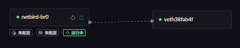
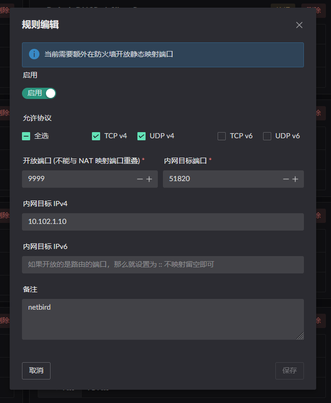
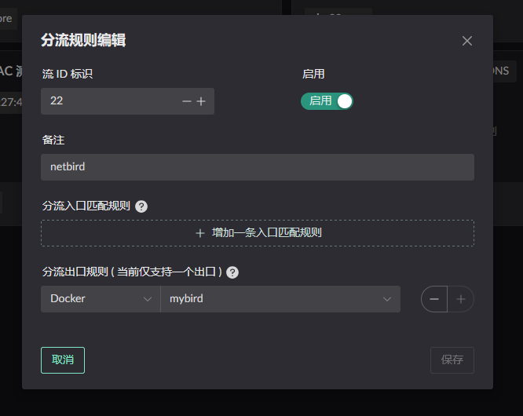
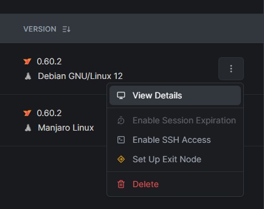
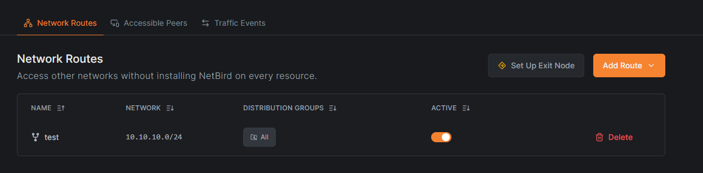
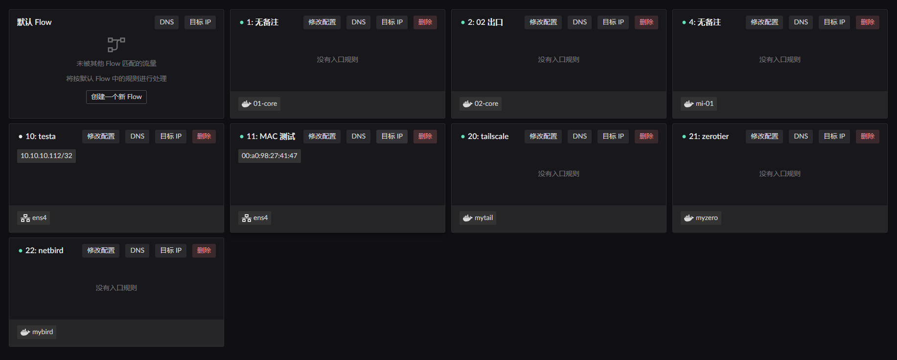
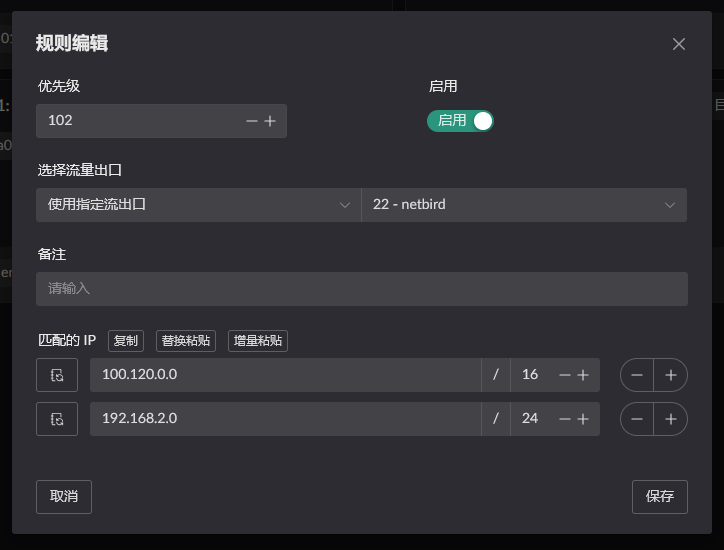
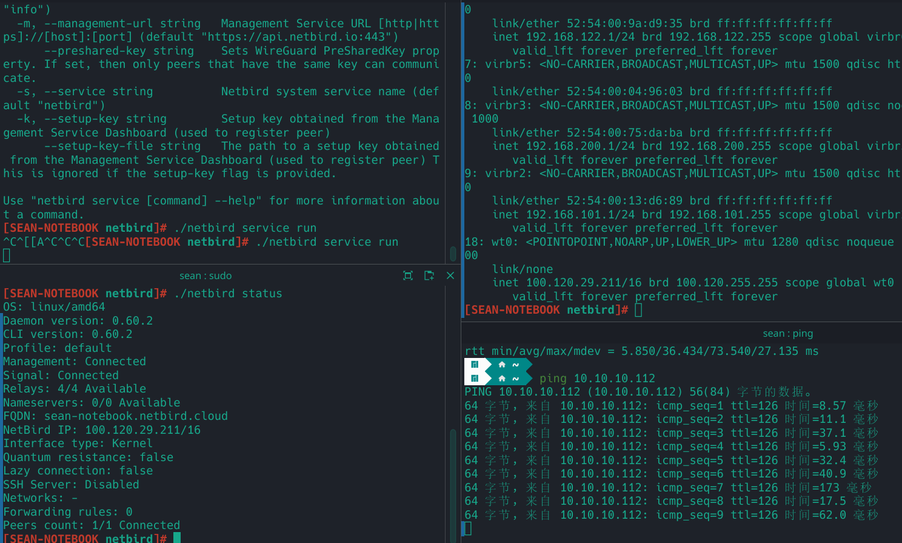
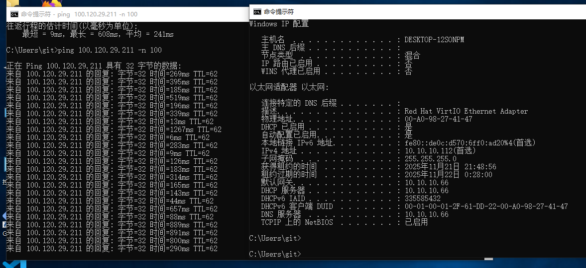

# NetBird
::: warning
NetBird 的网站在直连时被阻断了, 所以实际的直连能否使用得看当前部署的环境.
:::

NetBird 的部署使用的步骤大致如下:
1. 开启 NAT1 映射
2. 启动 NetBird 容器, 并以此容器为出口创建一个 Flow.
3. 设置路由让内网中的程序可以访问 NetBird 中的 IP / 网段.

## 设置 NAT1
主要有以下两种方式可进行 FullCone NAT (NAT1), 任选一种配置方式就行.
1. 将 NetBird 使用的端口[`51820`](https://docs.netbird.io/get-started/cli#up), 配置静态 NAT.
2. 将 NetBird 的域名 (netbird.io) 添加到 DNS 规则中. 并开启 NAT1 开关.

以上两种方式都只在容器所属的 `网桥` 开启 `Lan 路由转发服务` 时才生效. 如下图.


> 静态NAT配置 (内网目标端口为容器端口, IP 为容器 IP)


> DNS / IP 规则配置  
> 还未进行实际配置, 可参考 ZeroTier 中的配置方式.

## 启动容器
::: warning
网桥中的名称一定要设置 !!!
```yaml
networks:
  my-netbird-bridge:
    driver: bridge
    driver_opts:
      # 一定要设置, 否则默认会使用动态网卡名称, 重启后网卡名称变动导致 LAN 服务不能正常开启
      com.docker.network.bridge.name: netbird-br0
```
:::
使用 [apps](https://github.com/landscape-router/landscape-apps) 仓库编译的 [镜像](https://github.com/landscape-router/landscape-apps/pkgs/container/landscape-apps%2Fnetbird) 进行启动容器. 下方展示的 compose 配置可能过时, 最新配置文件请访问 [docker-compose](https://github.com/landscape-router/landscape-apps/blob/main/netbird/docker-compose.yaml).


然后按照你的 compose 配置进行启动即可. 
```yaml
services:
  netbird:
    image: ghcr.io/landscape-router/landscape-apps/netbird:latest
    container_name: mybird
    hostname: mybird
    cap_add:
      - NET_ADMIN
      - SYS_ADMIN
      - SYS_RESOURCE
      - BPF
      - PERFMON
    environment:
      - NB_SETUP_KEY=${SETUP_KEY}
    volumes:
      - ${DATA_PATH}:/var/lib/netbird
      - /root/.landscape-router/unix_link/:/ld_unix_link/:ro
    networks:
      my-netbird-bridge:
        ipv4_address: 10.102.1.10
    dns:
      - 10.102.1.1

networks:
  my-netbird-bridge:
    driver: bridge
    driver_opts:
      # 一定要设置, 否则默认会使用动态网卡名称, 重启后网卡名称变动导致 LAN 服务不能正常开启
      com.docker.network.bridge.name: netbird-br0
    ipam:
      config:
        - subnet: 10.102.1.0/24
          gateway: 10.102.1.1
```
然后创建一个 Flow 并使用这个容器作为出口.


注意，需要在 netbird 的控制面板中为网关节点添加路由。



## 配置 "路由" 规则
点击相应 Flow 的 `目标 IP` 按钮进行配置. 只有添加相应规则的 Flow 才会生效.


比如我当前 LAN 客户端的 MAC 地址是 `00:a0:98:27:41:47`, 这个客户端当前被 `Flow 11` 规则所管理. 所以我需要在 `Flow 11` 的 `目标 IP` 进行配置. 并选择流量的出口为刚刚启动容器时创建的 `Flow 22`.


这样, 当 LAN 客户端访问 `100.120.0.0/16` 或者 `192.168.2.0/24` 时, 这些数据包就会使用 Flow 22 (netbird) 的出口, 也就是被转发到 `mybird` 容器中.

> 192.168.2.0/24 这个示例是假设你在对端也部署了 netbird , 那么可以直接配置对方的网段. 这样就能实现互通.

## 结果验证
设备说明:
* `设备1`: 100.120.29.211, `非` 路由部署的 `NetBird 客户端`
* `设备2`: 100.120.126.160, 路由部署的 `NetBird 客户端`
* `设备3`: 10.10.10.112, 路由 LAN 下的一台主机  

1. 从 `设备1` ping `设备3` 通过 `设备2` 处理.

2. 从 `设备3` ping `设备1` 通过 `设备2` 处理.

