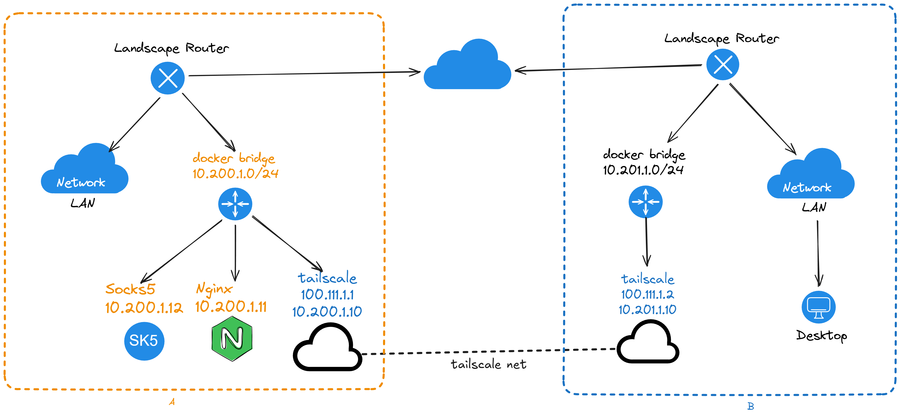
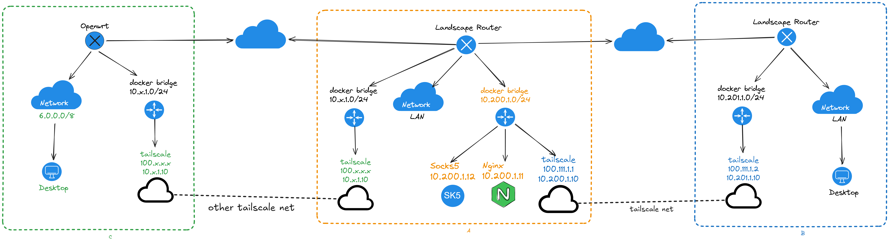

# Site To Site 网络配置
Site-to-Site 网络（站点到站点） 指的是：  
把两个（或多个）物理上分开的局域网 LAN，通过 公共网络（互联网） 安全地桥接在一起，让它们像同一个内部网络一样互通。

> 把两个办公室 / 两个机房 / 两个家庭网络 “连成一个大内网”。

## 拓扑

配置之后的拓扑大概这样
:::info
注意, 拓扑上未列出 A/B 两侧 LAN 区域的网段.  
如果要实现互通, 需要在 tailscale 启动参数中增加使用 `--advertise-routes` 添加各自 LAN `CIDR`.
:::



上图中 `B侧` 部分 LAN， 可以通过 `10.200.1.0/24` 对 `A侧` 的容器进行访问。而无需在意 tailscale 使用的 IP 是什么。

## 部署配置
首先是 `A侧` 的配置, compose 如下：

```yaml
services:
  tailscale:
    image: ghcr.io/landscape-router/landscape-apps/tailscale:latest
    container_name: <容器名称>
    restart: unless-stopped
    cap_add:
      - NET_ADMIN
      - SYS_ADMIN
      - PERFMON
    devices:
      - /dev/net/tun
    environment:
      - TS_AUTHKEY=<密钥>
      - TS_STATE_DIR=/var/lib/tailscale
      - TS_EXTRA_ARGS=--accept-dns=false --advertise-routes=10.200.1.0/24,<A区 LAN 的 CIDR, 或者其他 docker bridge 的 CIDR> --accept-routes
      - TS_USERSPACE=false
      - TS_TAILSCALED_EXTRA_ARGS=--port=41641
    sysctls:
      net.ipv4.ip_forward: "1"
      net.ipv6.conf.all.forwarding: "1"
    volumes:
      - <持久化存放路径>:/var/lib/tailscale
      - /root/.landscape-router/unix_link/:/ld_unix_link/:ro
    networks:
      my-tailscale-bridge:
        ipv4_address: 10.200.1.10
    dns:
      - 10.200.1.1
  # 测试用的 Nginx
  ng1:
    image: nginx
    container_name: ng1
    restart: unless-stopped
    networks:
      my-tailscale-bridge:
        ipv4_address: 10.200.1.11
    dns:
      - 10.200.1.1
  # 测试用的 socks5 服务
  sock-server:
    image: serjs/go-socks5-proxy
    container_name: sk5
    restart: unless-stopped
    environment:
      REQUIRE_AUTH: false
    networks:
      my-tailscale-bridge:
        ipv4_address: 10.200.1.12
    dns:
      - 10.200.1.1

networks:
  my-tailscale-bridge:
    driver: bridge
    driver_opts:
      # 一定要设置, 否则默认会使用动态网卡名称, 重启后网卡名称变动导致服务不能正常开启
      com.docker.network.bridge.name: test_tail-br0
    ipam:
      config:
        - subnet: 10.200.1.0/24
          gateway: 10.200.1.1
```

启动后需要按照 [tailscale 组网](./tailscale.md#启动容器) 中一样, 在 tailscale 的控制面板中允许此节点的路由.

`B侧` 配置:

```yaml
services:
  tailscale:
    image: ghcr.io/landscape-router/landscape-apps/tailscale:latest
    container_name: <容器名称>
    restart: unless-stopped
    cap_add:
      - NET_ADMIN
      - SYS_ADMIN
      - PERFMON
    devices:
      - /dev/net/tun
    environment:
      - TS_AUTHKEY=<密钥>
      - TS_STATE_DIR=/var/lib/tailscale
      - TS_EXTRA_ARGS=--accept-dns=false --advertise-routes=<B区 LAN 的 CIDR> --accept-routes
      - TS_USERSPACE=false
      - TS_TAILSCALED_EXTRA_ARGS=--port=41641
    sysctls:
      net.ipv4.ip_forward: "1"
      net.ipv6.conf.all.forwarding: "1"
    volumes:
      - <持久化存放路径>:/var/lib/tailscale
      - /root/.landscape-router/unix_link/:/ld_unix_link/:ro
    networks:
      my-tailscale-bridge:
        ipv4_address: 10.201.1.10
    dns:
      - 10.201.1.1

networks:
  my-tailscale-bridge:
    driver: bridge
    driver_opts:
      # 一定要设置, 否则默认会使用动态网卡名称, 重启后网卡名称变动导致服务不能正常开启
      com.docker.network.bridge.name: test_tail-br0
    ipam:
      config:
        - subnet: 10.201.1.0/24
          gateway: 10.201.1.1
```
启动后需要按照 [tailscale 组网](./tailscale.md#启动容器) 中一样, 在 tailscale 的控制面板中允许此节点的路由.  

以上配置之后, 除了在 [tailscale/配置-路由-规则](./tailscale.md#配置-路由-规则) 中, 配置的 tailscale 的路由, 额外需要增加对方的 LAN 配置.  
B区域除了访问 tailscale 的 IP 外, 还访问对方的 Docker 容器, 所以要将 容器 CIDR 也设置上.


A 区也同样的要将 B区 LAN CIDR 加入.


## 附: 使用 A 区作为跳板与另一个账号的 tailscale 网络进行组网



只要同时在连接 C 的 tailscale 客户端中通告 `10.200.1.0/24` 即可在 B 通过 A 访问 C 的 LAN.
当然 访问 C 的途径你可以换成任意的组网工具.
