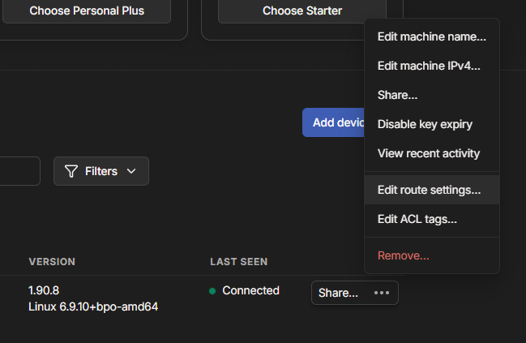
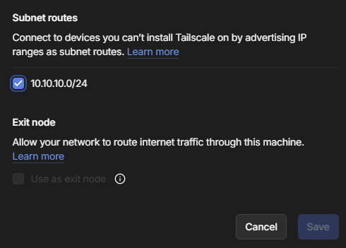
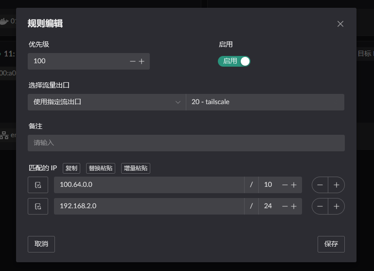

# Tailscale
Tailscale 的部署使用的步骤大致如下:
1. 开启 NAT1 映射
2. 启动 tailscale 容器, 并以此容器为出口创建一个 Flow.
3. 设置路由让内网中的程序可以访问 tailscalse 中的 IP / 网段.

## 设置 NAT1
主要有以下两种方式可进行 FullCone NAT (NAT1), 任选一种配置方式就行.
1. 固定 tailscale [使用的端口](https://tailscale.com/kb/1278/tailscaled#flags-to-tailscaled), 并使用静态 NAT 进行开放端口.
2. 动态 tailscale 端口, 但是需要添加 tailscale DERP 的 `域名` 或者 `IP` 到 DNS 或者 IP 规则中. 并开启 NAT1 开关.

以上两种方式都只在容器所属的 `网桥` 开启 `Lan 路由转发服务` 时才生效. 如下图.


> 静态NAT配置 (内网目标端口为容器端口, IP 为容器 IP)


> 规则配置  
> 还未进行实际配置, 可参考 ZeroTier 中的配置方式.

## 启动容器
::: warning
网桥中的名称一定要设置 !!!
```yaml
networks:
  my-tailscale-bridge:
    driver: bridge
    driver_opts:
      # 一定要设置, 否则默认会使用动态网卡名称, 重启后网卡名称变动导致 LAN 服务不能正常开启
      com.docker.network.bridge.name: tail-br0
```
:::
使用 [apps](https://github.com/landscape-router/landscape-apps) 仓库编译的[镜像](https://github.com/landscape-router/landscape-apps/pkgs/container/landscape-apps%2Ftailscale)进行启动容器. 下方展示的 compose 配置可能过时, 最新配置文件请访问 [docker-compose](https://github.com/landscape-router/landscape-apps/blob/main/tailscale/docker-compose.yaml).

然后按照你的 compose 配置进行启动即可. 注意 `--port=41641` 参数. 这是为了固定端口.
```yaml
services:
  tailscale:
    image: ghcr.io/landscape-router/landscape-apps/tailscale:latest
    container_name: mytail
    restart: unless-stopped
    cap_add:
      - NET_ADMIN
      - SYS_ADMIN
      - PERFMON
    devices:
      - /dev/net/tun
    environment:
      - TS_AUTHKEY=${TS_AUTHKEY}
      - TS_STATE_DIR=/var/lib/tailscale
      - TS_EXTRA_ARGS=${TS_EXTRA_ARGS}
      - TS_USERSPACE=false
      - TS_TAILSCALED_EXTRA_ARGS=--port=41641
    sysctls:
      net.ipv4.ip_forward: "1"
      net.ipv6.conf.all.forwarding: "1"
    volumes:
      - ${DATA_PATH}:/var/lib/tailscale
      - /root/.landscape-router/unix_link/:/ld_unix_link/:ro
    networks:
      my-tailscale-bridge:
        ipv4_address: 10.100.1.10
    dns:
      - 10.100.1.1

networks:
  my-tailscale-bridge:
    driver: bridge
    driver_opts:
      # 一定要设置, 否则默认会使用动态网卡名称
      com.docker.network.bridge.name: tail-br0
    ipam:
      config:
        - subnet: 10.100.1.0/24
          gateway: 10.100.1.1
```

然后创建一个 Flow 并使用这个容器作为出口.


注意，需要在 tailscale 的控制面板中允许此节点的路由。



并且在其他客户端启动时，需要增加 `--accept-routes` 选项, 例如: 
```shell
tailscale up --accept-routes
```

## 配置 "路由" 规则
点击相应 Flow 的 `目标 IP` 按钮进行配置. 只有添加相应规则的 Flow 才会生效.


比如我当前 LAN 客户端的 MAC 地址是 `00:a0:98:27:41:47`, 这个客户端当前被 `Flow 11` 规则所管理. 所以我需要在 `Flow 11` 的 `目标 IP` 进行配置. 并选择流量的出口为刚刚启动容器时创建的 `Flow 20`.


这样, 当 LAN 客户端访问 `100.64.0.0/10` 或者 `192.168.2.0/24` 时, 这些数据包就会使用 Flow 20 (tailscale) 的出口, 也就是被转发到 `mytail` 容器中.

> 192.168.2.0/24 这个示例是假设你在对端也部署了 tailscale , 那么可以直接配置对方的网段. 这样就能实现互通.

## 结果验证
1. 从 `非` 路由部署的 `tailscale 客户端` (100.118.21.86) ping `00:a0:98:27:41:47` 客户端 通过容器中 `100.76.59.45` 处理.

2. 从 `00:a0:98:27:41:47` 客户端, ping `非` 路由部署的 `tailscale 客户端` (100.118.21.86)

