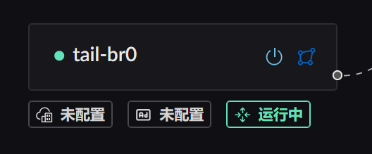
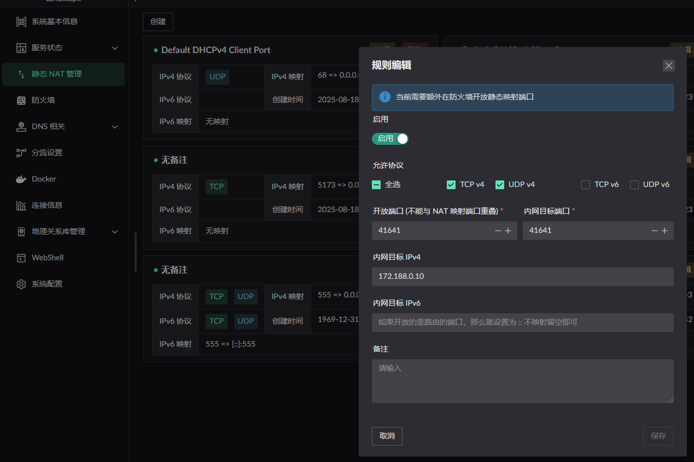
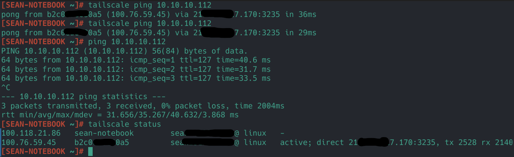

# Tailscale
大致方式是
1. 将容器所属的 bridge 转为 LAN 类型网卡
2. 并且将 bridge 网卡开启 LAN 路由转发服务
3. 然后再使用静态 NAT 映射配置, 需要将`容器的 IP` 填写到 `内网目标 IPV4` 上.

```yaml
services:
  tailscale:
    image: tailscale/tailscale:latest
    container_name: <容器名称>
    restart: unless-stopped
    cap_add:
      - NET_ADMIN
      - SYS_ADMIN
      - PERFMON
    devices:
      - /dev/net/tun
    environment:
      - TS_AUTHKEY=tskey-auth-<AUTH KEY>
      - TS_STATE_DIR=/var/lib/tailscale
      - TS_EXTRA_ARGS=--accept-dns=false --advertise-routes=<代理的内网网段>
      - TS_USERSPACE=false
      - TS_TAILSCALED_EXTRA_ARGS=--port=<指定端口>
    sysctls:
      net.ipv4.ip_forward: "1"
      net.ipv6.conf.all.forwarding: "1"
    volumes:
      - <tailscale 持久化路径>::/var/lib/tailscale
    networks:
      my-tailscale-bridge:
        ipv4_address: 172.188.0.10  # 可选指定容器 IP
    dns:
      - 172.188.0.1 # 设置为 bridge IP 可以使用默认流的 DNS 配置

networks:
  my-tailscale-bridge:
    driver: bridge
    driver_opts:
      com.docker.network.bridge.name: tail-br0<网卡名称. 必须指定>
    ipam:
      config:
        - subnet: 172.188.0.0/24
          gateway: 172.188.0.1
```
按照如上方式配置后, 在 UI 上转换该网卡的区域, 并且开启 LAN 路由转发. 如下图所示:


然后在 `静态 NAT 管理` 中添加端口映射为静态 NAT


最终从另一个主机A ping 路由下的一个 LAN `10.10.10.112` 主机
