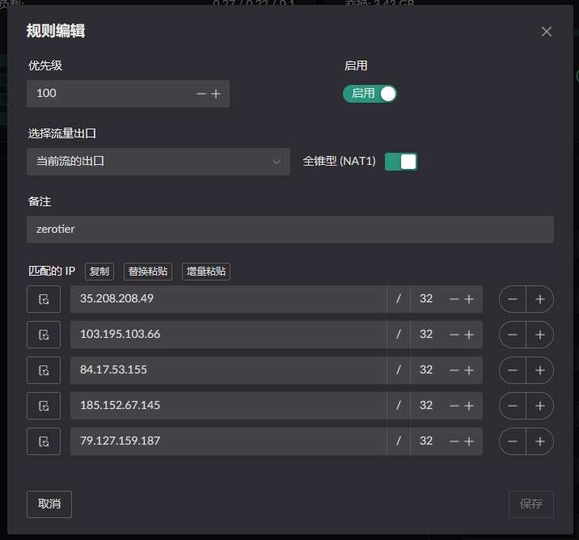
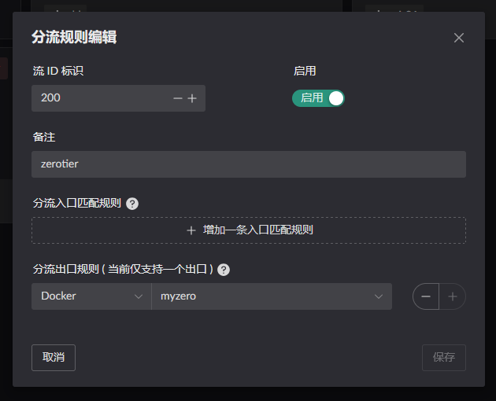
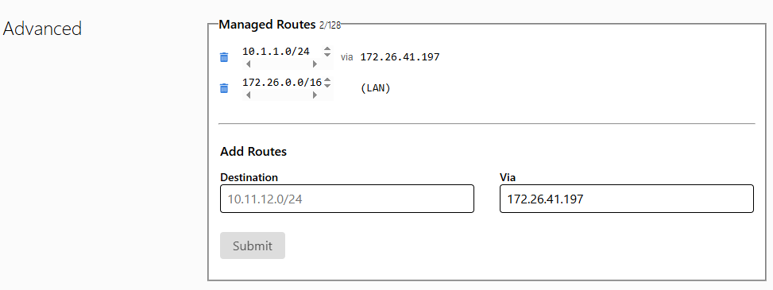

# Zerotier
首先从 gtihub 下载 handler
这边使用 x86 作为例子
```shell
https://github.com/ThisSeanZhang/landscape/releases/latest/download/redirect_pkg_handler-x86_64
```
在目录下创建 Dockerfile
```Dockerfile
FROM zerotier/zerotier:1.14.2

COPY ./redirect_pkg_handler /redirect_pkg_handler
RUN chmod +x /redirect_pkg_handler

COPY start.sh /start.sh
RUN chmod +x /start.sh

ENTRYPOINT ["/start.sh"]
```
`start.sh`的内容为
```bash
#!/bin/sh
set -e

# 启动接应程序
echo "[redirect_pkg_handler] starting..."
/redirect_pkg_handler -m route &

# 调用原本的 entrypoint.sh 并传递所有参数
echo "[zerotier entrypoint] starting..."
exec /entrypoint.sh "$@"

```
当前的文件夹下有以下内容
```text
tree
.
├── Dockerfile
├── redirect_pkg_handler
└── start.sh
```

然后执行，进行编译镜像
```shell
docker build -t <标签名称> .
```

得到该镜像，然后创建如下 compose 文件

```yaml
services:
  zerotier:
    image: <标签名称>
    container_name: myzero
    restart: unless-stopped
    cap_add:
      - NET_ADMIN
      - SYS_ADMIN 
      - BPF
      - PERFMON
    devices:
      - /dev/net/tun
    command: <填你的网络ID>
    sysctls:
      net.ipv4.ip_forward: "1"
      net.ipv6.conf.all.forwarding: "1"
    volumes:
      - <zerotier 持久化路径>:/var/lib/zerotier-one
      - /root/.landscape-router/unix_link/:/ld_unix_link/:ro
    networks:
      my-zerotier-bridge:
        ipv4_address: 172.199.0.10  # 可选指定容器 IP
    dns:
      - 172.199.0.1

networks:
  my-zerotier-bridge:
    driver: bridge
    driver_opts:
      com.docker.network.bridge.name: zero-br0
    ipam:
      config:
        - subnet: 172.199.0.0/16
          gateway: 172.199.0.1

```
需要在默认流中设置 zerotier NAT1 开放(不打开 NAT1 将只能使用中继模式), 可将以下复制粘贴到规则中即可. IP 可能会变动, 之后应该是会维护一个字典
```json
[
  {
    "t": "config",
    "ip": "35.208.208.49",
    "prefix": 32
  },
  {
    "t": "config",
    "ip": "103.195.103.66",
    "prefix": 32
  },
  {
    "t": "config",
    "ip": "84.17.53.155",
    "prefix": 32
  },
  {
    "t": "config",
    "ip": "185.152.67.145",
    "prefix": 32
  },
  {
    "t": "config",
    "ip": "79.127.159.187",
    "prefix": 32
  }
]
```



成功后可见
```
docker exec <容器名称> zerotier-cli peers
200 peers
<ztaddr>   <ver>  <role> <lat> <link>   <lastTX> <lastRX> <path>
68bea79acf 1.15.3 LEAF     274 DIRECT   13477    13477    xxx.xxx.xxx.xxx/21049
778cde7190 -      PLANET   329 DIRECT   25175    29846    103.195.103.66/9993
cafe04eba9 -      PLANET   290 DIRECT   25175    29885    84.17.53.155/9993
cafe80ed74 -      PLANET   192 DIRECT   25175    29795    185.152.67.145/9993
cafefd6717 -      PLANET   137 DIRECT   172      25038    79.127.159.187/9993
```

然后创建一个新流, 将 zerotier 的容器设置该流的出口.



然后在默认流, 将 zerotier 网段的数据传到 zerotier 容器中. 


除此之外要记得
```text
docker exec <容器名称> ip add
...
3: zt6jy55lqy: <BROADCAST,MULTICAST,UP,LOWER_UP> mtu 2800 qdisc fq_codel state UNKNOWN group default qlen 1000
    link/ether d6:46:9c:3c:ed:45 brd ff:ff:ff:ff:ff:ff
    inet 172.26.41.197/16 brd 172.26.255.255 scope global zt6jy55lqy
       valid_lft forever preferred_lft forever
    inet6 fe80::d446:9cff:fe3c:ed45/64 scope link 
       valid_lft forever preferred_lft forever
```
将你的 内网 (我这是 `10.1.1.0/24`) 配置到 zerotier 中, via 字段填的是 上方查询到的 容器内的 IP `(172.26.41.197)`


此时你再使用另一个客户端连接上, 就可以访问你的内网资源了.
