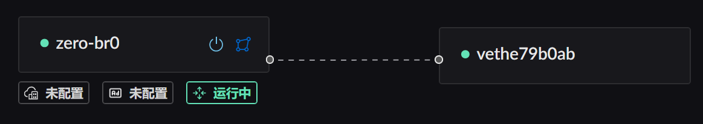
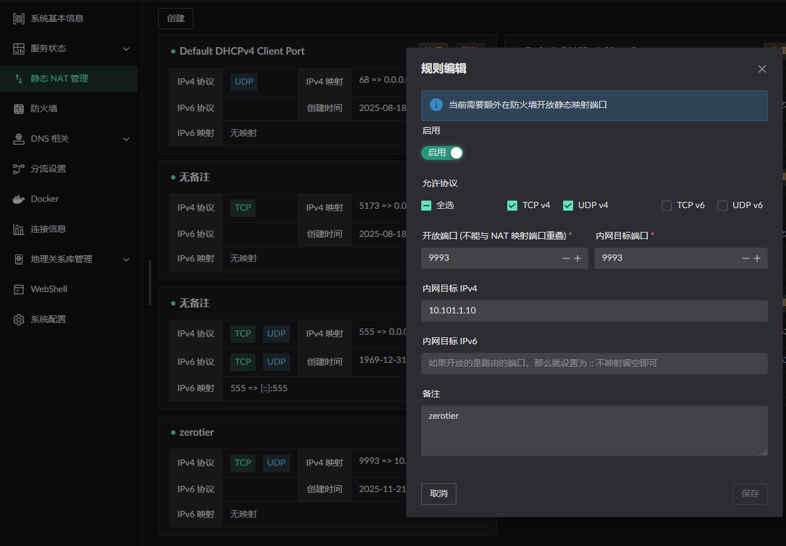
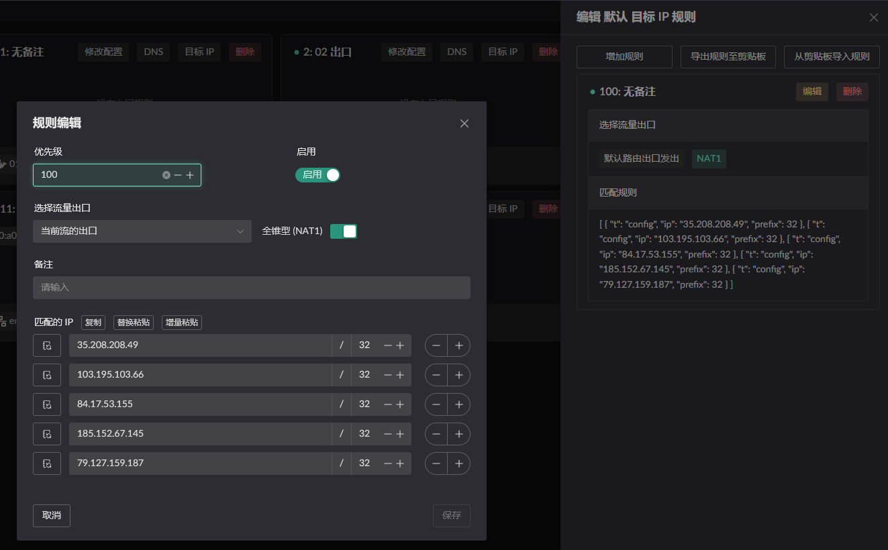
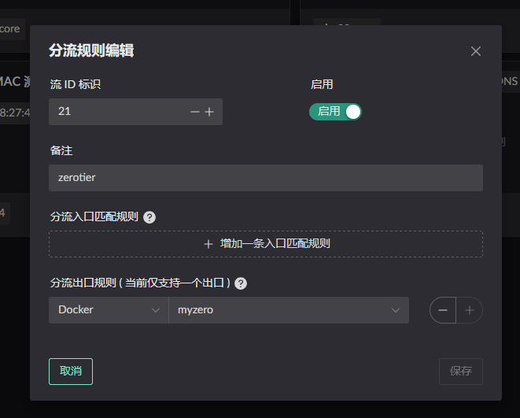
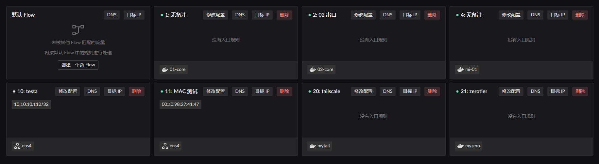
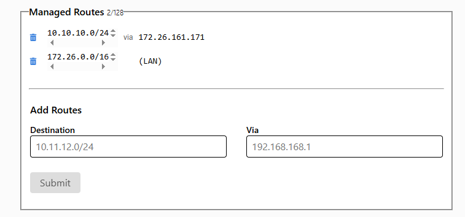
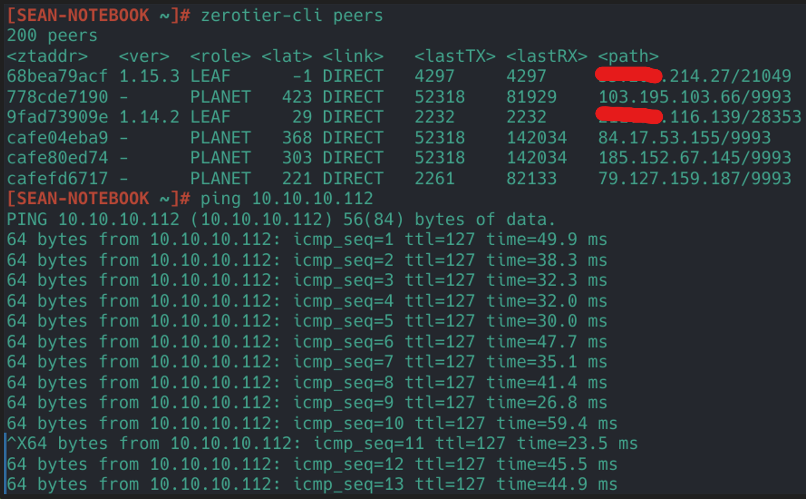
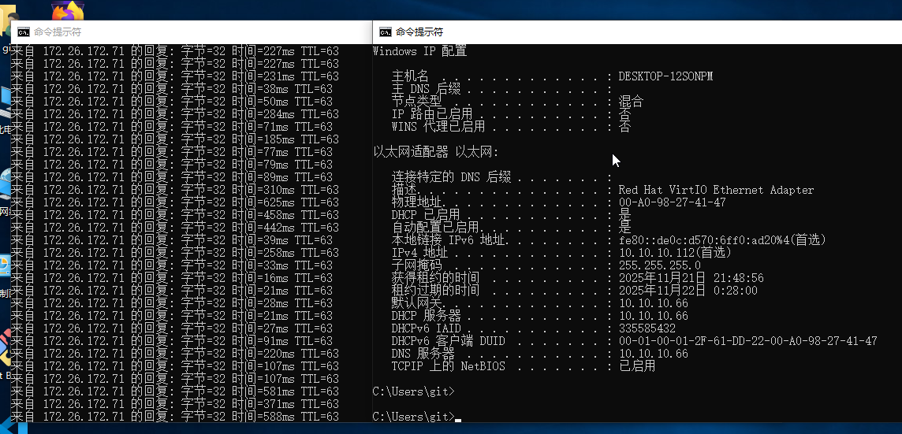

# ZeroTier
ZeroTier 的部署使用的步骤大致如下:
1. 开启 NAT1 映射
2. 启动 ZeroTier 容器, 并以此容器为出口创建一个 Flow.
3. 设置路由让内网中的程序可以访问 ZeroTier 中的 IP / 网段.

## 设置 NAT1
主要有以下两种方式可进行 FullCone NAT (NAT1), 任选一种配置方式就行.
1. 将 ZeroTier 使用的端口（`9993`）, 配置静态 NAT.
2. 将 ZeroTier 使用的 `PLANET` 添加到 IP 规则中. 并开启 NAT1 开关.

以上两种方式都只在容器所属的 `网桥` 开启 `Lan 路由转发服务` 时才生效. 如下图.


> 静态NAT配置 (内网目标端口为容器端口, IP 为容器 IP)


> IP 规则配置 (注意是在 `默认流` 的 `目标 IP 规则` 中进行配置, 假设你没有将该容器的 MAC 或者 IP 配置为某个流的入口)

可复制下列 JSON 并粘贴到规则中
>```json
>  [
>    {
>      "t": "config",
>      "ip": "35.208.208.49",
>      "prefix": 32
>    },
>    {
>      "t": "config",
>      "ip": "103.195.103.66",
>      "prefix": 32
>    },
>    {
>      "t": "config",
>      "ip": "84.17.53.155",
>      "prefix": 32
>    },
>    {
>      "t": "config",
>      "ip": "185.152.67.145",
>      "prefix": 32
>    },
>    {
>      "t": "config",
>      "ip": "79.127.159.187",
>      "prefix": 32
>    }
>  ]
>```


## 启动容器
::: warning
网桥中的名称一定要设置 !!!
```yaml
networks:
  my-zerotier-bridge:
    driver: bridge
    driver_opts:
      # 一定要设置, 否则默认会使用动态网卡名称, 重启后网卡名称变动导致 LAN 服务不能正常开启
      com.docker.network.bridge.name: zero-br0
```
:::

使用 [apps](https://github.com/landscape-router/landscape-apps) 仓库编译的[镜像](https://github.com/landscape-router/landscape-apps/pkgs/container/landscape-apps%2Fzerotier)进行启动容器. 下方展示的 compose 配置可能过时, 最新配置文件请访问 [docker-compose](https://github.com/landscape-router/landscape-apps/blob/main/zerotier/docker-compose.yaml).

然后按照你的 compose 配置进行启动即可.

```yaml
services:
  zerotier:
    image: ghcr.io/landscape-router/landscape-apps/zerotier:latest
    container_name: myzero
    restart: unless-stopped
    cap_add:
      - NET_ADMIN
      - SYS_ADMIN 
      - BPF
      - PERFMON
    devices:
      - /dev/net/tun
    command: ${NETWORK_ID}
    sysctls:
      net.ipv4.ip_forward: "1"
      net.ipv6.conf.all.forwarding: "1"
    volumes:
      - ${DATA_PATH}:/var/lib/zerotier-one
      - /root/.landscape-router/unix_link/:/ld_unix_link/:ro
    networks:
      my-zerotier-bridge:
        ipv4_address: 10.101.1.10
    dns:
      - 10.101.1.1

networks:
  my-zerotier-bridge:
    driver: bridge
    driver_opts:
      # 一定要设置, 否则默认会使用动态网卡名称, 重启后网卡名称变动导致 LAN 服务不能正常开启
      com.docker.network.bridge.name: zero-br0
    ipam:
      config:
        - subnet: 10.101.1.0/24
          gateway: 10.101.1.1
```

容器启动成功后可见.
```
docker exec <容器名称> zerotier-cli peers
200 peers
<ztaddr>   <ver>  <role> <lat> <link>   <lastTX> <lastRX> <path>
68bea79acf 1.15.3 LEAF     274 DIRECT   13477    13477    xxx.xxx.xxx.xxx/21049
778cde7190 -      PLANET   329 DIRECT   25175    29846    103.195.103.66/9993
cafe04eba9 -      PLANET   290 DIRECT   25175    29885    84.17.53.155/9993
cafe80ed74 -      PLANET   192 DIRECT   25175    29795    185.152.67.145/9993
cafefd6717 -      PLANET   137 DIRECT   172      25038    79.127.159.187/9993
```

然后创建一个 Flow 并使用这个容器作为出口. 



## 配置 "路由" 规则
点击相应 Flow 的 `目标 IP` 按钮进行配置. 只有添加相应规则的 Flow 才会生效.


比如我当前 LAN 客户端的 MAC 地址是 `00:a0:98:27:41:47`, 这个客户端当前被 `Flow 11` 规则所管理. 所以我需要在 `Flow 11` 的 `目标 IP` 进行配置. 并选择流量的出口为刚刚启动容器时创建的 `Flow 21`.


除此之外要记得
```text
docker exec <容器名称> ip add
...
3: zt6jy55lqy: <BROADCAST,MULTICAST,UP,LOWER_UP> mtu 2800 qdisc fq_codel state UNKNOWN group default qlen 1000
    link/ether d6:46:9c:3c:ed:45 brd ff:ff:ff:ff:ff:ff
    inet 172.26.161.171/16 brd 172.26.255.255 scope global zt6jy55lqy
       valid_lft forever preferred_lft forever
    inet6 fe80::d446:9cff:fe3c:ed45/64 scope link 
       valid_lft forever preferred_lft forever
```
将你的 内网 (我这是 `10.10.10.0/24`) 配置到 zerotier 中, via 字段填的是 上方查询到的 容器内的 IP `(172.26.161.171)`


此时你再使用另一个客户端连接上, 就可以访问你的内网资源了.

## 结果验证
设备说明:
* `设备1`: 172.26.172.71, `非` 路由部署的 `ZeroTier 客户端`
* `设备2`: 172.26.161.171, 路由部署的 `ZeroTier 客户端`
* `设备3`: 10.10.10.112, 路由 LAN 下的一台主机  

1. 从 `设备1` ping `设备3` 通过 `设备2` 处理.

2. 从 `设备3` ping `设备1` 通过 `设备2` 处理.


## 附：ZeroTier 使用的 PLANET
IP 规则配置中填入的 IP 地址为这些域名查询后得到的 IP  
```text
root-mia-01.zerotier.com  
root-tok-01.zerotier.com  
root-zrh-01.zerotier.com  
root-lax-01.zerotier.com  
```