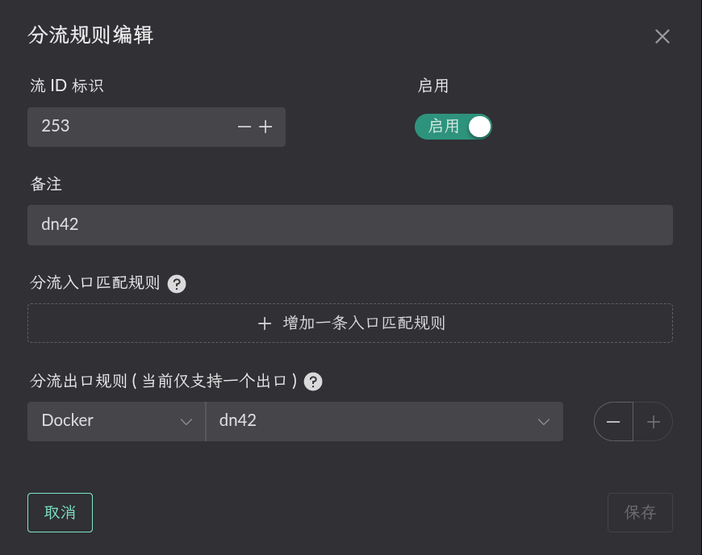
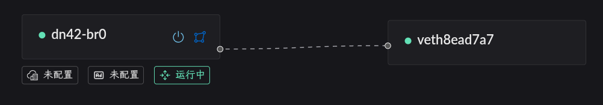
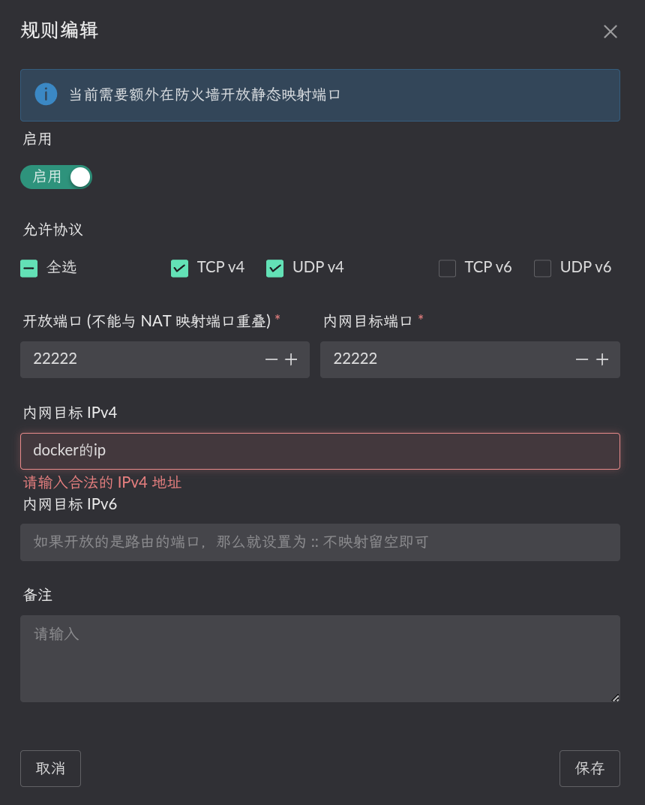
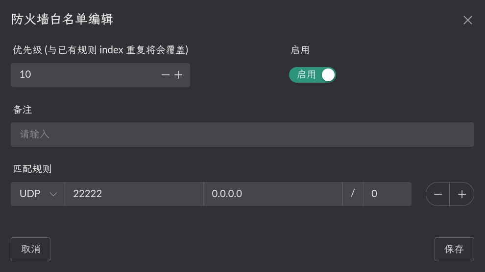
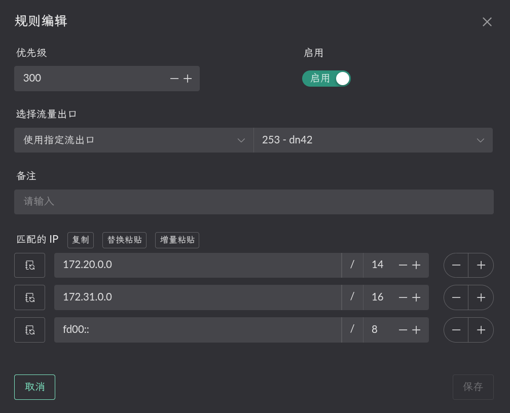
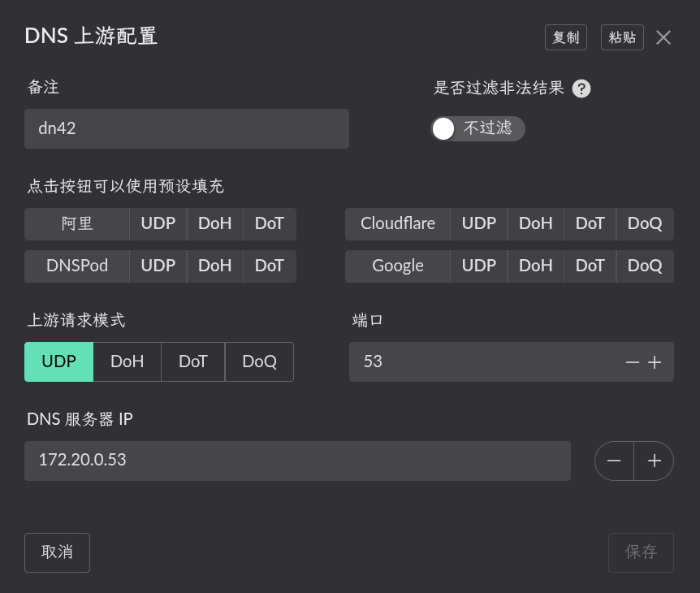
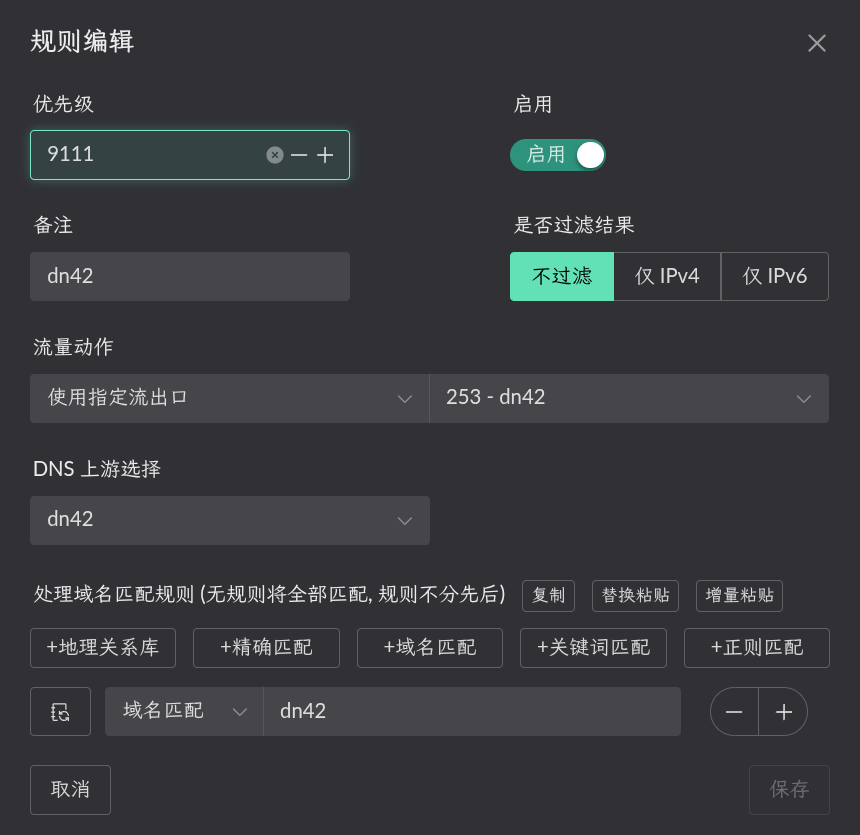

# dn42

Connecting to the dn42 network involves the following steps:

1. Build a container for WireGuard and BIRD 2.
2. Add the BIRD 2 and WireGuard configuration files, start the container, and
   create a Flow that uses it as the egress.
3. Configure **Full Cone NAT**.
4. Configure routing and DNS so LAN clients can reach dn42 addresses, subnets,
   and domains.

## Building the container

First create a `Dockerfile`:

```dockerfile
# Use Alpine Linux as the base
FROM alpine:latest
RUN sed -i 's/dl-cdn.alpinelinux.org/mirrors.tuna.tsinghua.edu.cn/g' /etc/apk/repositories
RUN apk update && apk add --no-cache \
    wireguard-tools \
    bird2 \
    libgcc \
    nano \
    iptables \
    tcpdump \
    iproute2 \
    tini \
    && rm -rf /var/cache/apk/*
# Create the configuration directories
RUN mkdir -p /etc/wireguard /etc/bird
# Copy the entrypoint and configuration (created below)
COPY entrypoint.sh /entrypoint.sh
COPY redirect_pkg_handler /redirect_pkg_handler
# Make the scripts executable
RUN chmod +x /entrypoint.sh && chmod +x /redirect_pkg_handler
# Use tini as the init process so signals are handled
ENTRYPOINT ["/sbin/tini", "--", "/entrypoint.sh"]
```

Create `entrypoint.sh` in the same directory:

```bash
#!/bin/sh
set -e
echo "[redirect_pkg_handler] starting..."
/redirect_pkg_handler -m route &
# Bring up every WireGuard interface (configuration files must end in .conf)
for conf in /etc/wireguard/*.conf; do
    if [ -f "$conf" ]; then
        echo "Bringing up WireGuard interface: $conf"
        wg-quick up "$conf" || echo "Failed to bring up $conf, check the configuration"
    fi
done
# Wait for the network to be ready (IPv6 in particular)
sleep 2
# Check the WireGuard interface status
wg show
# Start the BIRD2 daemon
echo "Starting the BIRD2 routing daemon..."
exec bird -c /etc/bird/bird.conf -f
```

Download the musl build of `redirect_pkg_handler` from the
[Landscape releases](https://github.com/ThisSeanZhang/landscape/releases/). The
directory should then contain:

```bash
tree
.
├── Dockerfile
├── redirect_pkg_handler
└── entrypoint.sh
```

Then build the image:

```shell
docker build -t <tag> .
```

## Starting the container

::: warning
Set a fixed Docker bridge name. If Docker generates a new interface name after
a restart, the LAN service cannot start correctly.

```yaml
networks:
  dn42-bridge:
    driver: bridge
    driver_opts:
      # Keep the bridge name fixed so it remains stable across restarts.
      com.docker.network.bridge.name: dn42-br0
```

:::

Then start it with your own compose configuration.

```yaml
services:
  dn42:
    image: <the image tag you built>
    container_name: dn42
    restart: unless-stopped
    cap_add:
      - NET_ADMIN
      - SYS_ADMIN
      - PERFMON
    sysctls:
      net.ipv4.ip_forward: '1'
      net.ipv6.conf.all.forwarding: '1'
      net.ipv4.conf.all.rp_filter: '0'
      net.ipv4.conf.default.rp_filter: '0'
    volumes:
      - /root/dn42/wireguard:/etc/wireguard
      - /root/dn42/bird:/etc/bird
      # For lkit deployments, use /root/.lkit/landscape/data/unix_link/ as the host path.
      - /root/.landscape-router/unix_link/:/ld_unix_link/:ro
    networks:
      dn42-bridge:
        ipv4_address: <an IP from the dn42 IPv4 range you registered>
        ipv6_address: <an IP from the dn42 IPv6 range you registered>

networks:
  dn42-bridge:
    driver: bridge
    enable_ipv6: true
    driver_opts:
      # Keep the bridge name fixed so it remains stable across restarts.
      com.docker.network.bridge.name: dn42-br0
    ipam:
      config:
        - subnet:
          gateway:
        - subnet:
          gateway:
```

Create `bird.conf` under `/root/dn42/bird`. You can start from the [dn42 BIRD
2 guide](https://wiki.dn42.us/howto/Bird2) and adapt it to your peers.

Create the peer's WireGuard configuration under `/root/dn42/wireguard`:

```ini
[Interface]
PrivateKey =
# Listen port
ListenPort =
# dn42 communication must use the official IP registered with dn42.
# Replace the example addresses with your own dn42 IPv4 and IPv6 addresses.
Address =
table = off
# Optional: add a link-local address for the BGP session
PostUp = /etc/wireguard/scripts/up.sh %i
PostDown = /etc/wireguard/scripts/down.sh %i

[Peer]
PublicKey =
# The peer's endpoint
Endpoint =
# The dn42 ranges allowed to route through this tunnel
AllowedIPs = 172.20.0.0/14, 172.31.0.0/16, fd00::/8, fe80::/64
# Pre-shared key
PresharedKey =
# Keepalive interval
PersistentKeepalive = 25
```

Create `up.sh` under `/root/dn42/wireguard/scripts`:

```bash
#!/bin/bash
# /etc/wireguard/scripts/up.sh
interface=$1
status=$2

ip address add <link-local address> dev $interface
iptables -t nat -A POSTROUTING -o $interface ! -s 172.16.0.0/12 -j SNAT --to-source <the docker IPv4 you set>
ip6tables -t nat -A POSTROUTING -o $interface ! -s fd00::/8 -j SNAT --to-source <the docker IPv6 you set>
```

And `down.sh`:

```bash
#!/bin/bash
# /etc/wireguard/scripts/down.sh
interface=$1
status=$2
iptables -t nat -D POSTROUTING -o $interface ! -s 172.16.0.0/12 -j SNAT --to-source <the docker IPv4 you set>
ip6tables -t nat -D POSTROUTING -o $interface ! -s fd00::/8 -j SNAT --to-source <the docker IPv6 you set>
```

Create a Flow that uses this container as its egress. 

## Configuring Full Cone NAT

First enable the `Route LAN` service on the bridge to which the container is
attached, as shown below.



> Static NAT configuration (the internal target port is the container's wg port, the IP is the container IP) 

> Open the matching port in the firewall 

## Configuring route rules

Click **Destination IP** on the relevant Flow to configure a rule. Only traffic
matching that rule uses the Flow. 

In this example, the LAN client with MAC address `00:a0:98:27:41:47` is
governed by `Flow 11`. Configure **Destination IP** on `Flow 11` and select
`Flow 253`, the Flow created for the container, as the egress.



Traffic to a dn42 range then uses the `Flow 253` egress and is forwarded into
the `dn42` container.

## Configuring DNS

Under **DNS -> Upstream DNS**, click **Create** to add the DNS server for the
dn42 network.



Return to **Flow Settings** and add a rule under **DNS** on `Flow 11`.



Queries for dn42 domains then use the `Flow 253` egress and are forwarded into
the `dn42` container.
