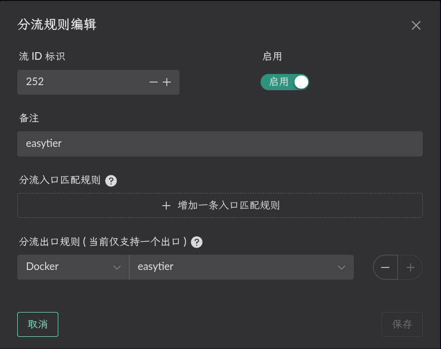
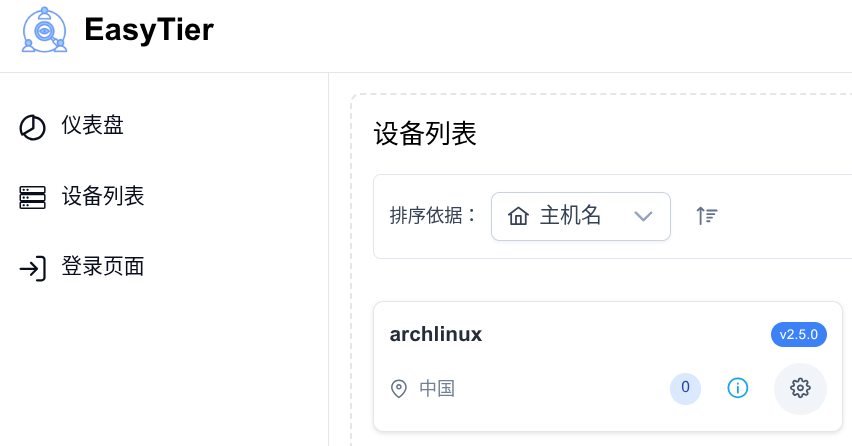
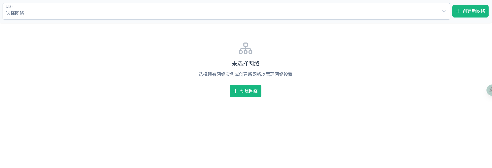
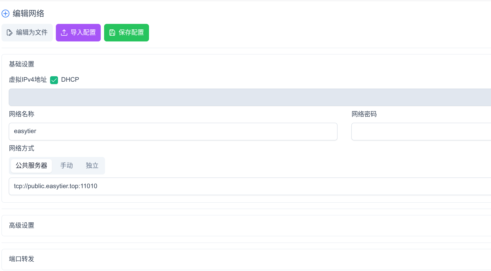
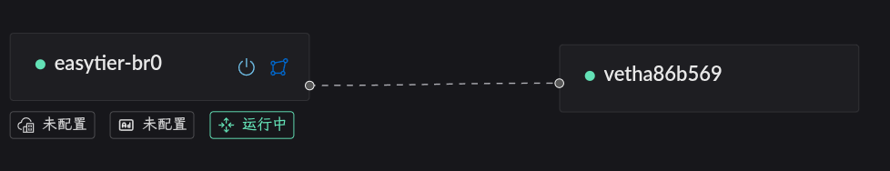
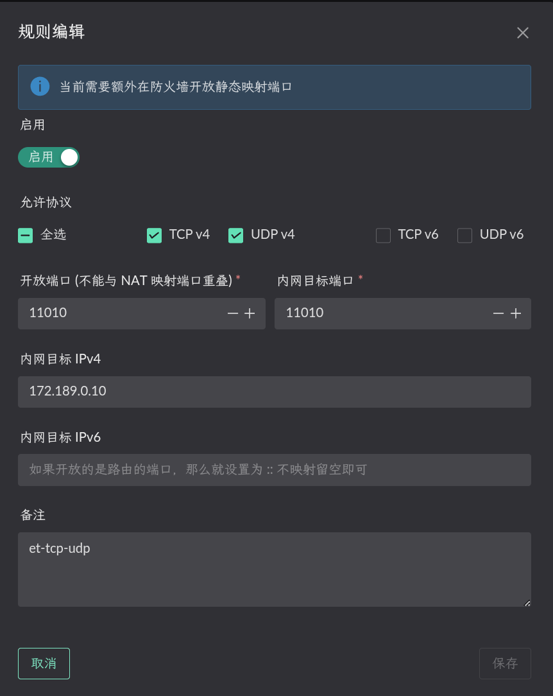
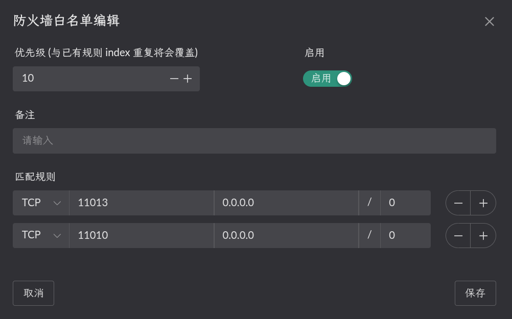
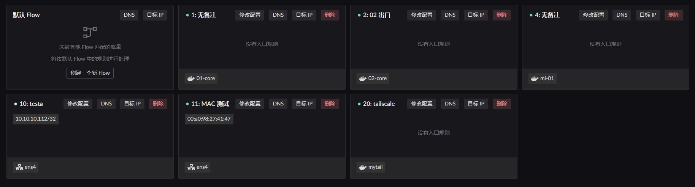
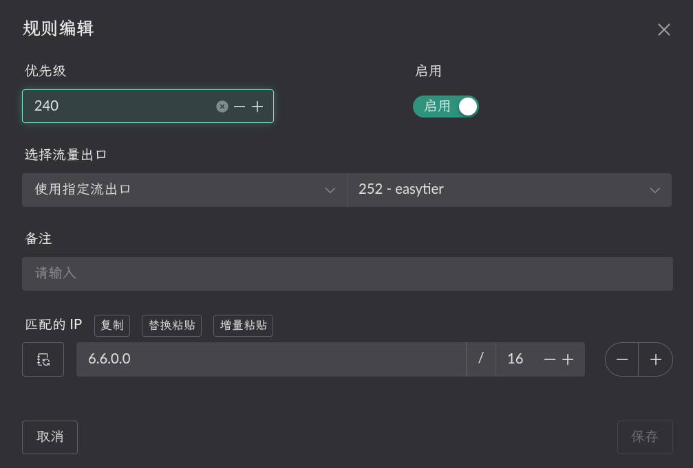

# Easytier

Deploying Easytier roughly comes down to:

1. Build an easytier container
2. Start the easytier container and create a Flow that uses it as the egress
3. Add the configuration on the easytier web side
4. Set up **Full Cone NAT** mapping
5. Set up routing so programs on the LAN can reach the IPs / subnets inside easytier

## Building the easytier container

First create a dockerfile:

```dockerfile
FROM debian:bookworm

RUN echo "deb https://mirrors.ustc.edu.cn/debian/ stable main contrib non-free" > /etc/apt/sources.list && \
    echo "deb https://mirrors.ustc.edu.cn/debian/ stable-updates main contrib non-free" >> /etc/apt/sources.list && \
    echo "deb https://mirrors.ustc.edu.cn/debian-security stable-security main contrib non-free" >> /etc/apt/sources.list

RUN apt-get update && \
    apt-get install -y --no-install-recommends \
        ca-certificates \
        iproute2 \
        iptables \
        wireguard-tools \
        curl \
    && rm -rf /var/lib/apt/lists/*

COPY easytier-core /easytier-core
RUN chmod +x /easytier-core

COPY redirect_pkg_handler /redirect_pkg_handler
RUN chmod +x /redirect_pkg_handler

COPY start.sh /start.sh
RUN chmod +x /start.sh

ENTRYPOINT ["/start.sh"]
```

Create a `start.sh` in the same directory. Mind the startup arguments — either set up the web side following easytier's own documentation, or [use the official web console](https://easytier.cn/web#/auth) and create an account. This example uses the official console, where filling in the account name is enough.

```bash
#!/bin/bash
set -eo pipefail

echo "[redirect_pkg_handler] starting..."
/redirect_pkg_handler -m route &

# Start easytier; replace the value after -w with your own username
/easytier-core -w <username> --machine-id <machine id> --hostname <name shown in the web console> &

for i in $(seq 1 10); do
    ip link show tun0 && break
    sleep 1
done

iptables -t nat -A POSTROUTING -o tun0 -j MASQUERADE

wait
```

Download `redirect_pkg_handler` and the easytier binary from the landscape and easytier releases. The directory should then contain:

```bash
tree
.
├── dockerfile
├── easytier-core
├── redirect_pkg_handler
└── start.sh
```

Then build the image:

```shell
docker build -t <tag> .
```

## Starting the container

::: warning
You must set the bridge name!

```yaml
networks:
  my-tailscale-bridge:
    driver: bridge
    driver_opts:
      # Must be set. Otherwise a dynamic interface name is used, and a restart changes it,
      # which stops the LAN service from starting properly.
      com.docker.network.bridge.name: easytier-br0
```

:::

Then start it with your own compose configuration.

```yaml
services:
  tailscale:
    image: <tag of the image you built>
    container_name: easytier
    restart: unless-stopped
    cap_add:
      - NET_ADMIN
      - SYS_ADMIN
      - PERFMON
    devices:
      - /dev/net/tun
    sysctls:
      net.ipv4.ip_forward: '1'
      net.ipv6.conf.all.forwarding: '1'
      net.ipv6.conf.all.accept_ra: '2'
      net.ipv6.conf.all.autoconf: '1'
      net.ipv6.conf.default.accept_ra: '2'
    volumes:
      - /root/.landscape-router/unix_link/:/ld_unix_link/:ro
    networks:
      easytier-bridge:
        ipv4_address: 172.189.0.10 # optionally pin the container IP
    dns:
      - 172.189.0.1 # setting this to the bridge IP lets it use the default flow's DNS configuration

networks:
  easytier-bridge:
    driver: bridge
    enable_ipv6: true
    driver_opts:
      com.docker.network.bridge.name: easytier-br0
    ipam:
      config:
        - subnet: 172.189.0.0/24
          gateway: 172.189.0.1
```

Then create a Flow that uses this container as its egress. 

## Adding the configuration on the easytier web side

Sign in to the [official web console](https://easytier.cn/web#/auth), find the device in the device list, and click the gear icon.



Open the management page.



Choose to create a network.



Fill it in to match your setup.

## Setting up Full Cone NAT

First enable the `Route LAN` service on the `bridge` the container belongs to, as shown below. 

> Static NAT configuration (the internal target port is the container port, the IP is the container IP) 

> Open the matching port in the firewall 

## Configuring the "route" rules

Click the `Destination IP` button on the relevant Flow to configure it. Only Flows with a matching rule take effect. 

For instance, my LAN client's MAC address is `00:a0:98:27:41:47` and that client is currently governed by the `Flow 11` rules. So I configure `Destination IP` on `Flow 11` and pick the egress as `Flow 252`, the one created when starting the container.



That way, when the LAN client reaches `6.6.0.0/16`, those packets take the Flow 252 (easytier) egress and are forwarded into the `easytier` container.

> The `6.6.0.0/16` example assumes you also deployed easytier on the far side, in which case you can configure the remote subnet directly and reach it both ways.
