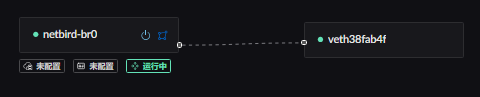
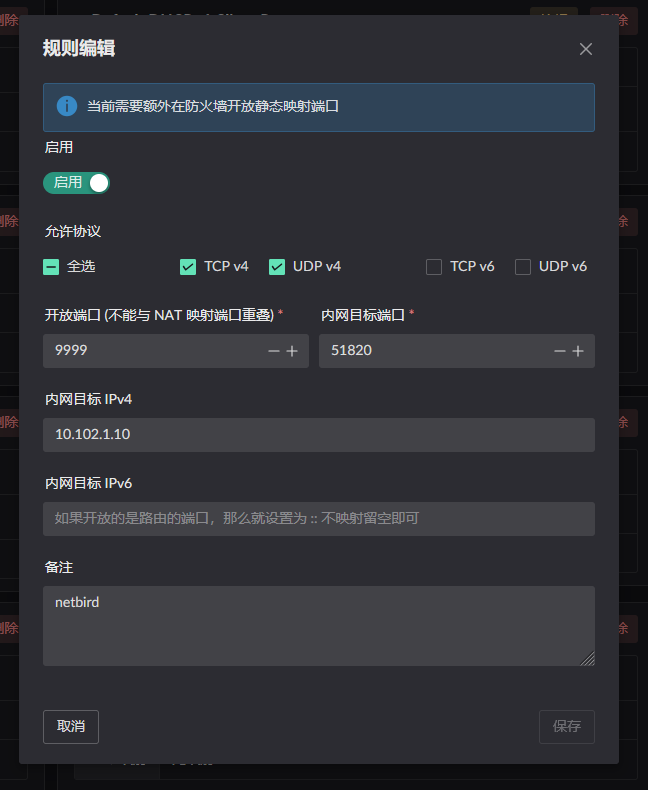
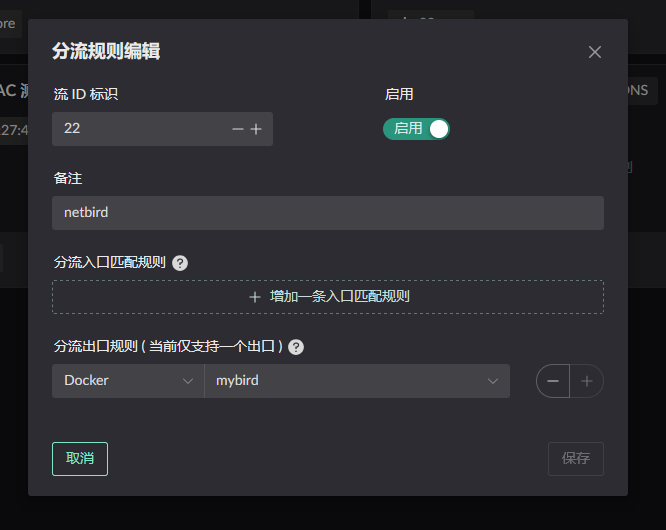
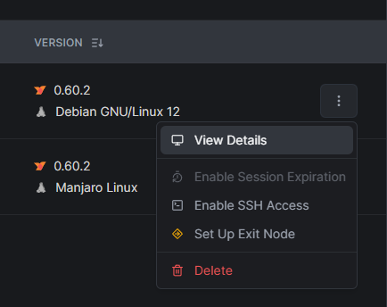
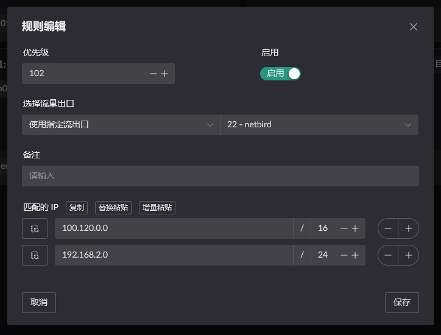
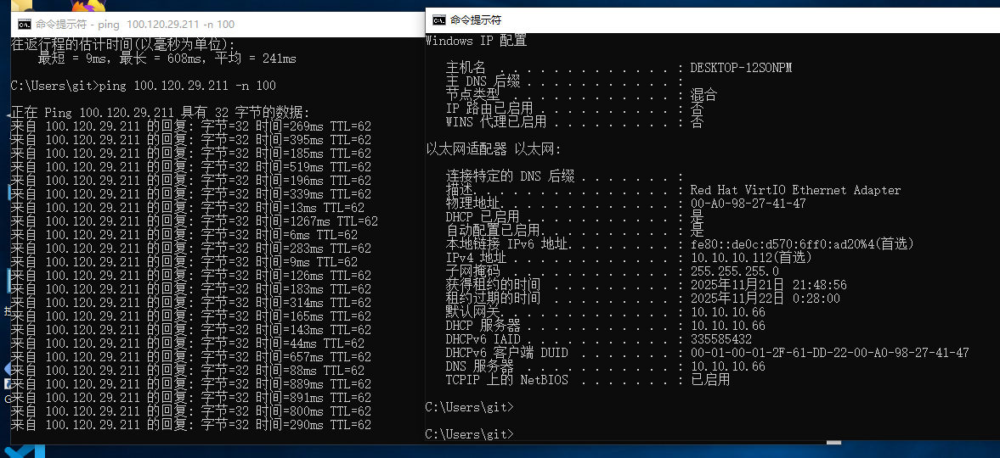

# NetBird

::: warning
Access to NetBird's website and control plane depends on the network from
which the container is deployed. Verify connectivity before starting the
container.
:::

Deploying NetBird involves the following steps:

1. Configure **Full Cone NAT**.
2. Start the NetBird container and create a Flow that uses it as the egress.
3. Configure routing so LAN clients can reach NetBird addresses and subnets.

## Configuring Full Cone NAT

There are two ways to configure **Full Cone NAT**; use either method.

1. Configure a static NAT mapping for the port NetBird uses, [`51820`](https://docs.netbird.io/get-started/cli#up).
2. Add NetBird's domain (netbird.io) to a DNS rule and turn the **Full Cone** switch on.

Either method also requires the `Route LAN` service to be enabled on the
bridge to which the container is attached. 

> Static NAT configuration: the internal target port is the container port and
> the target IP is the container IP. 

> DNS / IP rule configuration  
> This example is not yet tested here; see the ZeroTier page for the same rule
> pattern.

## Starting the container

::: warning
Set a fixed Docker bridge name. If Docker generates a new interface name after
a restart, the LAN service cannot start correctly.

```yaml
networks:
  my-netbird-bridge:
    driver: bridge
    driver_opts:
      # Keep the bridge name fixed so it remains stable across restarts.
      com.docker.network.bridge.name: netbird-br0
```

:::

Start the container from the [image](https://github.com/landscape-router/landscape-apps/pkgs/container/landscape-apps%2Fnetbird) built in the [apps](https://github.com/landscape-router/landscape-apps) repository. The compose file below may be out of date; for the latest, see [docker-compose](https://github.com/landscape-router/landscape-apps/blob/main/netbird/docker-compose.yaml).

Then start it with your own compose configuration.

```yaml
services:
  netbird:
    image: ghcr.io/landscape-router/landscape-apps/netbird:latest
    container_name: mybird
    hostname: mybird
    cap_add:
      - NET_ADMIN
      - SYS_ADMIN
      - SYS_RESOURCE
      - BPF
      - PERFMON
    environment:
      - NB_SETUP_KEY=${SETUP_KEY}
    volumes:
      - ${DATA_PATH}:/var/lib/netbird
      - /root/.landscape-router/unix_link/:/ld_unix_link/:ro
    networks:
      my-netbird-bridge:
        ipv4_address: 10.102.1.10
    dns:
      - 10.102.1.1

networks:
  my-netbird-bridge:
    driver: bridge
    driver_opts:
      # Keep the bridge name fixed so it remains stable across restarts.
      com.docker.network.bridge.name: netbird-br0
    ipam:
      config:
        - subnet: 10.102.1.0/24
          gateway: 10.102.1.1
```

Then create a Flow that uses this container as its egress. 

Add routes for the gateway node in the NetBird admin console.  

## Configuring route rules

Click **Destination IP** on the relevant Flow to configure a rule. Only traffic
matching that rule uses the Flow. 

In this example, the LAN client with MAC address `00:a0:98:27:41:47` is
governed by `Flow 11`. Configure **Destination IP** on `Flow 11` and select
`Flow 22`, the Flow created for the container, as the egress. 

Traffic to `100.120.0.0/16` or `192.168.2.0/24` then uses the `Flow 22`
(NetBird) egress and is forwarded into the `mybird` container.

> The `192.168.2.0/24` example assumes NetBird is also deployed on the far
> side. In that case, configure the remote subnet directly to enable two-way
> access.

## Verifying the result

The devices involved:

- `Device 1`: 100.120.29.211, a `NetBird client` **not** deployed on the router
- `Device 2`: 100.120.126.160, the `NetBird client` deployed on the router
- `Device 3`: 10.10.10.112, a host on the router's LAN

1. From `Device 1`, ping `Device 3`; traffic passes through `Device 2`.
   
2. From `Device 3`, ping `Device 1`; traffic passes through `Device 2`.
   
